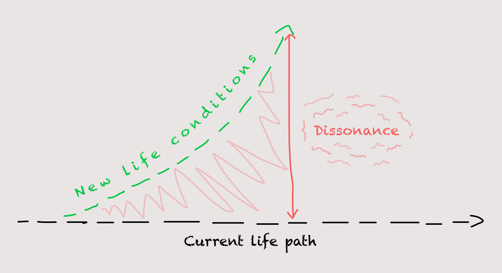
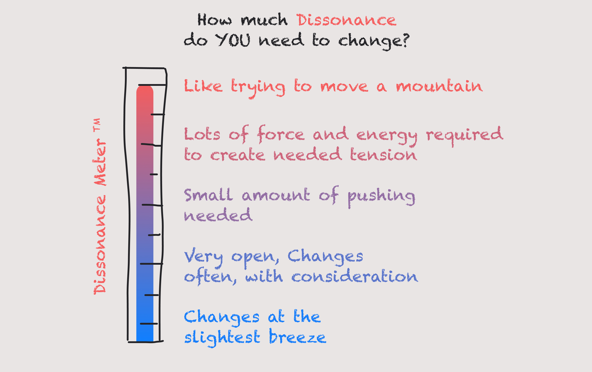
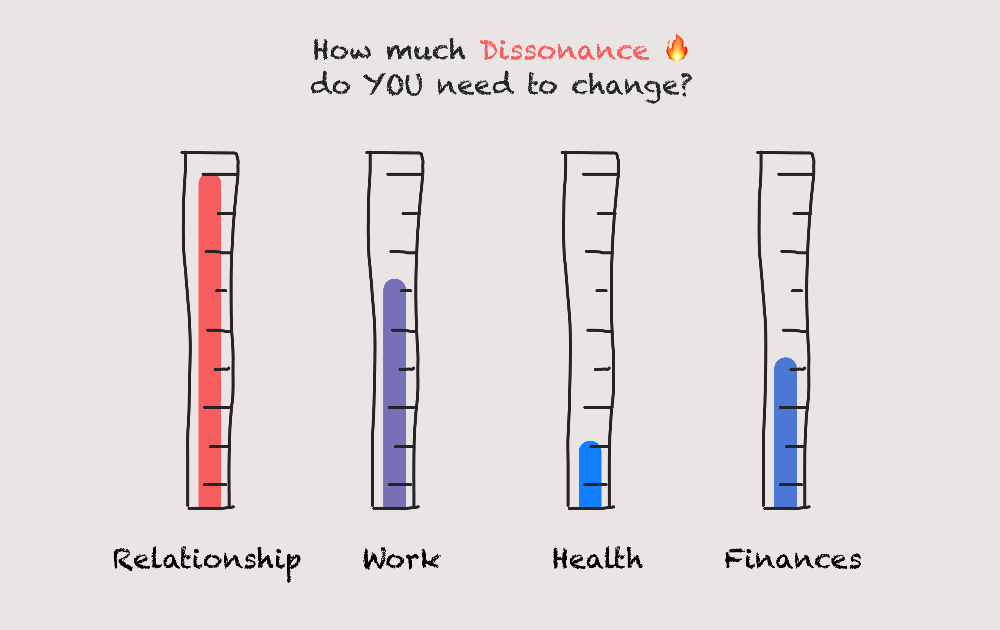

[👈 Back to all conditions](/articles/6-conditions-of-change/)

Our third condition that unlocks the door of real change is the ever-so-stubborn beast of **Dissonance**.

What’s Dissonance, you may ask? Put simply, how much does the boat need to rock before a change occurs? Do you *feel* enough tension to get off your but and do something?

> Dissonance: The awareness of a gap between life’s present conditions and our current means of solving them.

Put bluntly, Dissonance is the fire under you that makes you move your ass when it gets too hot.

## Rocking the boat
Have you ever had one fight too many in your relationship? You know that big one? The one that leaves you thinking, “That’s it! No more”.

What about at work? One task too many, or failed project later, and you feel it’s about time to move on to greener pastures?

Perhaps the climate gets too hot, and you move towns. Or you get enough comments from your friends that it’s time to give up partying and settle down.

In our image above, Mr. Blue comes home to one too many of Mr. Red’s parties. He’s thinking it might be time to find a new flatmate.

We are not strangers to Dissonance. It’s often the driving force that pushes us into new life choices, relationships, ideas, beliefs, and even towns!

Before the moment of change sets in, we feel the *tension*.

But it’s not yet painful enough for us to do anything about it. Depending on our pain tolerance, [Potential](https://spirals.blog/articles/6-conditions-of-change/potential/), and how much we care about the situation, we may stay where we are for a *good while*. We’re more stubborn than we give ourselves credit for, us humans.

> ***Many of us have things we want in our lives, but we don’t have a strong enough reason to realize them.***

The fire beneath us is not hot enough to warrant moving away. At least for now…

> The amount of disharmony (**Dissonance**) needed to create change is determined by the *willingness* to change.

---

## How stubborn are you?
### Getting to know your tolerance for Dissonance

We all have a level. It’s that point before we break and make something happen. When we get pushed too far, or the world is too much, and where the thermometer bursts. We make a change. Sometimes even a snap-decision!

Of course, we can have different levels for different parts of our life also!

I may have a **high Dissonance tolerance** for my **relationship**. This could mean it would take a lot of heat (strong Dissonance) to change the dynamics.

I could also have a ***low Dissonance tolerance*** with **work**, implying I’m jumping from companies all the time due to my frustrations with company politics.

Sometimes these levels work for us, and other times they don’t. Sometimes high tolerance is good, and sometimes it’s not.

Your tolerance could be **too high** if your mirror’s reflection starts saying:
- “I’ve just gotta stick with it” when everyone’s telling you to relax.
- “He’ll change one of these days, I know it!” when your friends are praying that you’ll leave him.
- “I refuse to change” when the world is demanding it

And your tolerance may be **too low** when it says:
- “This place is already on my nerves” when you haven’t even worked a month at the new job.
- “She’s not the same as when we first met”, but you’ve only been dating 2 weeks.
- “I give up” when you’ve only just started.

---

## Using Dissonance
As always, A Matter of Perspective likes to provide *practical* tools take us away from theory alone. How might we employ **Dissonance** as a catalyst for change?

The first step is to assess the [“Potential” of a given system ](https://spirals.blog/articles/6-conditions-of-change/potential/)(the first Condition of Change). If the system/person/group is **Closed**, a heavy dose of **Dissonance** may be required to shake the shackles loose. ***It may not even be worth the effort.***

However, if they remain **Open** to new ideas and ways of life, then the boat requires less rocking. They are already willing to change and half out the boat.

In the case that **Dissonance** **IS** needed, what might that look like? Consider a personal coach that picks up a client early every morning. Should the lazy client decide they want to sleep in, the coach promptly holds the horn until they drag themselves out of bed and into the car. He is creating such conditions in life that will force you to change. The neighbors love him.

Another example may lie in a corporation attempting to shift it’s work culture. At a management level, it may decide to hire a very new type of employee in hopes of stimulating fresh ideas and energy. With enough new people pushing for a new idea, the old ones may begin to loosen, creating a shift towards a different culture. All provided they’re open, of course 😉 (they’re often not, and this creates a big dilemma).

In our own lives, we may use this key-of-change to push ourselves. Getting ourselves to a meditation retreat when we least want it and most need it. Throwing out all the junk food. Giving ourselves a vacation. Depending on your situation (and if it’s required), there may be many ways to inject a little **Dissonance**. To put some fire under your belly.

Provided you need to change. And ***can*** change.

Often, we can just enjoy where we are and go along for the boat–ride.

[👈 Back to all conditions](/articles/6-conditions-of-change/)
