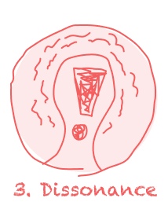

### [👇 Skip to the conditions 👇](#conditions)

1. [**Potential:** How flexible are you? 👉](potential/)
2. **Solutions:** What are you solving for? *(Coming Soon)*
3. **Dissonance:** Is there enough friction? *(Coming Soon)*
4. **Barriers:** What confronts you? *(Coming Soon)*
5. **Insight:** What can the past teach you? *(Coming Soon)*
6. **Environment:** Who is helping you transition? *(Coming Soon)*

---

Dear reader,
Have you ever spent what felt like an eon forcing everything you’ve got into trying to change something?

Maybe it is the endless attempts of diets or quitting smoking.

Perhaps, you’re trying to become a hard-working, responsible citizen that everybody else seems to have worked out how to be. Instead, you’re halfway through your first degree and just quit your job to travel to South America.

Are you trying to rally a team together at work but feel like you don’t have enough support?

Can you relate to me when I say, “I’ll change one of these days,” Or are you more the type to respond with, “Change? I’m open to anything, really.”

Do you feel like you’re reaching for something, but everything around you is pulling you down? You can’t get a handle on the world around you, and you just want, so badly, to arrive at the end?

---

## Removing the friction
Changing things is complicated. No matter how big or small, adjusting our current reality requires great dedication and energy. This is a series exploring the ***6 necessary conditions*** that need to be present in order for change to occur.

Imagine these conditions as six keys we need to unlock the door of *real change*. If one of these conditions is not met, the door remains closed. **If more than one is not met…we may even regress.**

With all conditions present, the door opens, and we can move easily through the passage. Change will live within us and act upon us effortlessly.

## The 6 conditions of Change
Behold! The 6 Keys, initially outlined by Clare Graves and his students Don Beck and Edward Cowen. This series will address the high-level concepts, providing illustrations, because…who doesn’t like pictures 😁? If you’re interested in reading further, I would encourage you to pick up a copy of their book for some bedtime reading.

<ul class="tiles" id="conditions">
  <li>
    
  </li>
  <li class="todo">
    <!-- <a href="solutions"> -->
      
    <!-- </a> -->
  </li>
  <li class="todo">
    <!-- <a href="dissonance"> -->
      
    <!-- </a> -->
  </li>
  <li class="todo">
    <!-- <a href="barriers"> -->
      
    <!-- </a> -->
  </li>
  <li class="todo">
    <!-- <a href="insight"> -->
      
    <!-- </a> -->
  </li>
  <li class="todo">
    <!-- <a href="environment"> -->
      
    <!-- </a> -->
  </li>
</ul>
