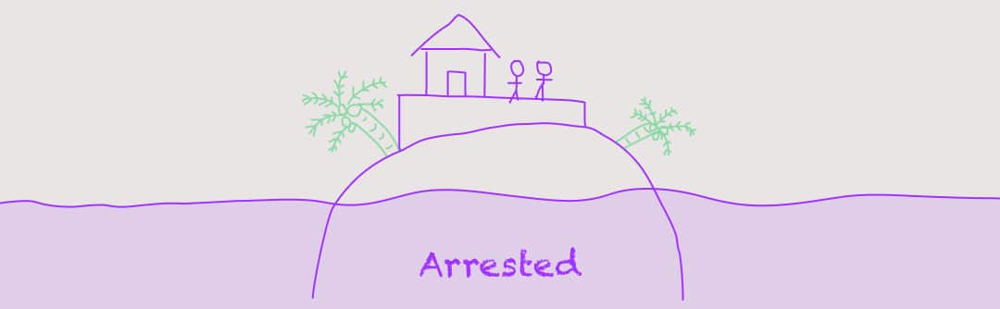

[👈 Back to all conditions](/articles/6-conditions-of-change/)

Our first condition of change is **Potential**. Not everyone is ***open*** to change, you see? Ever heard the phrase, you can lead a horse to water, but you can’t make it drink?

As the world moves to more chaos, and complexity rises like our sea (😕), we move toward a system of many different needs, values, and aspirations. It would make sense for us to be able to move between these right?

**Potential** is divided up into three “states”, depending on how “open” you are to other ways of thinking (or color systems).

- **Open:** Healthiest. Readiness to accept new modes of being
- **Arrested:** Caught up with the current way of life, and the **Barriers** present (more on **Barriers** later)
- ‌**Closed:** Unhealthiest. Blocked entirely by life conditions, and lacks flexibility

## Open: “Going with the flow”

To be “open” in terms of one’s **potential**, means there is flexibility for more *complex* levels of functioning to happen.
For you psychology buffs out there, this could correlate to the “Openness” of the Big 5.

Being open is the healthiest form, with the individual/organization/country adapting and shifting as the surrounding world changes. In our image above, we jump on a boat to escape the rising tide, able to move wherever we please.

Someone who is open does not hold a sharp picture (aka: a strong frame). They deal well with **Barriers**, as they are able to move outside the current way of thought, dodge things, or think about how to turn the situation around.

Open people/entities have great listening skills, are non-judgmental, tolerant of differences, and lack close-mindedness. Generally, they’re pretty bad-ass people 😎.

> Open:\
> Healthy, flexible, and anticipates change. Adapts when needed

The power of “openness” comes from it’s anticipation that **[things will change](https://spirals.blog/articles/chaos-surfing/)**. There is an “elasticity” between perspectives, and they’ll often engage in multiple colors.

This is the ideal place for us to all be, but it takes a LOT of work, and is something we must constantly be vigilant on. Lest we become…

## Arrested: “Don’t rock the boat”

For most of us, this is the default mode (unless we work really hard to be otherwise). Change *can* occur, but only if our **Barriers** are overcome. Also, we need more **Dissonance**, as we become more “entrenched” into our current way of life (not a problem for **Open**).

**Arrested** people/companies/countries may also lack **Insights** to explain what is happening. As a result, an **Arrested** entity will make excuses for the status quo, reluctant to change things. They will come to grips with the **Barriers**, as opposed to working with, changing, or transmuting them in **Open**.

If you catch yourself saying:
- “Let’s do what we can with what we have”
- “I’ll change *one* of these days
- “Stick with the tried and true”
- “I’ve come to peace with it now”

There may be a chance you’re a touch arrested in how you’re approaching the situation.

> Identifying the **Barriers**, teaming up with others, and finding innovative ways to approach your problems could help increase your openness.

If we chose to remain arrested, expect little movement towards more complex thinkings. Efforts will instead be placed toward refining and working harder/smarter, versus a fundamental shift of thinking and approach where things are more open.

New life conditions (org changes at work, new tax laws, natural disasters, breakups, etc) pose much more disruption for someone who is Arrested. They generate more anxiety, and uncertainty, as the “fixed” way of life is forced to change.

To extend our metaphor of the image above, the house on the island is quite stationary. Although we are fairing better than the drowning, **Closed**, figure, when the sea eventually rises we will be envious of the “S.S. Open”. Unless we re-address the fundamental relationship to our problems, we’ll just keep building higher, and higher, eventually ending up in…

## Closed: “Life sucks, and it’s NOT my fault”

The **Barriers** are high in a **Closed** state of mind. If we ignore the warning signs, and slip from [Beta into the Gamma Trap](https://spirals.blog/articles/cycles-of-life/), they will grow higher still. It’s not a great place to be.

There are a number of places a **“Closed”** perspective may come from:
- Historical trauma that created incredible, negative meaning towards something
- Refusal to identify and address the issues one is experiencing before it’s “too late”
- Strong social/parental conditioning (passing on fears and beliefs to children is sadly very common)
- Physical ailments or damage (unfortunately preventing the individual to progress developmentally)

What little flexibility we had in **Arrested** is now completely gone. The confusion, and uncertainty of **Arrested** give way to anger, hatred, panic, violence, suicide, depression, and a range of other nasties. Someone who is **Closed** feels threatened by just about everything that’s not “my perspective”, and will fight tooth and nail to protect the failing way of life.

If we observe, again, our metaphor, the individual has sand-bagged himself on a sinking island. Refusing refuge from the “Open Boat,” and too late to build a house, he remains trapped in his condition until he either changes, or drowns.

Grim, much 💀?

The danger of **Closed** minded thinking stems from it’s inability to see the **Barriers**. Much like the power that **Openness** receives from it’s flexibility, the opposite is true for **Closed** thinking. **Closed** perspectives are often exhibited by an overactive, single color that feels threatened by introduced circumstances.

Here is what to watch for in yourself and others to identify a **Closed** perspective:
- “My way is the only way a rational person would think”
- “This is all there is”
- “I can’t think of any way to solve this”
- “It’s done for”
- “Everyone else is wrong”
- “Why can’t you see my view?”
- Constant doubt (“Do you really love me?”)
- Insatiability
- Every idea washed with the same color
- Irritable quickly under stress
- Completes things to *extremes*
- Builds a shell to hide in

> Closed:\
> Inability to see Barriers, shuts down, avoids all change, and fights to stay put.

A **Closed** perspective will usually collapse in on itself, unless supported by others inflicted with the same thinking. Groups of closed-mindedness can clump together, dig trenches, and try to “take on the world”. Take, for example, how the Samurai of Japans dying feudal era resisted against western ideas. Instead of adapting, integrating, and merging into the modern world, they fought to the last man, and are no more.

---

## Open for Business: Using “Potential”
What do we get when we assess the “potential” of some thing, or some one?

The greatest benefit is we may now identify the *probability that it/we/they can change*.

If they are **Open**, then the probability is high.

If we are **Arrested**, the **Barriers** need to be identified that are creating walls, and the **Dissonance** volume may need to be turned up (make them sweat it 😓).

If it’s closed, then deep thought should be given to **whether it’s worth trying to change it or not**. This may sound drastic, however if **Potential** is low (**Closed**), and the fortifications are up, it may be more trouble than it’s worth.

Once we can read the Potential, we may also assess the required energy to shift the system. This can be critical at an organizational level to determine if resources should be placed in re-directing the current way of things, or investing energy into something else.

Potential will also give us insight into the stress produced from changes (side-effects). We additionally learn how much can be changed, and in what ways, and to what degree.

---

Potential is just **one** of the Six Conditions of Change. It is arguably one of the most important condition needed for enabling a shift, and provides valuable information on how receptive and flexible we/they/you are.

So next time, before jumping into that new exercise routine, company structure, or country, have a look at your own **Potential**. Are you **Closed** in some areas, and **Open** in others? Where could you be more flexible? What is holding you **Arrested**, limiting your options?

(Next up, we’ll take a look at Solutions)[/articles/6-conditions-of-change/solutions/], and how focusing on where we’re at can make all the difference.

[👈 Back to all conditions](/articles/6-conditions-of-change/)
