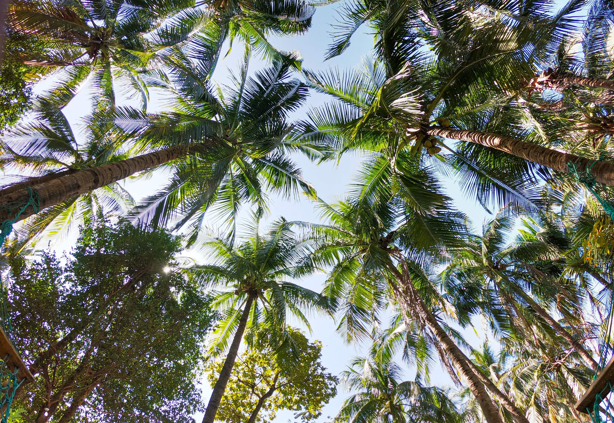

Early morning sunlight shone through the jungle’s canopy lighting the well trodden trail for Mani. It was a clear day with a soft, cool breeze blowing through the leaves, however Mani paid no attention to its beauty. He hated this track. Every day he would wake up at dawn and cart his heavy bag of fruits through the island’s jungle to trade in his neighbouring fishing village, and every night he would return. It was all Mani had ever known. His earliest memories were of him and his father making the journey each morning. Now Mani’s father was old and frail, and could no longer hold the bag of fruit on his back so Mani endured it alone.

He had been hiking for a few hours when the trail took a veer to the left. Mani’s heart sunk. He dreaded this part of his day. The path descended deep down into jungle, growing darker and gloomier with each step he took. Trees pressed in closer with an eerie silence that sent chills down Mani’s spine, and the road ahead became rockier and dangerous to walk on. Once again, he was bombarded with a vanguard of mosquitos, ticks, and spiders, biting and frustrating him as he attempted to make his passage down the darkened path.

After an hour or so, the sound of running water could be heard drawing nearer. Mani turned around a bend, and a small river flowed over his path. This was the worst part. He looked remorsefully at the stumps of the old bridge his father had built when Mani was a child. It had been lost by a flash flood one year in a terrible storm, and Mani did not have the skills to rebuild it, so he did what he did every day. He took off his shoes, rolled up his simple pants, and plunged into the icy waters. The current was strong today, and it was all Mani could manage not to lose his footing on the slippery rocks and be carried downstream. He clawed his way ever so slowly to the other bank, and heaved himself up the side muddying all his clothes and mood. He rested a few minutes to find his breath before continuing down his sombre road, soaking wet and miserable.

As Mani sludged along his mind wandered into a daydream he often had. He did not have to walk the track twice a day, and instead could lay about on the beach drinking coconut milk, and eating fish. He could be carefree and peaceful and people would approach him and enjoy talking instead of ignoring him. There was no jungle to trek, no river to soak in, no heavy fruits to heave across the island, just a relaxed hammock on the warm, sunny sands.

“Look, it’s Moody Mani!” The laughter of small children ripped Mani out of his dream, and back onto the road. Finally stepping out of the jungle and into a small clearing, he had arrived at the island’s other village only to be greeted (as per usual) with a torment of names and teasing from it’s youngsters.

“Leave me alone! I do not want to be bothered today” Mani retorted. He was exhausted and the last thing on the whole island he wanted was to fend off these brats.

“What’s the matter? Did the monkeys through poo at you again?” one jeered, and they all burst into laughter.

“My daddy says he has a banana for a brain!” jibed another.

“Banana brain, banana brain! Moody Mani’s a banana brain!” they chanted, and Mani’s temper got the better of him.

“ENOUGH!” he commanded, and the children scattered, giggling back to their huts and the safety of their mothers.

“Maybe I do have a banana brian,” Mani thought as he slumped over to the small market and setup his fruit, “After all, I never seem to do anything other than carry this stupid fruit, back and forth, every day”. He had developed quite a reputation on the island for being irritable and foul tempered, which certainly did not help in the market. The village people tended to avoid him and preferred trading their fruit with others who were more cheery. Mani was saddened by the loneliness of the market, kept company only by the odd monkey attempting to steal his fruit. Everywhere he looked he was greeted with disapproving looks, scowls, or was just ignored completely.

He remembered his father selling fruit here all those years ago. People flocked to Mani’s dad everyday to greet him and see what new fruits he had brought. There would be many regulars that returned and talked for hours, sharing stories and personal problems with him. His dad always smiled and greeted every customer with a warm hello. They would always travel back home with empty bags having sold all their fruit to the excited village. Now, nobody came to talk with Mani. He finished the day having sold only a few coconuts, and set out to lug the heavy bag home.

The journey back was more dangerous, as Mani could not see clearly in the dark jungle, and there was the chance of running into a large wildcat. He dreaded the disappointment on his family’s faces when he returned next to empty handed for his days work. He hated letting them down. The shadow of his father’s successful trading business loomed over him, but he had no idea how to match him. He was just unlucky and disliked. Some people are born with the ability to be happy, and some just are not. Mani had come to terms with that. He reached home and collapsed on his straw bed, drained from all the hiking. The children’s taunts ran over in his mind, and he fell asleep to a sad chorus of “Banana brain, banana brain…”

“Wake up sleepy!” Mani’s little brother, Ina, jumped up and down on the end of his bed, a bundle of excitement. Mani groaned, and awoke rubbing his eyes. “Tata says I am to go with you to the other village today. He says I am to learn how to fish from the men there!” he squealed. Mani envied his younger brother. Ina spent most of his time exploring, adventuring, and learning. He always appeared happy, and full of life. It cheered him up when he was around.

“Are you sure? It is a long journey,” Mani warned, slipping on his damp shoes, “I am not going to carry you.”

“Don’t worry, I can walk around the whole island twice in a day!” Ina said triumphantly. Mani laughed, he would enjoy his brothers company today.

The pair set off into the jungle after a quick breakfast, Ina bounding in front, inspecting all the trees and bugs with youthful fascination. Mani often wondered why he also had not been passed his brothers enthusiasm for life from his parents. “It is not fair” he thought, “I work hard, I deserve to be happy.”

They soon reached the veer in the road, leading down into depths of the jungle. Mani whined, “I hate this part” glad that he could share his discomfort with someone else. Ina looked back, puzzled.

“What do you mean?”

“It gets all dark and morbid down there, and I have to swim through the river. All the bugs bite me, and come out all itchy and wet.” Mani continued.

“Well why don’t you take a different path?” Ina replied.

Mani did not understand. “I have always taken this path. It is the one Tata showed me when I was your age. It is what we always do. It is the path.”

“So?” Ina questioned, “Do you like that path?” He grabbed a branch from a tree, and snapped it off.

“What are you doing?” Mani asked, unsure of where this was going. Ina ignored him and started smashing vines and plants. “Stop! This way is already well trodden. That is not the right way!”

“How do you know,” Ina asked, grinning, “If you have never been this way before?” Mani was terrified. He could not walk off the track. It was dangerous. What if they got lost? How would they find their way back again? They could end up in a ditch, or a dead end. Even worse, they could fall off a cliff. Ina seemed uninterested, and continued to push through the jungle.

Main followed after him, “Do you even know where you are going?” This seemed ridiculous. The branches and twigs scratched him as he made after his brother. “Stop! Where are you going? I would rather go this way, it is familiar. We know where this goes. I do not really mind the river, I was just complaining. Stop!”

“Oh relax you big wuss! Let’s try something different. Trust me.” Ina pressed on. Mani did not like this at all, but there was no stopping his determined little brother, and he did not want to leave him alone in the jungle. They walked for hours, Ina in front with his stick, making a path for Mani to follow, all the while heading steadily up. Ina never looked back once, and Mani thought he even seemed to be enjoying it. Mani however could not understand and grew more frightened with every step.

The jungle grew lighter and thinner the higher they rose, and soon they could see large patches of blue sky shining between the treetops. The pack on Mani’s back was wearing him down, and he was considering turning back when they reached the summit. They had climbed on top the dormant volcano that comprised the larger part of the island. Mani stood in awe. He had never seen anything so beautiful in his life. Before him in the clearing he could see the whole island below in every way he turned. The blue sea stretched out in the distance, covering the world in a shimmering blue sheet.

“I told you to trust me” Ina remarked. Mani was speechless. He had no idea that the world held such remarkable beauty. He sat down on a small boulder, and a sense of peace washed over him as he stared out over his home. “How could I have missed this all along?” he thought, “I had no idea this even existed”. They both sat eating the fruit for a while, taking in the view. Something moved in Mani. A small glimmer of hope that maybe life was not so gloomy as he had made it out to be.

“Let’s keep going” Ina said after some time, throwing his banana peels into a bush, and they resumed their hike down the volcano. It was easier going down. Mani did not notice the cuts and bruises anywhere near as much as before. His pack felt lighter and little details of the jungle he had never noticed before now seemed so vivid. The tiny flowers, colourful birds, and the wash of the gentle breeze all felt new to him, as if he had never walked through the jungle in his life. Time flew by with Mani and Ina chatting about what learning to fish would be like and before he knew they had made it to the neighbouring village in no time.

The fishing village was alive today, and once again the children came running up to them, joking and taunting Mani as usual, but something was different. The names did not sink in like they used to, and the chants grew boring. The children grew tiresome and left Mani and Ina alone. He was off to a good start. Ina helped Mani setup his fruit, and shouting out what they had to offer to anybody who would listen. They had soon amassed a small crowd of passersby, and Mani chatted to them all pleasantly, telling everyone of the beautiful views atop the volcano. He was buzzing. With Ina’s help and Mani’s good mood, they sold out of all the fruit for the first time since their dad had ventured across the island. Mani left his brother, and proudly marched back to the forest to tell his family.

The fork faced him at the jungles entrance. With Ina now no longer by his side, the new path to his left felt daunting. He was still sore from all the scratches and bruises and his clothes had been ripped from the morning’s exploration. To the right, the old path that was so familiar winded down into the dark. He knew exactly what was down that road. Mani stood there contemplating his options, and decided he had had enough. He was no longer going to take the miserable path just because it was easier. He did not want people to tease him anymore, or call him ‘Moody Mani’. He wanted everyone to respect him like his father. He would show them. He grabbed a stick, and went left up the volcano. It was tough. The jungle clutched on to him as he forced his way upwards as if to mock his attempts and deter him. “Just keep going” Mani heard his little brothers voice coaxing him on. He wanted to quit. His mind begged him to turn back down the easier road. Mani pressed on.

The moon was high in the sky by the time Mani reached the top for the second time that day. This was getting easier. The island looked very different at night, but just as beautiful. He was glad he took this route. He descended back into the jungle and made his way home, the view still fixed in his mind.

The next day, Mani was faced with the same choice, and the day after that, and so on for months. Each passing day he chose his new path, and his mood lightened. It grew easier the more he trod on it and a road began to form. The children no longer greeted him with rude names but rather asked him to share his stories of the jungle. The villages now eagerly awaited him each day to see what he had brought for them. He would often visit his brother after he had finished at the market and Ina would tell him what he had learnt that day.

“I’m proud of you,” Ina said one afternoon as they were sitting by the beach, “I know how hard it was for you to follow me that morning. You kept going too. I’m glad you did”.

“I am too” Mani replied, and he truly was. Everything had changed for him and that night on his journey home, he returned to the old path as it veered to the left. Despite all efforts to search for it he could not see the road anywhere. The jungle had consumed it, left it overgrown, never to be walked on again. Unfazed, Mani left it alone, smiling, and never once looked back.

