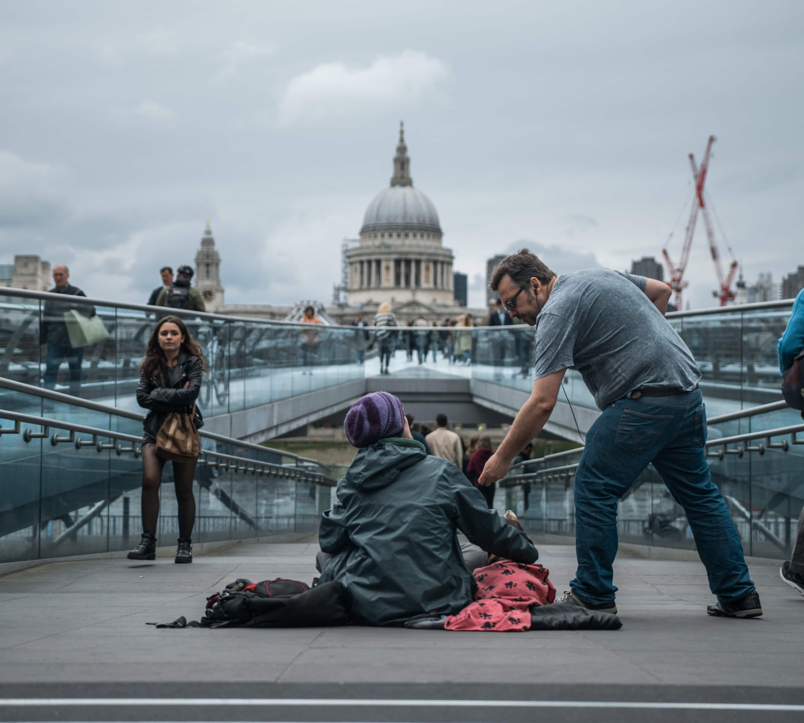
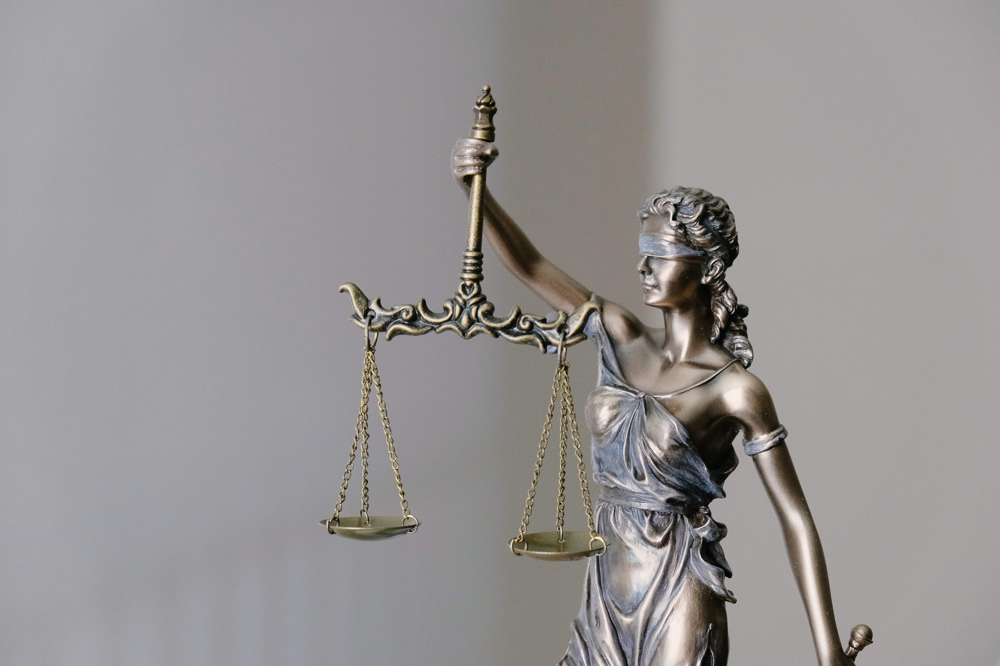
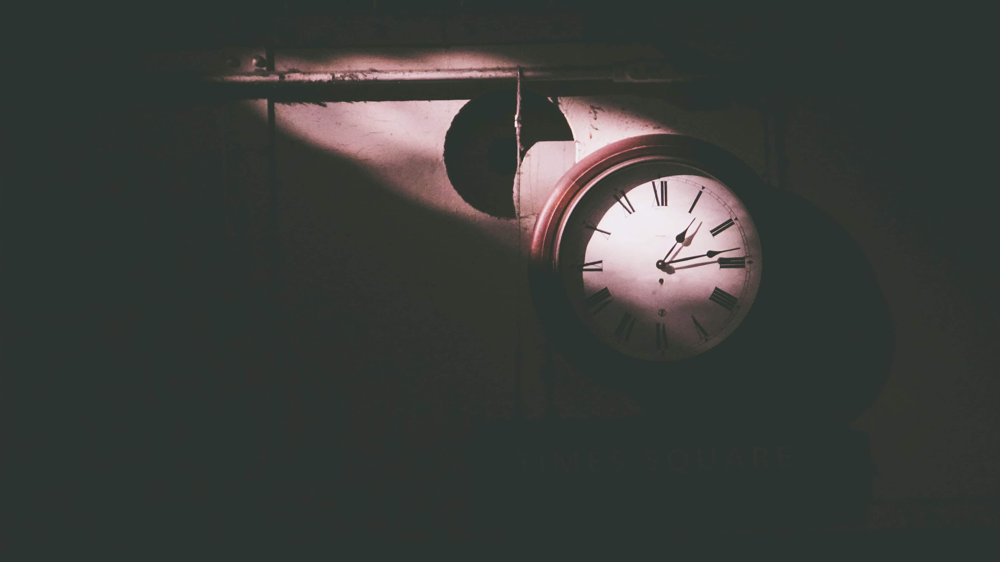
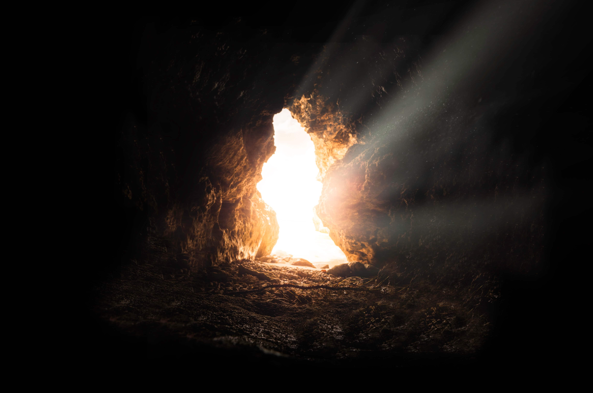
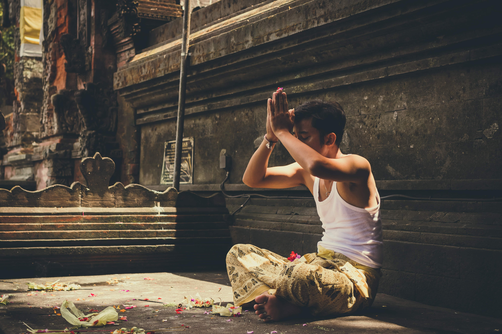
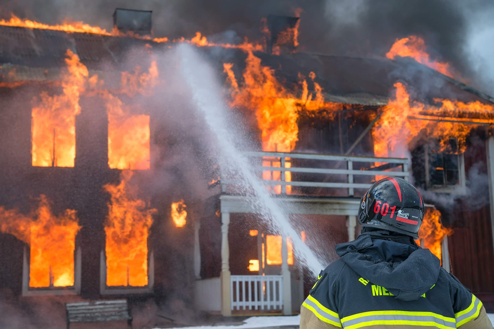

Blue represents the fourth stage” of human existence. If you’re new to Spiral, please first read:
- [What is Spiral Dynamics](https://spirals.blog/articles/what-is-spiral-dynamics/)
- [Beginning in Beige](https://spirals.blog/articles/beige-introduction/)
- [Progressing to Purple](https://spirals.blog/articles/purple-introduction/)
- [Rising to Red](https://spirals.blog/articles/red-introduction/)

This article will provide the necessary context for some of the concepts here.

Enjoy!

Dear Sir/Madam. Spirals.blog would thank you for reading this chapter. We hope you find this text informative and instructional. Once you are done, if you could please fill out the form below for further updates on the matter of perspective. It’s titled “Spiral Sundays”. Please queue to the left. Thank you.

Yes, next in line, please!

---

And lo! The Truth has been told! The word of <insert a god/“ism”/“ideology”> has spoken, and all who listen SHALL BE SAVED! Those who do NOT heed the Truth shall be condemned. They will be imprisoned and suffer horrendous guilt for all eternity. Ye be warned.

And oh! Yes! How our Truth is ***true***! We are the mighty, the chosen, and we have the ONE TRUE WAY to live life. All other beliefs are FALSE BELIEFS! They can go fuc–

Excuse me. We shouldn’t be so crude. We’ll have none of that unhealthy Red/Blue here now, will we? Remember how our [last article turned out?](https://spirals.blog/articles/red-introduction) We will, from now on, make a solemn promise to you, reader, that we will remain proper and courteous. We shan’t digress into any more obscene vanity or profanity. Let us start this article again. The polite way. The correct way.

---

## ~~The 10 commandments of Blue~~

## Table of Contents

The (in)formal Definition of Blue
1. Guilt
2. Fairness
3. Justice and the Bigger Picture
4. Order & Hierarchy
5. Time
6. Sacrifice now for the future
7. Truth
8. Religion
9. Service
10. Beyond Blue

## The (in)formal Definition of Blue

Blue is the fourth level of human existentialism, as defined by the theory of Spiral Dynamics. To understand Blue, one must let go of everything else they know and embrace its elegant, organized, fair nature. It’s what makes our world “tick”.

What is Blue? We’re delighted you asked. We know that colors are not “one thing” or behavior, or a single opinion or idea. They’re a living, breathing collection of all of these things put together. They’re a way of “solving life”.

Blue is essential as it’s the perfect tool to deal with the cacophony of chaos that emerges from Red. Red seeks to express itself, do whatever it can to promote itself, and doesn’t think about the future AT ALL. Hmph. Blue steps in to clean up the mess, make everyone take a little more responsibility, and think about the bigger picture.

A sense of obedience drives much of Blue. It is obeying the rules, order, and harmony that is created by those who have the truth. This could be our government, a religion, an “ism”, a company’s policies, and so on. In many ways, it’s the direct opposite of Red, in that it seeks to serve rather than express. [The pendulum swings yet again.](https://spirals.blog/articles/i-vs-we)

Blue is a stalwart, dependable, color, and is where most of the world is operating from today. One only needs to step into an airport, courthouse, police station, or accounting firm to observe Blue’s astute nature. Everyone has a role, a place in society, meaning and purpose, and a narrative by which to live. Blue gives us predictability and schedules and time. Blue is whom you call when you’re in trouble. Blue is who saves you when you’re sick. Blue is the protector against the evil and unjust in the world.

Blue is your friend.

## 1. Guilt
> When the person lives successfully this way [Red] and in living successfully begins to create problems for himself. Namely in living successfully [in Red], the person begins to get other people angry at him for his entrapment, for his using the others to gain one’s own satisfaction, for his ensnaring and trapping others. Then, this person has created a new problem for himself or herself, and if he or she is going to stay alive here, she has got to begin to shut down a little bit on this egocentric behavior that is shown, and **begin to think a little bit about other human beings**.\
> – Clare Graves - [In Conversation with Clare W. Graves. (Youtube)](https://youtu.be/tt3Uk1f3y_U?t=1647)

Guilt. A powerful, *necessary*, and useful tool in Blue’s arsenal of understanding the world and creating order.

When Red gets too Red, there’s a problem (like any color really), and if we continue living this way, we create disharmony for ourselves. **To stay in Purple, we must think about others.** There are only so many times you can steal your housemates’ toothpaste or butter before they start to notice. If you do something frequently, or to a severe degree, people *will* get angry, and they *will* confront you. You know you’re in the “wrong”. You’re behaving in a way that’s hurting others. That feeling is guilt.

Guilt, in some beautiful fashion, instills enough fear and negativity towards something BEFORE we’ve even done it. That’s its power. It prevents you from taking action on something you know will affect others, critical for controlling that unhealthy Red. It is NOT ok for you to kill someone so you can claim their partner for your own. That’s what it used to be, but we’re a little further along than that now. You **should** feel guilty if you steal, taking from someone’s hard labor to add to your “self”. Jibing an unjustly nasty remark to someone and feeling bad after is a **useful emotion** to ensure you don’t behave that way again. Going to jail for a life sentence is an appropriate societal response to murder. Embrace guilt. It saves you from hurting others before you do.

Guilt, of course (like anything), can be taken too far. What does this look like? Limiting of *healthy* self-expression, telling young children that “God will blind you if you masturbate” (yes, this actually happens), overly strict parents making their children feel bad for not coming home at the time they want, and so on. “Bad guilt” is all around us too.

How do we tell the difference between “good guilt” and “bad guilt? Perhaps we might ask, “Is the intention to protect and help, or is it coming from inflexible rules and insecurities?” We can use guilt where necessary to prevent things that should not happen, but not too much…

In later articles, we’ll discuss how we can raise or lower the “Guilt Line” to accommodate varying types of expressions from other “I” colors (Red, Orange, etc.).

## 2. Fairness

*Photo by Tom Parsons @tomzzlee*

With Red’s now “waking up” to this feeling of guilt, some begin to wonder if there is a better way. Can we possibly reconcile, or “integrate” both living in Purple AND expressing in Red? For the Red’s now “entering Blue”, the concept of fairness begins to emerge out of the guilt.

To maintain the balance, these new ideals propagate out to the rest of the Purple group. At an individual level, one realizes their actions and, stemming from the guilt associated with their past Red activities, resolve to treat everyone fairly.

Fairness is “valued” as a way of protecting people against unhealthy Red. It stands in defense for those who might not necessarily be able to stand up for themselves. They are sheltered by the value Blue shares in *how* we should lead a **good** life. Thanks, Blue.

This is a **massive** part of Blue’s motivation; the protection of the innocent. Fairness for all that “accept blue”. But what about those that don’t “accept” this way of life? The obstinate, the “closed Reds”, the sinners, and barbarians, and criminals, and hooligans? What about them?

## 3. Justice and the Bigger Picture

*Photo by Tingey Injury Law Firm @tingeyinjurylawfirm*

There are some that don’t see it as the “Blue” way. The Reds and Purples? They’ve got their own way of seeing things, and it certainly doesn’t match Blue 100% of the time. That’s for sure.

So what are we to do about this? We started convincing people and showing them the pain that was being caused by the Reds. We started groups, holding town-halls, and market place Khutbahs (Islamic sermons). We worked together to come up with a system of rules and ways of living that we ALL had to abide by, lest there be a punishment (guilt).

And so legal systems around the world were born and often tied very intensely to a religion. A set of rules, ideas, stories, and values that helped us all to live healthier lives, without violence or hurting each other. In theory.

Blue that has moved through Red (can step into Red and enforce it) spread across the globe. It was far more capable than it’s *pure* Red predecessors, and it conquered everything. If one has studied history to any degree, we may draw from the countless of Blue applying it’s justice and truth wherever it goes. Blue’s trained armies are no match courageous Purple/Red warriors. Movies like Braveheart depict this perfectly, with the British playing a significant aggressor in “Blue”-ifying the world at the time. The Roman Empire is another example.

And so, justice served. It served us all as we served it. God’s justice, the judge’s justice, the justice of the law, the justice found in the Truth. This is the biggest motivator behind how most of society’s across the world operate today. We go to work, we pay our taxes, we follow the law, and we listen to the experts who have studied things we haven’t. We speak the same language. More importantly, we agree (mostly) on *how* we should live, and are comfortable letting society determine these rules.

Something magical happens in Blue. As we become more aware of how our actions affect others, we grow to appreciate the “collective” idea that binds us together. This could be the law, a god, or a companies mission. **It is more significant than any one of us**, and when everyone follows this, we have peace. Unless there are other versions of the Truth.

## 4. Order & Hierarchy

*Photo by Jeffrey F Lin @jeffreyflin*

As you can imagine, things start to get pretty complicated once we start leaving Red. There are laws to right, borders to protect, fields to plow, institutions to uphold, and the King to serve. In Purple, there’s next to no hierarchy (asides from the odd Shaman or two). In Red, we see a little more of this but driven by a desire to dominate. Red respects the biggest Red.

In Blue, this changes ***dramatically***. For order to ensue, we must put people in charge to make sure everyone’s doing the right thing and following the rules we’ve agreed to. Very quickly, we develop a “pyramid” like structure, with someone at the top who “calls the shots”, and trickles down through middle managers, sergeants, priests, and eventually finds it’s way down to the workers.

If someone “above” you in this structure asks you to do something, it’s expected (per Blue) that you do it without question. It’s assumed that someone higher than you has access to more of the bigger picture, has served longer than you have, and is closer to the Truth. Thus, we treat our “superiors” with respect, obedience, and give them the authority that they “deserve”.

This structure (the worst nightmare for a Red) is what gives Blue the discipline, security, and predictability it relies on upon to carry out it’s behemoth missions. Organizing society is no small task.

Should you decide NOT to follow this order, you are promptly spoken to, and if it continues, removed. If there is a soldier in-sighting a rebellion against the General, this could mean the difference between winning the war or falling succumb to the enemy. A rogue employee who vehemently disagrees with the CEO can be a danger to the companies vision and must be dealt with accordingly.

### A side order of stagnation
Interesting, Blue’s rigid structure is also it’s downfall. As we will see in Orange (and how it transcends these limitations), too much hierarchy, combined with inflexibility, creates problems for Blue. Over-reliance on these hierarchies and processes can stagnate a country/organization and grind everything to a snail pace. In some cases, it can create a complete deadlock.

“Why don’t we try this new way?”

“Because THIS is the way we’ve always done it. Get back to work”

## 5. Time

*Photo by Jeffrey F Lin @jeffreyflin*

Have you ever noticed, in particularly Purple/Red interactions (chilling on the couch, picnicking in the park with friends, going for a hike, etc.) that you *entirely* lose track of time? You look at the clock, and what feels like 10 mins were 4 hours. Purple/Red is brilliant for connecting, relating, and building closer relationships. It’s not so great at showing up to work on time.

In the perfect Blue world, nobody is late. Those Reds and Purples don’t exactly “own a watch” so to speak. It is in Blue that ***time*** becomes observed, and we are better for it. Isn’t it pleasant when everyone shows up to our compulsory daily meeting on time, well-groomed, considerate, and there to serve?

Time, like guilt, is one of Blue’s greatest strengths. The ability to observe things over a period, recognize patterns, and respond accordingly. Blues gain foresight from their unique ability to perceive time. It invents devices to track it, systems to follow it (astronomy, seasons, etc.), and language to communicate it. It becomes the lead actor on Blue’s societal stage.

Without time, how could we organize ourselves into large groups, coordinate projects, and keep the world running? We’d have trouble even doing the simplest of activities. To compare, take a trip to a Purple/Red country. The meaning of time is different there.

“Hey, I thought we had an 11’oclock?” Says the businessman to the contractor.

“Yeah we do! I said I’d come in the morning, right? It’s only 11:30. I’ll be there soon.”

---

It’s an entirely different way of seeing reality. It can be incredibly frustrating for a Blue when other colors (and even other cognitive functions) perceive time differently.

In time (pun intended), and as we observe ourselves moving through it, we develop a key realization that forms another critical aspect of Blue.

## 6. Sacrifice self now, for the future benefit

*Photo by Jonathan Borba @jonathanborba*

> “How about we DON’T eat all our grain, let’s save some” exclaims the Blue to the Purple/Red, “You remember what happened last winter right? We had to eat Annie.”

Poor Annie.

What a fantastic idea. Truly. ***The idea of forgoing temporary pleasure for something greater in the future.***

Have you ever practiced a musical instrument? Trained in a sport? Studied for a test? Worked hard at a job to retire?

Our ability in Blue to sacrifice “now” for the “future” (born from our newfound relationship to time) is what set’s the foundation for all other colors in the Spiral. Good luck trying to build a successful “Orange business” if all you’re looking for is immediate short term again. It’s sad that many of our cherished industries have become this.

By saying to ourselves, “Gee, I’d really love to party tonight guys, but I gotta study for my mid-terms” we pass university. We **get** the degree to become a doctor. We **save** those thousands and thousands of lives.  **That’s** what this idea brings to society.

How can you expect to save up for your own life and retirement without it? Red spends it all, and Purple has no idea what to do with it! Blue gives you the ***discipline*** to not buy the new motorbike or trip to Hawaii and put it towards a house deposit. It might feel crap at the time, but boy oh boy, do you thank your past self. Again, thanks Blue.

In many ways, Red is the complete opposite. “Sacrifice the future for NOW dude! 🤘😎”

## 7. Truth & Absolutism

*Photo by Bruno van der Kraan @brunovdkraan*

Blue works. That’s a fact.

Compared to Purple, Red, and Purple/Red, Blue wins in building large societies. In a similar fashion to it’s Armies of Justice, Blue methods of living spread. Because compared to everything before, they work.

Are they perfect? Blue likes to think so, because what other things have worked this well? They have the one way to live that solves the problems. This is where things can get a little unhealthy. ***A Healthy Blue is an Open Blue.***

Depending on what you believe, the truth is either relative or it is the Truth. I don’t want to get into relativity discussion here, so I will just say that Blue *tends* to think in absolutes.

Most people would generally agree (hopefully) that murder is a bad thing. Many would say that’s an objective truth. That good and evil are objective truths. Things that actually exist. That reality, the world, and all in it operate in such a fashion — a fathomless philosophical conundrum non-the-less.

What about when this extends to things on a more day to day example? You must do this thing that I believe, or you’re a terrible person. I’m sure we all have something like that in one way or another. Interesting isn’t it?

We all hold some of these absolutisms. These “truths”. Are they really true? Now is not the time or place to discuss such things.

But, oh, how they get in conflicts don’t they? Sometimes we even find these conflicts in ourselves—a dichotomy. And we fight over them—a lot.

This truth is more accurate than this truth. Because it’s the truth.
**Circular arguments are all around us.**

Perhaps, to make the world a kinder place, we should start by saying, this is “MY” truth, but you hold your own. Let’s not worry about other people’s versions of the truth. Unless they use it for evil, of course.

## 8. Religion

*Photo by Artem Beliaikin @belart84*

With your permission, I’d like to discuss a touchy subject for many people. I myself have nothing against ***HEALTHY EXPRESSION*** of religion, none what we’re about to cover will ever attempt to say it’s “bad”. Done right, religion is a truly incredible and beautiful force in the world. What we will discuss is how and why Blue often expresses itself through religion, and the forms this can take.

What is at the core of every major religion? Being kind to others so we can all get along. Blue. Here are some rules for it. Blue. If you don’t follow these rules, there will be consequences. Blue.

For a Red, hearing a powerful Blue narrate this to us will wake a few of us up. “You mean I can find peace from all this war shit?”

Yes.

Sadly, unhealthy expression of religion has killed more people than pretty much anything else humans have done to each other. But that’s not necessarily what religion was designed for…

The healthiest religious people I know hold their own truth, yes, and are open to others holding theirs. There’s no need to compare, to fight over which is better or more true, or disturb the peace.

Other Blues, unusually the unhealthy kind, tend to disagree. A lot. This is unfortunate, but the nature of the reality we live in, and we mustn’t ignore it. It’s a dominant force in this world, and left unchecked creates much pain and disharmony. It is the author’s hope that spreading tools like Spiral will enable us all to be more emphatic about such things.

Done right, religion expressed in Blue provides the “blue”-print (ok, I’ll stop the dad jokes) for how to live a good life. For billions, this is precisely what they need in order to live a good, healthy, meaningful life. You take that away from them, and they’re left with an existential hole so deep it would send most into chaos.

It provides us answers (truth) to ideas and questions we can’t conceive. Most importantly, it unites us.

## 9. Service

*Photo by Daniel Tausis @greatmalinco*

When one discovers the cool, air-conditioned breeze that Blue offers from the maddening sands of the Red Desert, one is grateful. Put simply, we feel indebted to what Blue provides us and saves us from.

If this gratitude is strong enough, it expresses itself in servitude. To serve one’s country, god, or company is the life of a true Blue.

> “I will give myself to the collective, that which is more significant than me. “

A remarkably pure intention. We would not be where we all are today without it. There would be no nurses, or lawyers, or rubbish men to take your 23 smelly beer bottles away from your home. No police to come RUSHING to your house as soon as you make a phone call. No books. Or written word for that matter.

We give ourselves to make the world around us better. Purple serves the tribe, but Blue serves something more powerful. Blue can serve ideas. These ideas, if enough people believe in them, can change the course of entire nations. They empower us, inspire us, and in return, serve US.

Think about the idea of the law for a minute. What would the world be like if there were not sensible rules we all abided by? Many are grateful enough for this and believe it so much that they become an officer or a lawyer.

Do you go to work? Do you believe in the idea of money enough to work for someone else? You serve society because, in return, you hope it will serve you. This is the deepest truth behind Blue. Let go of the chaos and serve your truth. This service is the foundation that gives many people meaning and purpose in their lives. Without it, the world stops.

## 10. Beyond Blue

*Photo by lucas clarysse @lucky_photography*

For many reading, this is where much of our own perception is based. In some combination of Purple, Red, and Blue – we live our lives.

We have [spoken at great length](http://localhost:8080/articles/wholearchy/) on the topic of “objectifying” the “higher colors”. Simply put, it’s dangerous, we’re often out of perspective, and it can fuck us up (profanity intended) more than we’d ever realize.

**This is especially true with leaving Blue.**

In so many ways, Blue is a gigantic safety blanket. It covers us all, allowing us to live our lives without having to worry about anything more complex.

Very few of us truly know what it feels like to come “this close” to winning an Olympic gold medal. Nobody remembers second place.

Not many among us have faced the challenges of maintaining an international conglomerate, with 100,000 employees in 12 different timezones.

---

Some successfully solve Blue’s challenges in life, only to find that it doesn’t provide what it said it would. By living the narrative they were told, they still encountered problems in life. The government didn’t provide for them. The lawyer cheated them out of a deal. They lost the company job that was offering “life-time job security”.

Blue doesn’t always work. Like every, single, other color, it’s just ***one*** perspective. It can’t solve every type of problem that exists in the world (Even though it tries to. Ever read a tax law book?) At some point, the system breaks. The bureaucracy, old laws, and “Great American Dream” create more problems than they solve. This is the case with every color.

Orange is the shiniest color of them all. Don’t be tempted by the snake-oil-trader’s promises of grandeur. 99.999% of the time, he’s full of shit. It’s not really a get rich quick scheme. And no, standing on a machine that makes you jiggle **WON’T** make you lose weight (and neither will pills).

There are those who seek to trick us. Those who know we’re weary of **the 20 years it takes to be successful in Blue**. So they play at our weaknesses. They know we’re buying.

SIGNIFICANT care, environment, and perspective must be taken when transitioning into Orange. Please consult your local Spiral expert. Leaving the comforts of Blue to pursue what you *“think”* is “Orange” (which the majority of the time is not even close) is risky business. Now read this whole paragraph, out loud, another three times. ***Please*.**

That said, there are legitimate cases where Blue is the bottleneck, and new skills are required. We will discuss this in our next article.

---

## In closing
It is my hope that you see the beauty in Blue. For the I’s among us, yes, Blue is a pain in the ass a lot of the time, but it’s there to keep us safe. To keep it all flowing.

Healthy Blue enables you to do all the other things in life. It provides the stability of a steady paycheck, the assurance of emergency services, running water, and proper healthcare. We probably wouldn’t be alive without it.

We’re at a point now in this series of colors where things are becoming **very complex.** This is our most extended article to date, and yet we’ve only scratched the surface on all things Blue.

How does Blue show up in your life?

What do you hold as truth?

How do you serve?

Blue and all it’s values can be embraced and combined with other colors and perspectives to produce insanely powerful results. For those operating in “higher colors”, look towards Blue for the platform on which all your habits, techniques, and principles are built on.

For those living the good Purple/Red life, Blue can be an intense journey to set out on. It can feel long and arduous. But always remember, we’re doing it together.

So hop to it. Clean up your room, do your budget, [get a haircut and a real job](https://www.youtube.com/watch?v=PbAoXw_DqvM). Save that bonus. Floss your teeth. Pay the overdue fine. Serve those around you.

And find ***your*** truth.
