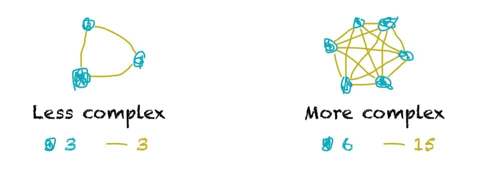

## Finding stability in the modern world of pandemics, AI-disruption, and failing markets

I want to share something that I think will help us all. These are dark times, and there’s a strong chance they may grow darker. May this be a light for others as it has been a light for me and mine. But first, we must set our stage.

---

***Control.***

It’s such a ***human*** idea, isn’t it? One of our *core* needs, you might argue. And yet, of late, it seems to be slipping away faster than we can slip on our custom-printed, designer mask.

Readers, these are trying times for us *all*. COVID is raging. We’ve lost our jobs. Those that haven’t are stuck trying to balance work and kids without school. Since March, we’ve experienced one of the most tumultuous and chaotic market crashes in the history of money. And then there are the hopeful whispers, and blasé, off-handed comments on weekly Zoom calls; “Oh, when things get back to normal, we’ll open things back up again.”

Normal. What a strange word. It kind of implies control, doesn’t it? What is *normal* anyway? Can anybody define this elusive concept?

And now we hear rumors of the “New Normal.” Is the New Normal showing up to a limited capacity restaurant with an obligatory face-mask, greeted with a mandatory dose of potentially [poisonous hand-sanitizer](https://www.fda.gov/drugs/drug-safety-and-availability/fda-updates-hand-sanitizers-methanol), being quietly ushered to a table with a QR code for a menu?

What about our jobs? In April, [~88,300 American truck drivers lost their jobs](https://www.businessinsider.com/trucking-bloodbath-truck-drivers-lost-jobs-april-jobs-report-2020-5). Will the new [Telsa Semi](https://www.tesla.com/semi) replace the backbone of the American economy? Last month, GPT-3 was announced, heralding yet another breakthrough for Open AI, the company founded by Elon and others to create safe AI before it gets out of hand. Even web developers aren’t immune anymore.

Chesapeake Energy, America’s second-largest oil and fracking company [filed for bankruptcy](http://app.quotemedia.com/data/downloadFiling?webmasterId=101533&ref=115098942&type=PDF&symbol=CHK&companyName=Chesapeake+Energy+Corporation&formType=8-K&dateFiled=2020-06-29&CK=895126) on the 28th June (2020), marking it as one of the most prominent pins to drop in the silence of a terrified market. Oil even went to a negative value. Yes, that means people would pay you to take their oil.

Meanwhile, a borderline sociopath (and most certainly an ego-maniac) is running “the greatest country in the world” into the ground. China is [literally creating new islands](https://www.defensenews.com/opinion/commentary/2020/04/17/chinas-island-fortifications-are-a-challenge-to-international-norms/) to gain more influence on the South-China sea. Our beloved tech-giants have grown from enabling us to connect with loved ones, into a very scary and legitimate war-zone on our privacy. They’ve even admitted to [listening to our conversations](https://www.digitaltrends.com/news/facebook-admits-it-was-also-listening-to-your-private-conversations/). Thanks Fuckerberg.

Unemployment in the States is at 14%, a number we haven’t seen since the Great depression. There are talks of second waves of the Coronavirus. Countries are locking down their borders. The climate is warming, and [the sea is rising](https://www.globalchange.gov/browse/indicators/global-sea-level-rise).

---

## Rising complexity - Pandoras Box

*Photo by Anastasia Dulgier @dulgier*

The world is in complete disarray. Chaos has finally caught up to us and peeled back the razor-thin veil of order and sanity that we call “society.” It was always there.

The vast majority of us find “safety” in our perceived abilities to predict, nudge into line, and trim the hairy shrub of possibilities that represents the branches of our future realities. We’ve attempted, for millennia, to contain chaos into a neat little Pandora’s box (read Blue for those who are students of Spiral Dynamics). But it seems that the cat is out of the bag now. Before we find a solution to the chaos in our lives, let’s explore where it comes from, and why it’s increasing.

### Defining complexity
Let us briefly define complexity (though it should be stated this is not an entirely comprehensive capture of this “complex” word. Pun indeed 🙃)

> “A system with multiple agents, dynamically interacting in multiple ways, following *local* rules, and oblivious to any higher-level instructions”
> Steven Johnson: Emergence: The Connected Lives of Ants, Brains, Cities, and Software

**Put simply, complexity emerges when there are lots of things doing their own thing, all interacting with each other, and paying no mind to anything other than what they want.**

Sound familiar?

The 2 factors of complexity are:
1. The number of “things” (Distinction)
2. How many of those “things” are connected/talk to another “thing” (Connection)

Can you think of something that’s connected us more and more in the past few decades? 3 significant technologies come to mind:
- Better airplanes
- Telephones
- The Internet

Compared to a century ago, our actions have more of an effect. Some developers in sunny California can “accidentally” cause a genocide in Myanmar. [This actually happened](https://www.nytimes.com/2018/11/06/technology/myanmar-facebook.html). Why?

From our definition before, “following *local* rules, and oblivious to any higher-level instructions” is an apparent reason for this. Humans were not designed to be cognisant of how our individual actions affect those outside our tribe. We evolved to live with at most 150 people in a band. It’s impossible to consider how, when posting that picture of our overpriced cocktail to Instagram, we will affect someone on the other side of the globe. We just don’t have the mental capacity.

And yet this is what’s happening even day. In a world of hyper-connectivity, hyper-travel, and hyper-communication, no-one is separate. Like the “nodes” of our image above, we touch more lives today than we were designed to. Hence the chaos that has ensued.

## Surfing
Is it clear, now, that we are incapable of determining our future? Sure, we can set goals, work toward building a family, move to a country, and change careers. But can we control the outside factors that are “emerging” (technical word) from the apparent chaos?

This was precisely my situation. I’ve spent the last 2 years trying to move to San Francisco, traveling between 5 different countries in just one year while I wait to live with my wife. Come March (2020), all visa processing was put on hold, and my marriage (long-distance) was put to the test. I’m not the only one.

It’s easy to let this get to us. If we “doom scroll” on the news (designed to evoke an emotional response), and continually hit refresh on [worldmeters.info](https://www.worldometers.info/coronavirus/), is it *really* going to improve our situation? Is knowing the recent antics of Donald Trump actually going to help us deal with life?

> Frodo: “I wish the Ring had never come to me. I wish none of this had happened.”
>
> Gandalf: “So do all who live to see such times, but that is not for them to decide. All we have to decide is what to do with the time that is given to us.”
> – J.R.R. Tolkien, The Lord of the Rings

**Trying to control life and the future is as silly and pointless as trying to stop the waves from crashing up against the shore.** It cannot be done. It *should* not be done.

What if instead of trying to prevent the inevitable, we ***accepted it***, and ***used it***? What if we could “surf” the wave of chaos?

## The Motion of the Ocean
### Go along with the ride

*Photo by Andrzej Kryszpiniuk @kryszpin*

Depending on what you believe, no thing, person, or event is truly “good” or “bad”. These virtues only appear when we compare them against something we are seeking in life.

When we hold a tightly-coupled relationship to a future outcome, we expose ourselves to the anxiety and stress of this not eventuating. That is not (at all) to say we should live without purpose. We should be directed and clear with what we are aiming to achieve in life. But when the game changes, we need to change with it, and so do our ideas of the future. We can hold on to the bitter end (many do), or we can re-calibrate.

What’s dramatically different from the past is the *frequency* of which we need to re-calibrate. [Black Swan Events](https://en.wikipedia.org/wiki/The_Black_Swan:_The_Impact_of_the_Highly_Improbable) are increasing in their occurrence, and this calls for greater flexibility.

### Flexibility
Where I come from, we have a phrase:

> The person with the most behavioral flexibility will have the most impact on the system.

I can’t change that Australia (my home country) has shut down it’s US embassy, preventing me from moving to San Francisco to be with my wife. I complained. I grew livid. I swore. And I got over it. No action from my wife or myself could modify the chaotic nature of pandemic-influenced international regulation.

So, we both looked at the 14 countries an American citizen is allowed to visit (as of Aug 2020). We cross-referenced those with the timezones of our jobs (we work remotely), good internet speeds, safe spaces. We concluded we’d reunite in Mexico City (from where I am writing this). We are currently in the process of redefining what our idea of family will look like. Where to raise our children. Where they can go to school. Are we ok with them being a [“third-culture-kid”](https://www.bbc.com/worklife/article/20161117-third-culture-kids-citizens-of-everywhere-and-nowhere) despite the intense challenges?

---

Surfing these waves is not easy, and I will never pretend it is. It means, often on a daily/weekly basis, re-addressing the core things you hold dear about what you are looking forward to in your life. If you’ve ever taken a surfing lesson, you’ll know you fall off the board; a lot. But this isn’t failure. Failure is when you don’t get back on the board again.

One thing is for sure, and that is this world is not the same as it was 10 years ago and is **DEFINITELY** not what it will be in another 10 years. Nobody can predict the future. Nobody can tell you where to invest, or what country is safe from global warming, or the impending 3rd World War with China. Nobody.

Because that’s not the point. The point is to let go of trying to control what we simply cannot, and ***enjoy what we can***. Perhaps with prolonged, intensive work on ourselves, we may find we’re in a position to influence things. Perhaps not.

### Control -> Flexibility
Allow “flexibility” to enter your *core values* in replacement of “control”. I implore you 🙏. With flexibility comes greater empathy, healthy detachment from definite outcomes, and a deeper sense of happiness, born from a connection to the present moment.

---

We don’t own the future. But we own our experience.

