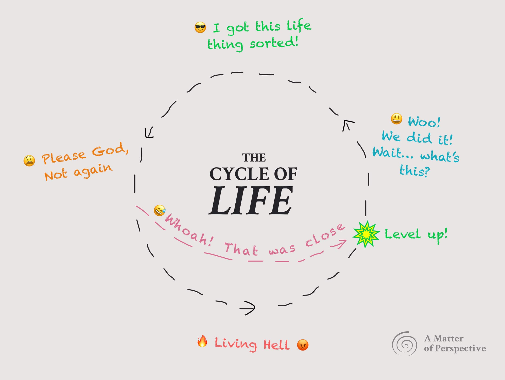
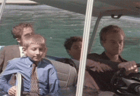
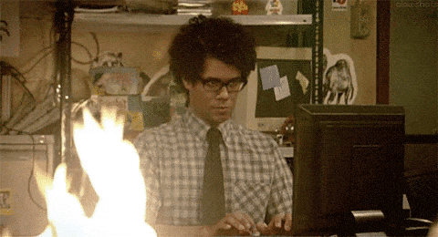
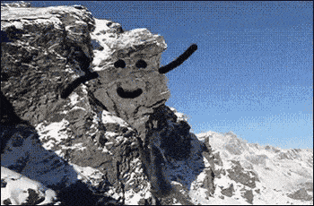
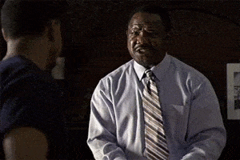
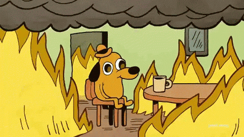
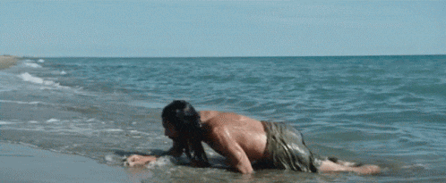
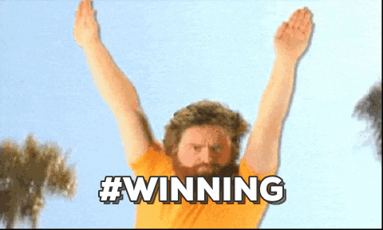

## Or, why life gives you lemons just when you think you’ve got it figured out 🍋

Things seem to go round and round don’t they? Have you ever noticed that we seem to be thrown into the midst of these crazy situations (a new job, country, or a deadly pandemic that forces us to stay home and rewatch old Friends episodes for the 17th time)? And just about when we think we’ve got a handle on things, life (like the big bully it is) comes and kicks over our sandcastle.

## The good times and the bad: Cycles Baby!
Life has ups and downs, for sure. We all know this intrinsically, but seem to forget it. When things are sunny, we turn a blind eye to the blinking fuel light. When things are crap, we fall into a hopeless pit of self-deprecation and “Nietzsche-esque” pessimism. Are we doing something wrong? Why do things turn sour when they’re going oh-so-right? (Hello, America 👋). Turns out there’s a mechanic to this, like many natural processes.

---

Introducing **The Cycle of Life!** (And no, in case you’re wondering, this has nothing to do with the awkward “birds and bee’s” science lesson you got in 10th grade).

Let’s break this down into 5 stages:

1. Alpha Wave: (AKA: 😎 I got this life thing sorted!)
2. Beta Condition: (AKA: 😫 Please God, Not again)
3. Shortcut – Reform option: (AKA: 😅 Whoah! That was close!)
4. Gamma Trap: (AKA: 🔥 Living Hell 😡)
5. Delta Surge: (AKA: 😃 Woo! We did it! Wait… what’s this?)

We go around and around and around… That’s life 🤷‍♀️.

## 1. The Alpha Wave:
### 😎 I got this life thing sorted!

Ahh, life is bliss, right? The **Alpha Wave** is when we are “in sync” with what’s going on. In other words, [our internal matches our external](https://spirals.blog/articles/internal-external/).

As an individual in Alpha, we’ve “got it together”. We’re winning at life. Go you. This might look like someone who has a good job, in a happy relationship and is at peace with where they are. There’s no gloomy rainclouds or fly’s in the butter here.

For companies and organizations, this is a fantastic time for growth. The service/product/team/vision is matched to the niche, and everything is running like a well-oiled machine.

At the societal/governmental level, this is a wonderful time for all involved. The needs of the citizens are met by opportunities and resources.

Humanity is in a state of equilibrium…
Happily ever after. Right…Guys?

Until it’s not.

---

Perhaps you can recall a time when, from your paradise, the storm clouds began to gather on the distant horizon.

“Fear not ye happy citizens! We have food and wine plenty!” Our leaders may call.

“Those are problems for when I’m older!” You might claim, unwilling to accept that the peace is yet again about to be disturbed.

> Leaving Alpha for Beta:\
> Our world appears to be stable, **but it’s not.**

In true Spiral fashion, the solutions for where we are now create more problems. Harder ones. Ain’t life a bitch?

---

## 2. The Beta Condition
### 😫 Please God, Not again

Soon enough, the crack of thunder bellows from above, beckoning change and new types of problems. The Beta Condition is a time of uncertainty, questioning, frustration, and doubt.

“Things just aren’t like they used to be!” Cries the disgruntled hippy, “These Yuppies are knocking down all the trees for shiny condos, and killing our culture! THEY’RE CULTURE KILLERS!”

Perhaps you’ve found yourself thinking, “Something is wrong…but what *is it*?” For example:

- A strained marriage
- Organization is beginning to lose its vital talent and productivity
- That “Netflix and Chill” friend you have has stopped responding to your texts
- People are moving out of the country to look for better work

Oh, what are we to do! More of the same, perhaps? Indeed, this is the mentality many of us adopt when the winds of change begin to howl. After all, it worked so well back in Alpha. Right?

Wrong. We’ll often say things like:
- “Let’s just focus more”
- “Work harder and smarter”
- “We’ve got to purge the negativity”

And so, we put more and more energy into the sinking ship of the old Alpha way of life (system).

For those [studying Spiral Dynamics](spirals.blog/articles/what-is-spiral-dynamics/), here is a little excerpt from *Spiral Dynamics - Mastering Values - Leadership and Changes*:

(If none of this makes any sense, you can skip this ⏩)

#### Beige:
Habitat can no longer support human bands as food becomes more difficult to find.
#### Purple:
Offerings and rituals fail to fend off evil spirits as tribal order beings to collapse.
#### Red:
Have/have-not contract begins to erode as the powerful haves are ‘weighed in the balance and found wanting’.
#### Blue:
The Truth no longer guarantees order, and the future is masked as doubt. Skepticism and new options appear.
#### Orange:
The “good life” is frayed and tarnished by consumptiveness—the search for inner peace flourishes.
#### Green:
Warm, human aspirations wear thin as the realities of complex societal problems, and limited resources are laid bare.
#### Yellow:
Reliance on individual choices and freedom fails to provide the cooperative action necessary for overall survival.

With the good ol’ days behind us, we have two choices. Sit here and pout (which will undoubtedly lead to bigger issues) or look for new solutions.

---

## 3. Shortcut – Reform option
### 😅 Whoah! That was close!

Have you ever almost stood on a snake before someone yelled and screamed at you to watch out? Having a knowledgable environment can save your life. Literally.

As the Beta Conditions grow louder, and the wind blows stronger, a savvy mentor can mean the difference between losing everything and making safe passage to the promised land. Someone who’s “been and done it all before” (and lived to tell the tale) can point out the tiny trap door that briefly presents itself—a pathway out of the Gamma Trap and into the way of solving life’s new problems.

***The name of the game here is “pro-active” rather than “re-active”***

Some examples might include:
- A concerned family holding an “intervention” for someone with alcohol problems
- The CEOs personal coach, who whispers that he needs to look after his staff, lest they find greener pastures
- A wisened business owner, offering advice to the young and reckless entrepreneur

The Reform option lies somewhere on the road to the Gamma Trap, as things stop working. Take it, and you may pass unscathed (mostly) to the next cycle (or color). Ignore it… and you’re in for a rough ride.

If you are unsure of where you might be in the cycle, join our Slack community and ask! We’re here to assist with your existentialism.

<a class="button" style="width: 100%; margin-top: 2rem" href=“https://join.slack.com/t/spiralsblog/shared_invite/zt-h4zmiolw-tCZAYSJn2YNm5bMcvYaoQA”>😫 HAAAALP!</a>

---

## 4. Gamma Trap
### 🔥 Living Hell 😡

Oh, dear. We *were* warned. But we didn’t listen. And now look where we are. The shortcut is gone, the ship has sunk, the storm is here, and we’re kinda screwed.

The **Gamma Trap** is a state of *anger, hopelessness, and desperate revolution*. We become trapped by the barriers we’ve constructed by ignoring the new problems. Often, we enter this stage if we become too attached to a way of life (or color), and refuse to do anything different.

The frustration and confusion of the **Beta Conditions** give way to anger and hostility. The scary thing is:

> Once we’re in **The Gamma Trap**, there is no turning back to how it used to be, yet no place to go.

According to Don Beck and Edward Cowen, “the pain penetrates into the depth of the soul”. Even scarier is this trap can become an entire lifestyle. This is serious business, folks.

Have you ever caught yourself saying or doing any of the following?

- “Damn the torpedoes, full speed ahead!”
- Curling up in a fetal position, preparing one’s self for imminent death
- Sinking into a righteous crusade (My Truth is the only Truth)
- Engaging in some shady shit (blackmail, bribery, lying, etc.)
- Arrogantly questioning everyone else’s motives

Jokes aside, many of us (the author is shuddering at their own examples) posses elements of our lives where we’re stuck in this trap. We refuse to acknowledge there’s a problem with **US** and instead blame the rest of the world.

If you find yourself in this position (and many of us are if we’re honest with ourselves), please consult your local Spiral Wizard, psycho-therapist, shaman, or philosopher.

Did we mention we have a [Slack channel?](https://join.slack.com/t/spiralsblog/shared_invite/zt-h4zmiolw-tCZAYSJn2YNm5bMcvYaoQA)

---

## 5. Delta Surge
### 😃 Woo! We did it! Wait… what’s this?

And we’re out! The barriers of Gamma are broken, and we are free of our problems! Grab the champaign, we are liberated from the –

Hold your horse 🐴, here be dragons.

> Breaking free of the barriers in Gamma, **is not** the same as reaching the next Alpha.

I know it’s tempting. But the yeasty excitement and rapid changes we’re experiencing can quickly disappear. Sometimes, people even return back to Gamma once the party is over!

Slow down, take stock, and tread carefully. The promised land is close, ***but the old behaviors may still persist for some***.

## 6. The New Alpha
### 🥰 Life is sweet, once again

At long last, the world returns to a steady state. The storm has passed, the enemy has retreated, our company is in harmony, and we once again feel at peace.

This is the time to reflect, rebuild, and discover our new powers. The problems we faced are long behind us. We are presented with unexplored wonders, abilities, and opportunities that we unlocked with our perspective shift.

Many believe we have reached the pinnacle. They claim the ultimate stage of human development is here to stay. Beware! By now, we know that this is just the eye of the storm.

Enjoy the balance while it lasts. It may be months, years, or decades. But one thing is for certain, ***life is a cycle***. Like that annoying telemarketer that never stops calling, the storm will return. Keep your heart in the present moment, but your eyes to the horizon.

Cultivate the company of those who have walked your path before you. Their stories are worth their weight in gold.

Be honest with yourself about your problems when they present themselves. It will save you pain down the road.

But most of all, remember to enjoy the ride! An open heart, mind, and eyes will allow us to sail smoothly around the storm. Stay vigilant, readers!

---

These concepts were taken from the wise works of Clare Graves, Don Beck, and Edward Cowen. You can read more about it all [here, in their book.](https://www.amazon.com/Spiral-Dynamics-Mastering-Values-Leadership/dp/1405133562)
