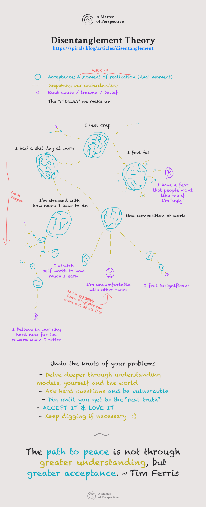
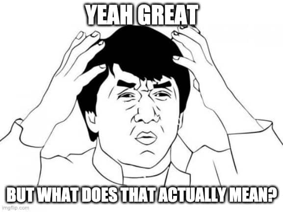
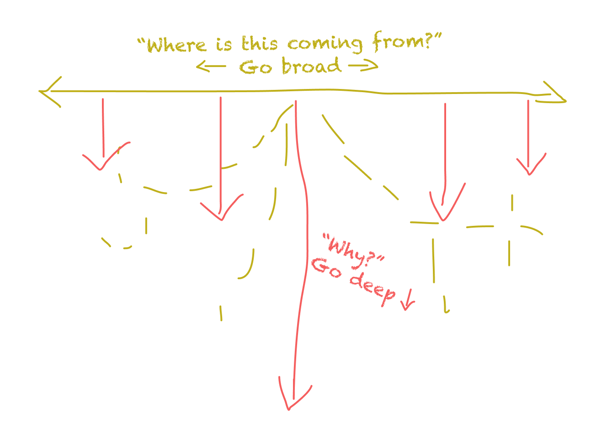

> Author’s note:
> If you’ll permit me, I’d like to try an experimental approach to writing articles than I’m used to. This is a play on an idea that I’m not entirely sure is correct yet. It’s an opinion, it’s in “beta”, and it could be wrong. Thank you for reading.

Think of a problem you have in your life. It could be anything. A turf war at work. Something your partner is doing. Maybe you feel like shit all the fucking time. Perhaps you're lonely, or confused about life, or bored with everything, or feel like nobody understands you or one of ALL the other problems we face. That makes you the same as everyone else. That makes you human.

Just get to the point: [GO TO THE VISUAL 👀](#diagram)

Well, great then. We’re all a LOT more alike than we want to admit. Or, in some cases, know. The truth is, we are all very bloody similar. We’re not that different in what we’re experiencing. We know this because of foreign films. And art. And sad love songs written in every language, that ever existed; ever. The stories and the myths that we all try to live and re-enact in our own lives. All of it. We suffer together. We suffer the same. It might look different on the surface, but humans suffer the same ways everywhere.

So what do we do about it? We’ve all got these “hairy-scaries”. Can we fix them? Can we do something to win the budget at work? Fix our partner? Instantly make ourselves feel better? Sometimes, yes, and sometimes this is a ***very*** bad idea. But what else makes sense to do? **If we’re taking responsibility**, we look inwards, not outwards.

## “I wanted to change the world”
### AKA: “I wanna fix my shit yo”
>  When I was a young man, I wanted to change the world.
>
> I found it was difficult to change the world, so I tried to change my nation.
>
> When I found I couldn’t change the nation, I began to focus on my town. I couldn’t change the town, and as an older man, I tried to change my family.
>
> Now, as an old man, I realize the only thing I can change is myself, and suddenly I realize that if long ago I had changed myself, I could have made an impact on my family. My family and I could have made an impact on our town. Their impact could have changed the nation, and I could indeed have changed the world.
>
> Author: Unknown Monk, 1100 A.D.

## Understanding and acceptance
I propose we may fix our problems in life by:

1. Understanding ourselves and the world
2. Accepting ourselves and the world

These become the two components that make up our exercise. Understanding and accepting. Just the two. Let’s delve deeper.

I heard once on the [Tim Ferris show](https://tim.blog/2020/05/18/jim-dethmer/):

> The path to peace is not through greater understanding but greater acceptance.

If that one was your’s, Tim, then good on ya. That’s a good one.

It got me thinking; **a lot**. As someone who is CONSTANTLY overthinking, I also understand the benefits of and practice regularly, states of awareness - like meditation. This was a much-needed puzzle piece. I wasn’t putting the two together. Tools like Spiral help you understand things, but they *in themselves* don’t bring peace. **We must first understand, then learn to accept what we know to be true.** [Seek first to understand before being understood.](https://www.franklincovey.com/the-7-habits/habit-5.html) Then there comes a time where understanding is limiting you. You’re overthinking it, scrutinizing it too much, and not letting yourself truly “allow” it. We need to accept it.

Like Spiral, this applies to macro and micro. But we’re going to focus on the micro. Us. You. Me. The shit we got goin’ on in our lives.

This is where I came up with an idea that I wanted to share. It’s called Disentanglement.

## Disentanglement
Here are the major ideas:
### 1. The Story

We all bullshit. Don’t pretend you don’t. Unless we’re near enlightened, live 10000% in a place where we’ve transcended personal ego, and kissed the feet of gods - we bullshit.

What’s that mean? It means we tell stories that we *think* are true, maybe even ***believe*** are true; and aren’t.

- “I can’t leave the country because it’s too dangerous”
- “She’ll never like me because I’m too nerdy”
- “I’m not good enough for that job”
- “I feel like shit”
- "\<insert race here\>’s are just here to take our jobs"
- “I need more money”
- “Nobody understands me”
- “Unless my hair looks EXACTLY like this, random people who I don't know will think I'm ugly and I'll feel terrible for the rest of the day and probably end up crying”

Dude.

They’re all stories. Are they objectively true, without a scrap of doubt, undeniably representative of all realities? Probably not. They’re made up of a messy tangle of other stories. And those stories are further messed up balls of crap. And so on, until you reach the thread, then the end of the thread, where things stop – and you discover the truth.

What pains us, what we feel 99% of the time, what we believe is just a mixed-up bunch of other things. All are rolling around and getting more tangled up. **Disentanglement is the process of slowly “un-knotting” all the stories, beliefs, “truths”, customs, etc. until we get to the truth of the matter.**

### 2. Understanding
How do we “disentangle” ourselves? Carefully trace each string until you come to a knot.

Ask questions. Hard ones. Deep ones. *Personal* ones. Ones that hurt. Ones that pierce the vulnerable comfort layer we all got goin’ on and say, “Hey, you’ve got some work to do”

> “Why?”

It’s my favorite question. Why?

Shutup.

“Why” is like a shovel – it digs deeper. *It forces the brain to consider the nature of what we think is the core of something.* Why? Because in order to explain something, you need to know it’s components. And in order to identify the components, you need to “chunk into it”, go further in.

“Why” in the visual context of Disentanglement creates the force to go deeper. It’s your “momentum” if you will. What about direction then?

> “Where is this coming from?”

What are the “things” that make this problem up? If “why” goes deep, “where from” then *"goes broad"*.

There are many other questions you could ask. What can you think of?

### 3. Acceptance

Here is the kicker, and just when you thought all the work was done. You cried or screamed, or sat there in disbelief and yet the most important, hardest part was still coming. Accepting it.

But hold on, this isn’t always what you think. Accepting can be reframing it, seeing it from a different perspective, coming to a realization that you were wrong about someone or something. Accepting can be a beautiful, enlightening, aha moment.

Other times it can be one of the hardest, longest marathons you’ve run. If that’s the case, dig deeper. You’re still entangled. Rinse and repeat.

How do we “accept” something? *“Is this some zen/yoga/meditation bullshit?”* Yeah, kinda.

Acceptance may be a little different from what you’ve experienced before – it comes from understanding deeply. It’s not a blind, “do what you will”, “throw caution to the wind”, “let go of this reality” kind of thing. It’s a **felt empathy** - to all parts of what the situation is. We need the understanding to ***know*** all the pieces. But then we take it a step further and try to, even if for a moment, ***be*** all the pieces.

We integrate all the perspectives into our world view. We take the best of each one, recognizing that no “one thing” is 100% true, and bring it “into us”. It’s a stunning, freeing, feeling that leaves one far more peaceful and lighter.

It often comes about, or results in some kind of “reframe”. Seeing things in a different light can turn your worst enemy into your best friend. Sometimes this is just the shift we needed to “love that part of ourselves” or “really appreciate what the other person was saying”.

Here are some questions/tools to cultivate more acceptance in things:

- “How do I know it’s true?”
- “How many ways do I know it’s NOT true?
- “If there was something about this that was positive, that I’m not yet seeing, what would it be?”
- “If it wasn’t true, how would my life look?”
- “Is this belief mine, or is it something given to me?”
- “What am I protecting right now?”
- “When did I first decide to believe that?”
- “Where do I feel this on my body right now? What’s it doing?”

These questions “loosen” the tangle, allowing you to accept something (a root cause or belief) or go deeper into it.

Sometimes you’ll uncover something so powerful it knocks you on your ass. Literally. These might be the “end of the thread” kinda realizations. They can feel incredible, and they can feel terrible. But they’re often very intense. Not always, of course, but often. **It’s the difference between an “Aha!”, and an “Ohhhhhh fuck…”**

They’re regularly the root cause of something. Something that happened a long time ago, usually in the imprint period (0~7 years old). A defensive mechanism, a way of handling a problem that you never bothered to change, an automatic behavior. There are thousands and thousands of these. Some work for us, some don’t.

## The Path to Peace

Disentanglement Theory is an attempt to get to the bottom of things, The ***real*** bottom, and then heal it. It requires courage, patience, empathy, love, strength, and intuition. It builds emotional intelligence, your sense of love for yourself and the world, deeper happiness, and a generally pretty chillin’ vibe. It’s sweet.

As always, I would love to know your thoughts. After all, no idea is entirely true, right?

---

I will end this with a quote from Gandhi on the matter.

> “There is no path to peace - Peace is the path.”
> ~ Mahatma Gandhi
