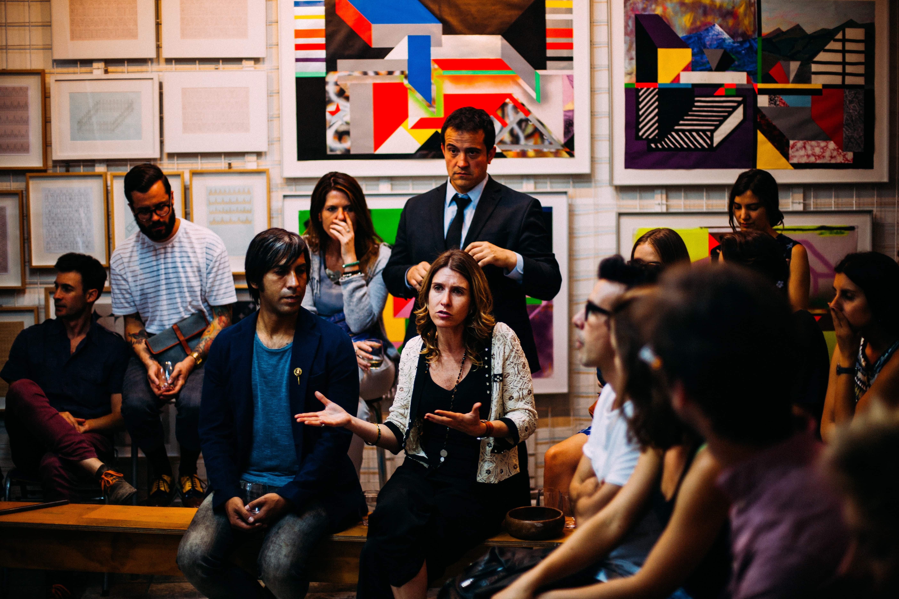

Green represents the “sixth stage” of human existence. If you’re new to Spiral, please first read:
- [What is Spiral Dynamics](https://spirals.blog/articles/what-is-spiral-dynamics/)
- [Beginning in Beige](https://spirals.blog/articles/beige-introduction/)
- [Progressing to Purple](https://spirals.blog/articles/purple-introduction/)
- [Rising to Red](https://spirals.blog/articles/red-introduction/)
- [Believing in Blue](https://spirals.blog/articles/blue-introduction/)
- [Out-performing in Orange](https://spirals.blog/articles/orange-introduction/)

It's highly encouraged you read these before this article. Thanks!

Hey fellow human ✌️, I’m stoked you’re here. Thanks for joining us. The time has come for us to let go for a moment, center ourselves, and breathe. Just breathe. You know? We’re going to go on a journey today. Together.

You see, some things have changed since [our last article](https://spirals.blog/articles/orange-introduction). A lot actually. Let me explain.

That Orange stuff was pretty intense. We did it for a while, maybe even got good at it, and ran into some problems (like every color really). We had the riches, private jet, food, experiences, and anything else that money could buy. Or so we thought. Turns out, we can’t buy happiness.

You see, what happened is we started pissing people off. And hurting people. Not always intentionally, of course, but Orange has this tendency to never stop you see. It just keeps going and going and going… This became a problem. It is not only in our personal lives (late nights at work away from our partners, constant challenging of those around us, and a bit of an ego trip if we’re honest) but also at a more systemic level. We exploited communities, countries, movements, governments, laws, you name it — anything we could do to get ahead. We weren’t evil per se, just a little self-absorbed, so to speak. You with me?

---

## Leaving Orange - The Good Guy/Gal

*Photo by Johnathan Kaufman @j_photos357*

We had SO much that we became wasteful. We still are a bit. We became so focused on OUR success that we forgot about everyone else’s. As our eyes were opened to how our actions were affecting others (akin to how Red affected Purple), we rediscovered a part of our humanity lost in the competitive arena of Orange.

This awakening is often unpleasant for those who move through it. We become more conscious of feelings (not something a pure Orange really cares for) and how much we’ve neglected them in ourselves and others. If we’re still pulled by the allures of Orange, we often get very good at managing appearances at this point. We ***want*** to be the better person, but we’re honestly still pulled or fueled by the Orange perspective. Think of, for example, the “ethical attempts” of individuals or companies who “try” to care about the environment, but really they’re just doing it to manage perceptions. We get it. It’s not an easy transition.

Sometimes, the warmth and peacefulness of our newfound Green can be jerked back suddenly. As we tiptoe out of the shiny world of material success and status into a more human, centered, and equal playing field, the Orange perspective often fights us. It becomes a war in our heads as we toss-up between working towards our goals and remembering to help those who need us most. After all, do you really need that extra bonus at work? Someone else probably needs your help more.

While we’re transitioning, Orange will wake up to the importance of others in achieving our objectives. It will use people, not necessarily in a nefarious way, so that we all benefit. In moments of clarity, we aspire to be the “Good Guy/Gal,” but we still have work to do on our authenticity. And others can see this too.

> Is this all there is?

Ultimately, if we become successful at Orange, we often don’t feel acceptance from others. Maybe our tactics were slightly unethical. Perhaps we disregarded others’ needs or time to make room for our own ambitions. Or it could also be that we earn more in a month than others do in a lifetime 🤷‍♂️. Either way, something has to change.

## Entering Green: Journey to the center

*Photo by John Towner @heytowner*

Over time, if our life conditions adjust, achievement gives way to emotion. We recognize we don’t need all the crap we’ve accumulated (It doesn’t really make us happier anyway). We start treating people as humans. Our own humanity is re-presented to us. Once again, the great pendulum of Spiral swings from “I” (express-self) to “We” (sacrifice-self).

The road bends away from the brightly-lit, flashy, boulevard, and steers into a calm forest. Since we’re not competing with everyone so much, we now have a chance to really understand who and why they are. The need for status drops away, rendering us all human. All equal. All deserving of love and rights and community.

The artificial divisions we constructed and clung to in Blue and Orange soon feel isolating and cold. With our new Green appreciation for harmony and acceptance, we tear down these “unnecessary” walls and bring everyone into the same space. Everyone is welcome. As long as you agree with our values.

With our excessive array of physical possessions sold, our corporate jobs on the back seat, and a new desire for connection on our minds, our spirituality is re-awoken. Maybe we even move to an ashram or commune for the hardcore Green’s amongst us 🙂. We begin the quest to find our center, exploring the inner beings of ourselves and others.

The future and the past drop away, and we are left with…now. You speak to most Green’s, ask them what’s important about life, and they’ll tell you it’s about being present. Many experiment with vegetarianism/veganism, horrified by these new feelings and how they pertain to the meat/dairy industry. Maybe we take up yoga or meditation. We get into nature more as it just feels *so much* better to be amongst the earth, the animals, and the fresh air. The smog-ridden rat race feels unimportant to us now. “Why was it ever?” We think.

Some typical Green behaviors, beliefs, thoughts, and concepts:
- A deep concern for our earth, climate change, and conservation of nature
- Refreshment of spirituality, and a desire to “reach out and touch the universe”
- Political correctness
- Energy and enthusiasm for ***cooperative*** ventures
- Lack of interest in materialism, the Man/Establishment, advertising, and the Blue or Orange Narrative
- “Peace and love, man”
- Listening intently to others

## A cultural awakening

*Photo by Sorasak @boontohhgraphy*

Interestingly, perspective **before** Green is not always the most accepting of other cultures. Purple often feels threatened by stark contrast, Red wants to explore and conquer it, but not understand it. Blue is disapproving of anything that doesn’t fit its Truth, and for Orange, much of the time, it’s about how many likes the Instagram photo of Phi Phi Island gets.

Green has done away with all the material success, comparing, dogma, rules, and fears of difference that other colors may posses. Everyone is equal and important. Being you a CEO of an international conglomerate, or a Mexican street-food vendor, each person’s story needs to be heard. That is the beauty of Green. There is a space for everyone (mostly).

Many Green’s (if they’ve solved enough of the Blue or Orange problem and have enough money) LOVE to travel. If you’ve ever met a young grasshopper, with stars in their eyes, joining a volunteering cause, learning yoga in Bali or India, or just wanting to “connect with other ways of life” – there’s a decent bet they’re fueled by a Green appreciation for the world.

Where this becomes unhealthy is if those preaching peace, love, and giving up the nine-to-five have not yet solved the problems of where they’re at. If you can’t afford to quit your job, you’re not helping the world in the long run. No matter how many endangered creatures you save. Eventually, you will end up running out of resources, and someone (often our parents or friends) will have to support us while we re-address our negative “moving-away-from” Blue or Orange. In short, **solve your own problems before trying to solve the worlds.**

## Rise of the minorities

*Photo by Sharon McCutcheon @sharonmccutcheon*

Green’s love for all is not limited to just culture. It will stand up for anyone it feels is underrepresented, or oppressed by dogma, greed, and unjust treatment. Green is the liberating force. The social justice. The White Knight. The activist. The human rights advocate.

This opposition to the Blue/Orange establishment is an important one; when done correctly and for the right reasons. The women’s movement of the 60s, the airing-out of America’s systemic racism during 2020, protection, and preservation of important natural ecosystems and areas – they all have a powerful and dramatic impact on how we live our lives. If it wasn’t for Green, Orange would continue to exploit and outsmart others, and Blue would be fixed in it’s box forever.

As you might have guessed, Green’s causes are often twisted by Blue. They become hijacked by those who do not see the real intent, and turn essential movements into “isms” – losing all the original love of it’s Green originator, and becoming a rule-based, check-the-box, “belief”.

To risk saying something incredibly controversial, why is it only “**Black** Live’s Matter” in 2020? Why isn’t it “***ALL*** Lives Matter”? Are there not other oppressed groups and races worth standing up for? When we choose “our” cause, we neglect the true purpose of many of these movements. We are ALL human. We are ALL living souls (animals included) that abide on this earth. We ALL belong.

At a business/organizational level, many are now choosing to update their policies to foster a more diverse and fair workplace. This is an **EXCELLENT** thing! (Especially considering our history) However, when this is translated into a Blue process, it loses its power entirely. Ever heard of a “diversity hire”? When Blue takes control of the process, they will seek out and hire purely to check the box with very little consideration of who they’re hiring, and how they think. True diversity, true equality means **equal opportunity**. Not equal numbers.

## Harmony: The Language of Green

*Photo by Louis Hansel @shotsoflouis @louishansel*

Healthy Green communicates with sincere warmth and authenticity. They make for fantastic listeners, passionate lovers, and when coupled with other colors, excellent leaders.

A Green’s spirit is lifted by sharing positive vibes. Bringing others into the fold, hearing new stories, and communicating with a kindness and openness not found previously. A Green seeks to harmonize.

This is the guiding principle of how Green organizes itself into communities and groups. Green’s relativistic (meaning the truth is relative to the individual) perspective produces a “consensus-based” style of coming to decisions as a group. Everyone must be heard, feelings must be voiced, and we all must agree. Together. The authority in Green lies in the group, not externally. This means there is no need to compete, and comparisons between ourselves (👀 Orange) become irrelevant. We’re all in this together.

> Blue stands up for its beliefs. Orange enjoys debating to win. Green builds consensus to enhance feelings of inclusion in the group.

Green often has very high levels of interpersonal abilities. Warm and harmonious interaction is integral to it’s self-satisfaction. Put simply, you feel happy when you’re making others happy and will go at great lengths to do so. This is the crux of Green’s biggest issue – but we’ll get to that a bit later.

---

## Green’s Perspective: Relativism

*Photo by Louis Hansel @shotsoflouis @louishansel*

### We’re *ALL* right
With Green’s new social superpowers, it re-addresses two major concepts learned earlier.

- Blue’s “we have the Truth” 👉 Green’s criticizing of rigid boundaries/dogma.
- Orange’s “tried-and-true” experience 👉 others stories and perspectives

These shifts give way to an epiphany.

> If I’m not 100% right, and neither is the higher power, perhaps we all are!

This becomes the driving force behind Green seeking out authentic relating and genuine connection. It’s also why it defends everyone. To a Green, it’s all subjective, and we have a right to think what we want.

The issue with extreme relativity is concrete decisions are difficult to make as others enter the equation. We’ll address this more below.

### Are you with us?
There’s only one thing that Green is harshly judgmental of. Judgementalism. Kind of ironic, right 😅? Green will include anyone and tolerate anyone, **as long as they agree to do the same**.

Blue sorts “horizontally,” so to speak, dissecting the world into groups with an overarching “Us vs. Them”. Conversely, Orange sorts “vertically”; it doesn’t matter where you come from, rather where you are in the hierarchy. Green does away with sorting and lumps everyone into the same group. It’s incredibly inclusive.

There’s a caveat, however. Green will only include you if you share in the experience, embrace diversity and openness, and contribute and share your resources. Don’t do this, and you fall subject to collective guilt, emotional manipulation, and many “holier-than-thou” attempts of social conditioning. Like colors before, Green is still quite judgmental. It believes it has the answer to life.

As Green intensifies, so too does the desire to level hierarchy and status. Taken too far, this idea can turn companies and organizations into “Flat Land”. A place of no hierarchy, no order, and ironically, no diversity.

---

## Spirituality - Green’s Quest of Enlightenment

*Photo by Kaylee Garrett @realkayls*

With emotions, community, and humanity now at the forefront of a Green’s mind, spirituality rises as a focus for many. With the harshness of Orange behind us, we journey back to our core selves and what it means to be human.

The scientific, analytic perspective of Orange gives way to metaphysics and emotions. We foray into experimentation with mind-altering drugs, deep meditation, breathwork, circling, yoga, and rediscover many “ancient Purple rituals. Of course, there are a multitude of other activities that promise the awakening of your Chakras, balancing your energy, and other various spiritual objectives.

Commonly, Green’s dis-interest in materialism leads them to renounce much of their life and possessions to pursue a simpler existence. This is witnessed consistently in many eastern spiritual practices, wherein an aspiring monk or guru will forgo much of life pleasures to connect with what they feel really matters; the human mind, body, and spirit.

Taken too far (as it so very often is), these activities lead one to become sanctimonious. We think we’re better somehow. Somewhere along the way towards “self-actualization” we convince ourselves that we’ve somehow entered a higher consciousness. **Many Green’s think they’re Turquoise**, but they’re kidding themselves. Sadly, much of Green seems currently pre-disposed for this style of thought.

This is dangerous and unhealthy as, more often than not, these individuals believe that they have experienced or “reached” something others have not. If you have yet to “connect and be one with the universe” then there is something wrong, and you need to be “fixed”. Needless to say, if you happen to bump into one of these disillusioned, “woke”, travelers, it can be a little unsettling.

All that aside, Green’s re-focus on deep healing, healthy introspection, self-acceptance, meditation, and healthy mind/body brings a joyous and much needed breathe of fresh air to this point of the Spiral.

## Getting out of hand: Green’s Problems

*Photo by Antenna @antenna*

Ok, we’ll admit it, there’s a few problems with Green. Despite its fuzziness and inclusivity, like every color, it introduces new issues when something becomes too overactive. For Green, it can be extremely challenging to admit to some of these as it prides itself on its consideration of others’ feelings.

### Collective Guilt
Green has a tendency to feel guilt from its past Orange/Blue life. It can become uncomfortable when the topic of how they became successful (both individually or culturally) and due to it’s empathy, push others to follow the same path. This often becomes dogmatic.

Communally, this can become an incredibly powerful limiter to ideas and freedom of expression (especially from other colors). There’s often a “Go along to get along” attitude. We become so aware, deeply felt, of others and their pains that we take them on as our own. Some take this further and feel they are somehow responsible.

Sometimes, the pressures of caring can be overwhelming. A healthy Green knows when to stop and look after themselves. And yes, this is hard.

### Too offended
In their open-source policy document for contributing, Microsoft has stated that:

> “Even a single person being offended is one too many”

Green’s quest for making everyone comfortable is plain impractical when taken to a larger scale. In its attempts of inclusivity, it becomes so rigid, so afraid of offending or triggering someone, that it dilutes the entire experience for everyone involved.

The reality is that any decision you make (especially at a product, government, or leadership level) will rub someone the wrong way. The work should not be placed in just reducing “offensive” concepts and training and helping others become more tolerant. This would resolve many of Green’s problems.

### We can be anything we choose
Until you can’t. Let me explain.

You’ll often hear (or feel) an Orange say:
“I am far superior to you”

Green shifts this into:
“Any one of us can be anything we choose”

In our typical Green fashion, we create space for anyone to be whomever they chose. The reality is, we all have ***very real*** limitations and capacities (something Yellow emerges to deal with). Despite how much you *want* to be something, sometimes you just can’t. Our range of possibilities, especially when it comes to Spiral, is directly proportional to our life conditions. What have we been exposed to?

If you’ve never lived through an solved the problems of Blue, Orange, Green, then reached the limitations of all these, shifted into tier 2 thinking, spent YEARS of your life trying to fix things there, and then encountering THOSE issues, Turquoise won’t make sense. It doesn’t matter how many meditation and yoga retreats you’ve been to. We simply cannot understand perspective beyond our current level of thinking. We may *think* we can, but this is only experiential. It is not, as ancient India referred to as “sati”, an *experiential knowing*. Sorry.

### Too slow
As mentioned earlier, Green’s authority comes from the group. The decisions often must be unanimous. For this to happen, everyone must come to the same conclusion. For those who have experienced this, it is akin to herding cats.

Fundamentally, the issue with much of Green’s leadership is due to the underpinning belief that:

> Harmony leads to productivity

This simply is not true. While harmony is a noble value and objective of many a team, are we truly aware of what it will take to achieve the elusive “harmony”?

Anyone who has worked on the board of a non-profit, inside any social endeavor, or within volunteering organizations, will have had the same experience.

1. An idea is presented
2. It is discussed, and everyone’s opinions and concerns are voiced
3. The idea is concluded to need more work, and another meeting is scheduled to address these issues
4. Next month, a new person is on the team, and when the improved idea is revealed, they also take issue, but with something else.
5. Rinse and repeat for months. Sometimes years.
6. Maybe, just maybe, we will come to a conclusion.

Sadly, this is how much of Green operates. Everyone has the opportunity to speak and contribute. It’s very well-intentioned, but it fails to realize that the whole time they spent calmly deliberating if they should spend the investor’s money on a new marketing campaign, the competition had already beat them to market.

---

## Beyond collectivism

*Photo by NASA @nasa*

The efficacy of consensus, equal say for everyone, and suppression of individuality (hello Purple and Blue) can take its toll on some. If it’s not yet apparent, Green’s caring intentions have yet to manifest any *actual* change to some of the world’s biggest looming problems. Perhaps Green is not equipped to deal with them.

Personally, the author has felt that Green has some of the most important messages in the world, with no ability to actuate anything substantial. Equality, global warming, racism, free speech, human rights, the list goes on. Despite Green’s plea at their rallies and policy sessions, they seem entirely incapable of achieving any real difference.

*Why?*

Complexity. A topic for the next time.

Thanks for reading, friend.
