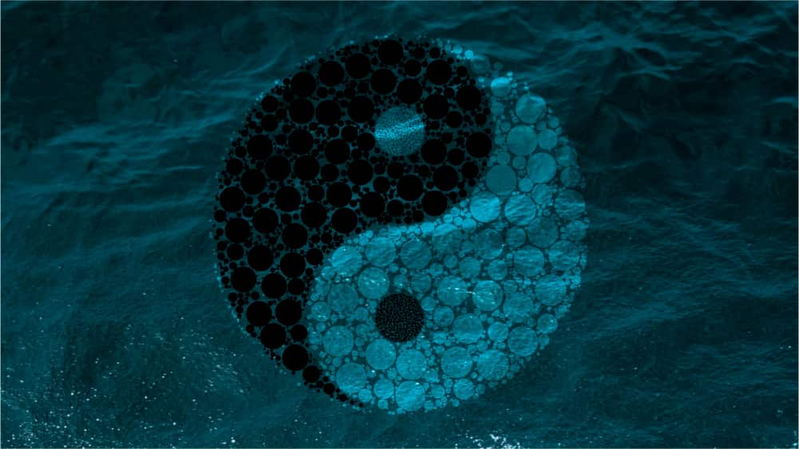

## The Great Pendulum
If you’ve studied Spiral Dynamics for long enough, you may have noticed that a pattern forms between the colors. Beige looks out for itself, and Purple looks out for the tribe/family/friends. Red looks for glory and significance and Blue looks to sacrifice itself for a higher power (organization, nation, religion, etc.). Orange does whatever it can to be the best and look good doing it, only for Green to forget it all and only looks out for the world. And so on…

What can we notice in the above? Is there anything that stands out particularly around the intentions of each of these? If you think about it hard enough, you may notice it shifts from thinking about “Me!” vs. thinking about “Us.” It moves back and forth between the expression of the individual and the sacrifice to the collective. Combined with increasing complexity, this oscillation is what creates the “Spiral” in Spiral Dynamics.

## Warm and Cool
Generally speaking, we divide each stage of Spiral into either “cool,” representing the “We/Collective/Sacrifice-self” perspective, or “warm” for the “I/Individual/Express-self” perspective.

### “Cooler/Feminine” colors
- Purple: Sacrifice self for the tribe
- Blue: Sacrifice self for society/god/ideal
- Green: Sacrifice self for the world/environment
- Turquoise: Sacrifice self for the collective consciousness
- ???

### “Warmer/Masculine” colors
- Beige: Express self to survive
- Red: Express self for power/significance
- Orange: Express self to win
- Yellow: Express self without harming others
- ???

The distinction between these two modes of operating becomes clear when laid out like this. The “I” intentions seek to express themselves, discover new things, shatter barriers set by others, and overcome obstacles. “We” tends to harmonize with the group, creating order and structure, and wholeheartedly attempts to put the group’s interests before its own.

**Which is right or wrong?**

For the astute student of Spiral, we know that this question doesn’t apply. Self-expression and Self-sacrifice form two sides of the same coin – Yin and Yang. We cannot live in a society with only self-expression as nobody would collaborate, and nothing would get done. Conversely, a world where everyone self-sacrificed would not last long as nobody would break the status-quo or discover anything new. The “I” and the “We” form a sacred relationship underlying many natural patterns we see in the world around us.

## Why does this occur?
The pendulum pattern emerges from how “I” and “We” solve problems in fundamentally different ways.

### Shift into “I”
“I” individuals and societies are driven by a strong desire to “break-out” of their current reality. They are often the people in an organization trying to find a novel way to approach something. A culture focused on “freedom of expression”. A movement oriented to moving the world forwards. A great example of this is the Purple -> Red transition.

After living in Purple for a period, some realize (some never do) there is a whole world out there. They discover that the weekly rain dances the shaman involves everyone in are not working, but the tribe down near the river has unlimited water. So, they venture outside of Purple, taking further risks and journeys each time. The “Entering Red” becomes known for their bravery, courage, and sense of adventure. Not to mention they solved the tribe’s water problem. Over time, they find they enjoy this newfound attention, partaking more dangerous/adventurous/bigger things to impress more people around them. The Purple tribe looks up to these new Reds as leaders and protectors (Red protects Purple in many ways), and thus the Chief/Warlord/Shaman/Warrior is born.

The Red seeks (from sheer boredom, or external conditions like a warring neighbor) to do more. The safety Purple creates frees up mental space for Red to think about other things. Living in a community where everyone is part of a whole is excellent, but an “I” will feel left out if they don’t have room for themselves. This cognitive dissonance creates a mechanic that pushes the individual away from the collective, thus creating a new color.

---

### Shift into “We”

How does this process look going the other way? “We” individuals or groups are motivated by the needs of the many. Cooler colors align themselves to ideas/movements/deities larger than themselves and bind others to their cause. We see this manifested in the diligent company worker who works away at whatever task given to him, in the name of the company (Blue). The caring mother who would, without a seconds hesitation, forgo her dinner so that her children might eat (Purple). An activist who *refuses* to unchain herself from the tree because, for her, the forest the Orange wants to cut down is home to thousands of animals. Without her, they have no voice.

Let’s look at an example of a Red -> Blue transition to illustrate a shift from “I” to “We”. A man on a small island in Central America loved snorkeling. He formed a small business, specializing in adventure travel. He would take curious tourists out on boats to go snorkeling. All was well for many years, and his company grew in popularity. What started as a way for the owner to “get paid doing what he loved” soon started getting out of hand. He had no accounting system, no-one at the store to greet customers when he was out on the water and didn’t comprehend the legal implications of what he was doing. After an intimidating letter from the taxman, he decided to enlist the help of his other friends in the business.

Things got very complicated very quickly. He had to train up his new employees on how to correctly use the snorkeling equipment,  safety instructions, the accountant was asking him for receipts from 2 years ago, and everyone had questions. After a few months, he barely had any time himself to do what he loved; go snorkeling. The business was booming, reviews were rolling in on travel blogs, his employees were working towards his idea, and yet somehow he felt he’d made a mistake.

Blue is an excellent solution to solving the chaos that Red can create. As we saw in the example above, some are not quite ready for a transition (perhaps you’ve witnessed this in yourself or someone close to you). Cooler colors step in to “organize the mess” that the “I”  ’s create. “We” will standardize, harmonize, and attempt to get everyone and everything on the same page. In “We” all of us sacrifice ourselves for something more meaningful than any one of us individually. We work towards the same goal/idea. Theoretically.

## More transitions
In this article, we briefly looked at the Purple -> Red (“We” to “I”) and Red -> Blue (“I” to “We”) transitions, but there are many more! Spiral is non-linear, meaning that individuals/groups don’t necessarily move from Purple to Red, then Red to Blue, Blue to Orange, and so on. It is entirely plausible for a Purple to shift into Orange, Green into Purple, and Red into Green. Any shift between colors will create a transition, massively transforming the values, behaviors, beliefs, etc. of anyone involved.

Knowing all this, perhaps you can view some of your transitions, looking back on your life. Was it a shift from traveling the world to settling down and getting a job (Red -> Blue)? Maybe you grew up in an overly religious family and decided, as soon as you were able, to leave home and move to a fun city (Blue -> Red). For some, it might have looked like quitting your stable job and throwing caution to the wind for an entrepreneurial venture (Blue -> Orange). Whatever the case, studying our personal history can provide valuable insights into our structures and Spiral Dynamics as a whole.

Next time you experience someone/thing operating a little differently to how YOU would handle the situation, stop, and think. “What’s their intention?”. If you’re more “I”, embracing the power of your group can give you much-needed feedback on how you’re behaving. If you tend to more “We”, the self-expressive perspectives can assist in making you feel more confident, creative, and assertive.

Like all good things in life, the “I/We” dichotomy is about balance. To simplify, too much I and you’ll piss people off; too much “We” and you’ll get walked over. Striking a balance between these two opposing forces (that live in all of us), will shape you into a well-rounded person, capable of dealing with more situations and people. We naturally tend to one or the other, and working to even these out can have life-changing effects.

So what are you waiting for? Studying Spiral doesn’t end when the article does. It begins when we apply it to ourselves. What side of the coin do we find ourselves on? How can we balance between self-expression and self-sacrifice even further?

Where on your Spiral do you need to work?

*Cover photo by [Paul Wainwright](http://www.paulwainwrightphotography.com/)*
