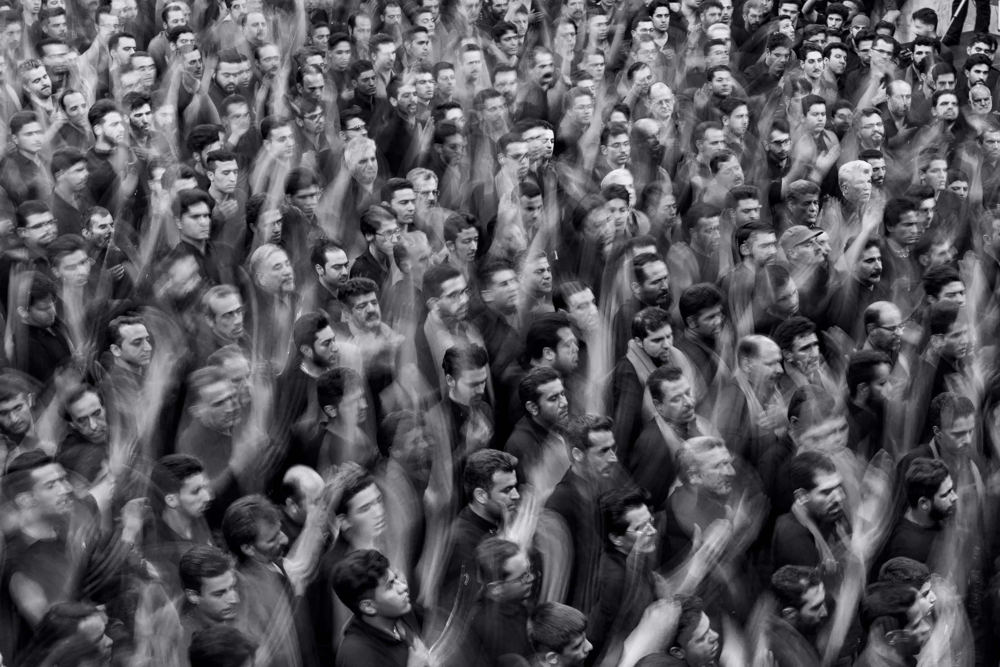
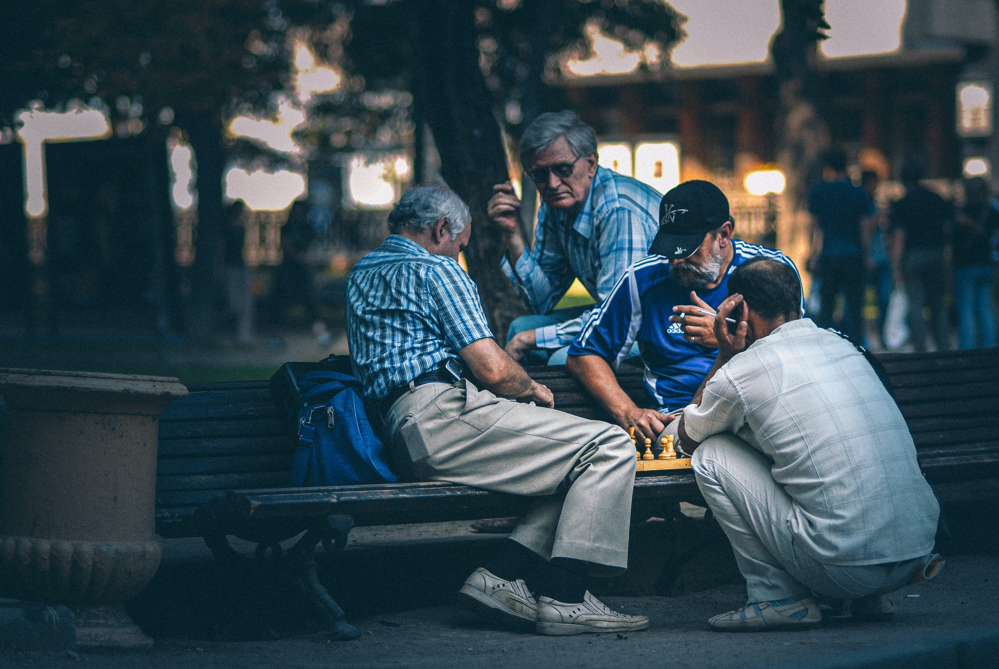
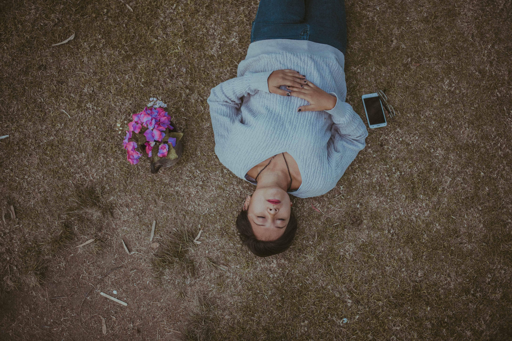
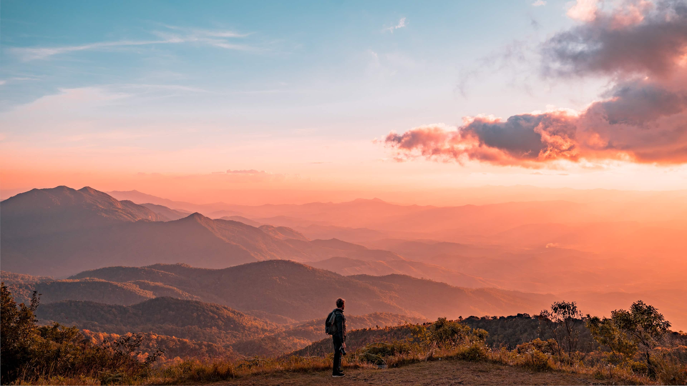

## The Inside & the Outside
There are two worlds for all of us. Every single human being on the planet, every sentient creature experiences two realities; the inner and the outer. Inside of us lives our thoughts, our feelings, our ideas, and our beliefs. The other expands out around us, the chaotic plane of existence in which we all live. Sometimes these two worlds are at odds, and other times they live in harmony. The choice is often ours.

Where I come from, one asked, "Does the internal match the external?" In other words, does the world around you agree with who you are, and do you agree with the world?

Do ***you*** agree with the same way of solving life as the people around you? Or not? For some, they live in absolute, content, accordance with everything that's going on around them.
- A Purple stay-at-home-mother of 7, living on a small island of the Philippines
- A Purple/Red college-dropout bar-tender, hopping from job to job in the South American jungle and beaches.
- It could be a Blue, living in a heavily Blue country like modern Iran or Australia, adhering to all laws and customs.
- An Orange/Red, living large in Wall Street, and loving it.
- Or, a Green, post-punk, vegan, nude painter living in a small art studio in Berlin.

For others, they are NOT content with the world around them, and either move somewhere else that agrees with them, turn it upside down, or, in some incredibly sad cases, give up.
- A Blue/Green protesting on the streets of Seattle, feeling a sense of justice was finally served to the police.
- A union of workers teaming up together to fight "The Man" for more equal wages.
- Teenage kids rebelling in school because "Fuck the teachers; that's why."
- An entrepreneur leaving the small town in India to pursue his ideas in Silicon Valley.

## What can we do about it?

*Photo by Sasan Rashtipour @srashtipour*

Perhaps you may find yourself in a similar position to one of the above. Maybe it's not all of your life, but just one area. Have you ever felt out of place at your job or in a relationship? Traveled to a country that REALLY didn't agree with you or your values? Before we go assuming that we ***should*** leave because *"OUR perspective is correct"*, we should stop – and consider the idea that perhaps we are running from something.

This was the case in my own life. Around 18 years old, I "woke up" to what I thought the Blue narrative was. Blue meant, "Growing into an adult, getting a good education, a job, a mortgage, kids, fat, then divorcing only to die" Nope, not for me, thanks. I quit everything, left my fancy dual degree in Business Management and IT, resigned from the industry job that I'd "proudly started right out of high school," and said goodbye to my girlfriend at the time. Simply put, I was running the hell away from Blue.

I decided that a good thing to do would be *anything* that wasn't what was before, so I booked a ticket to Spain to volunteer in meditation centers, with $4000 to my name and not a whiff of a plan. I told everyone I had no idea when I was coming back. I'd convinced myself that I could somehow solve the world's problems by meditating and giving my time to a worthy cause. I was out of perspective; big time.

## Get into perspective before making ANY changes

> **You might be wrong.**

It's hard for us to admit, but we often are, and we need to accept it. It does not have to be confronting, however, and this is where [our environment comes in](https://spirals.blog/articles/building-environment/).

Bring people you trust and who know you well into your circle. Get them up to speed, and identify any filters that THEY might have in the moment as well. Explain your circumstance, where and who you feel you are, and the context. Listen intently to their responses, and study the intentions of what each person says, and what they think. If they know colors (which makes things MUCH more straightforward), we might choose to communicate certain aspects through this lens and focus on [the structure, not the content](https://spirals.blog/articles/building-environment/).

*Photo by Egor Myznik @vonshnauzer*

More often than not, you'll see something else, something in what someone said, or felt, or the light in which they saw the conditions, and a part of how you see things… changes. A new piece of information you didn't see before. For some, this novel perspective poses such a threat to our current way of viewing life or the situation, that we reject it, attack it, or deny it entirely. We feel the pain of changing "everything else" is larger than the pain of ignoring it or fighting it – **a cause of much unnecessary suffering.**

But if we are [Open, not arrested or closed](https://spirals.blog/articles/open-arrested-closed/), practice taking other perspectives often (as an art form), and we listened attentively enough, we might decide to shift, perhaps "integrate" this perspective into our own. If we feel safe to do so, we'll take on the contrary idea if we think it truly is a beneficial decision (so we should ensure our environment is ALSO in perspective).

## What if there *genuinely* is a mismatch? Should I change or just accept where I am?
The answer is, as always, it depends. Which has healthier colors? Do you possess a "moving away from Blue" (like in my situation)? Is there an aversion to Purple, Red, or any color? Look into why.

Is it due to pushing away that "old" way of solving things? Or do you acknowledge/understand how some parts of it work but need some new tools for addressing those new problems you've started experiencing?
These are two very different cases. One is rejecting part of ourselves or the world's perspective, and the other is integrating it, but moving onto other things.

Determining this distinction is often impossible to do alone, so enlisting the perspective of your environment can dramatically aid this process. ***Be vulnerable, ask questions, and be honest***. Fail fast and fail often; this puts us in a healthier perspective to know ourselves, what we ***really*** want in life, and who we want with us on the journey.

### If you can; change it slowly.

*Photo by Cristian Newman @cristian_newman*

Sometimes this is not possible (such as jumping into a new country), but often it can be.
- Instead of just "quitting your job" for that business idea (because you're sick of being told what to do), "grind it as a side hustle" until it makes enough to live on *(Stay in Blue and integrate it before jumping into Orange)*.
- Rather than leaving the relationship because you're scared of getting too close because you were hurt before, hold on for just a little longer to explore the feeling and where it might lead. *(Healing our Purple, explore being vulnerable; instead of "defending ourselves" in unhealthy Red)*
- Do you need to leave your company of 20 years, overburdened with the stress, pressures, criticisms, and pain you might be feeling, to buy that sports car you've always wanted? Or could you possibly take up a few hobbies, go to a Meetup or two, and spend more time outside? (Not shifting too dramatically into Red after a long stint of Blue - a typical midlife crisis)

These are just a few examples of the millions that happen every day. Taking time to slow down and think about what's going on for us and around us can prevent some big mistakes.

## What if I feel great where I am? Do I/We *need* to change?
No. Not unless you want to introduce more complexity into your life, which is not as glamorous as it sounds. Sometimes this is necessary, such as an invading country that is bringing a new perspective. Or a novel technology like the internet, which dramatically changes everything around it without our choice in the matter.

Seeking out a deliberate change can be a dangerous endeavor. Especially if we don't have the supporting environment to guide us to the "new world" we are seeking. It can be useful if done correctly (not running from our shadows) and for the right reasons (solving a new type of problem), but we must apply the utmost care and precision to the transition.

## As Above, So Below
[So where are you at?](https://spirals.blog/articles/getting-to-know-your-own-perspective-part-1/) Does your internal match your external? Do you feel a sense of peace and balance when you think about the immediate world you're living in, or do you feel resistance (internally or externally)?

If you do feel friction, from where does the disagreement arise? Is it driven by fear, rejection, or "blindness to other perspectives"? Or is it more systemic, something genuinely unhealthy in the world around you?

Whatever we ***think*** the answer might be, we should always get this checked by someone not in the same position before making big moves. As much as you might want to break free and change it all, hold on just a bit longer until you're coming from a broader perspective.

> "Life is a mirror and will reflect back to the thinker what he thinks into it." — Ernest Holmes

Are the problems we feel so strongly about *actually* a problem? Or is it just how we're currently viewing them? There are, of course, legitimate, systemic issues in this world, that's not lost on us. However, are the day to day issues in our relationships, careers, and families undoubtedly related to them? How else could we view the situation?

## A path of least resistance

*Photo by Colton Duke @csoref*

Changing our inner world is always easier than changing our external world. Yet, for the majority of us, we spend all of our time and energy worrying. We allow the disconnection of "where we are" and "where we want to be" to drive us to states of anger, sadness, or fear. These thoughts and feelings propagate out to everything else we do in our lives, polluting our minds and our hearts, and creating more issues than are realistically there. A vexing mirage.

While inaction and blind acceptance of our reality is also not the solution, we could assuredly practice more empathy, forgiveness, and love as a species. Next time we feel separated from our outer world, let's stop and ask ourselves, "How else could this be viewed? Is there something that ***I*** am not accepting that perhaps I should?".

Everyone has a unique perspective, each with beautiful truths, and terrible deceptions. Let us open our hearts to the beauty in others, and help heal the shadows in ourselves, our people, and our ideas.

*Cover photo by NICO BHLR @nicobhlr*
