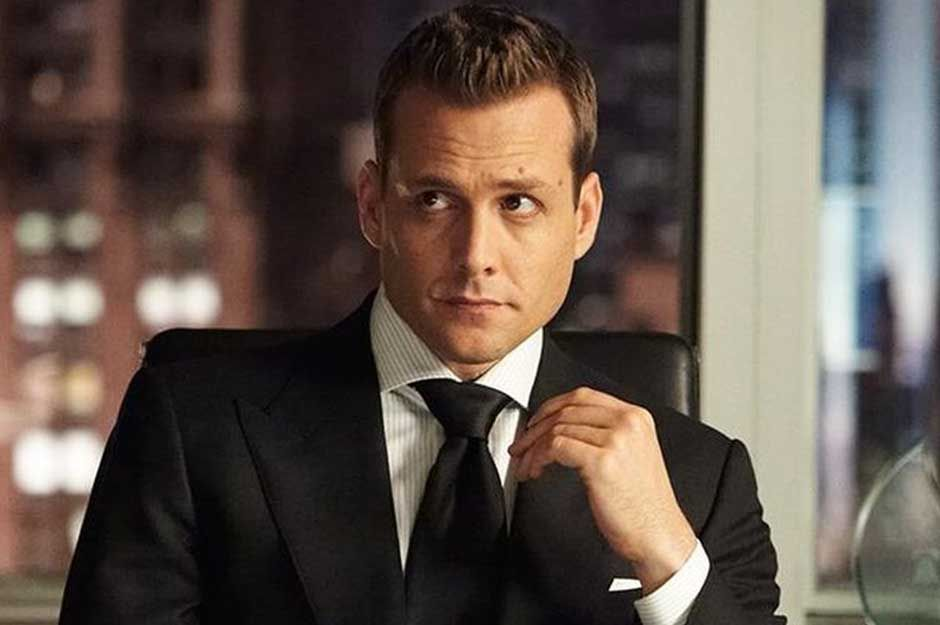
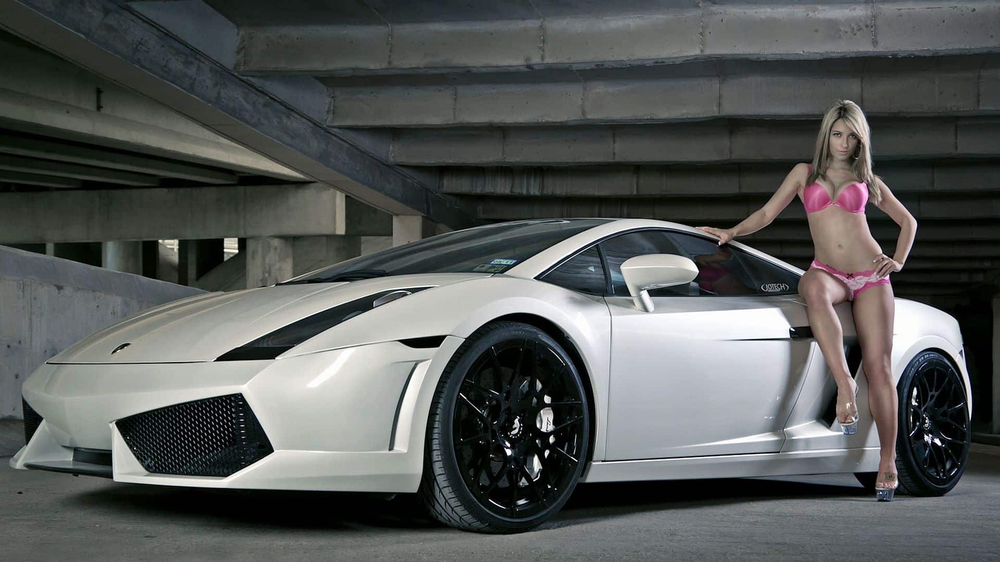
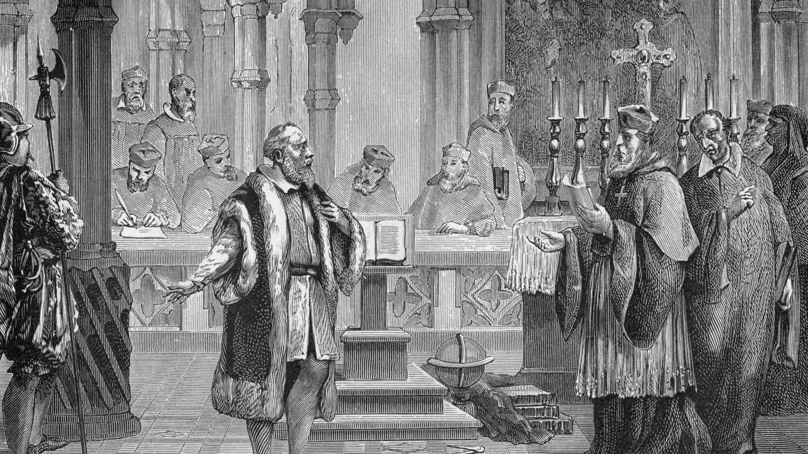
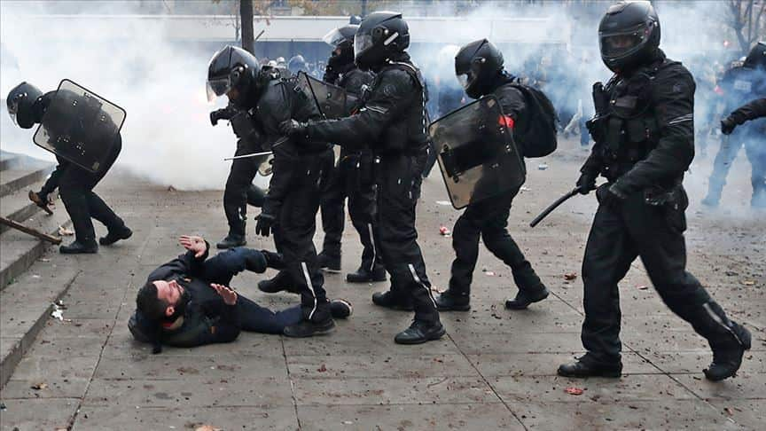
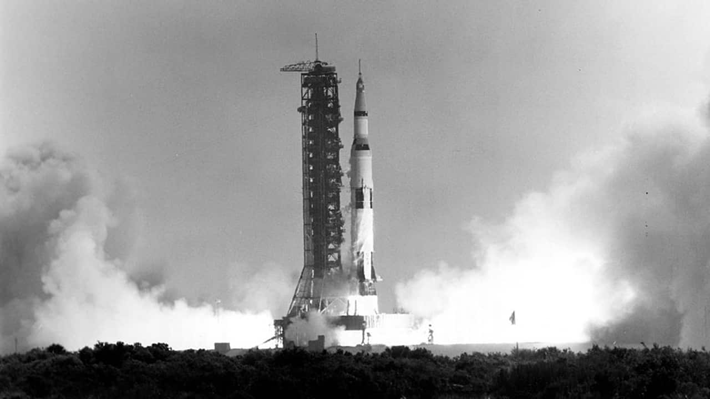
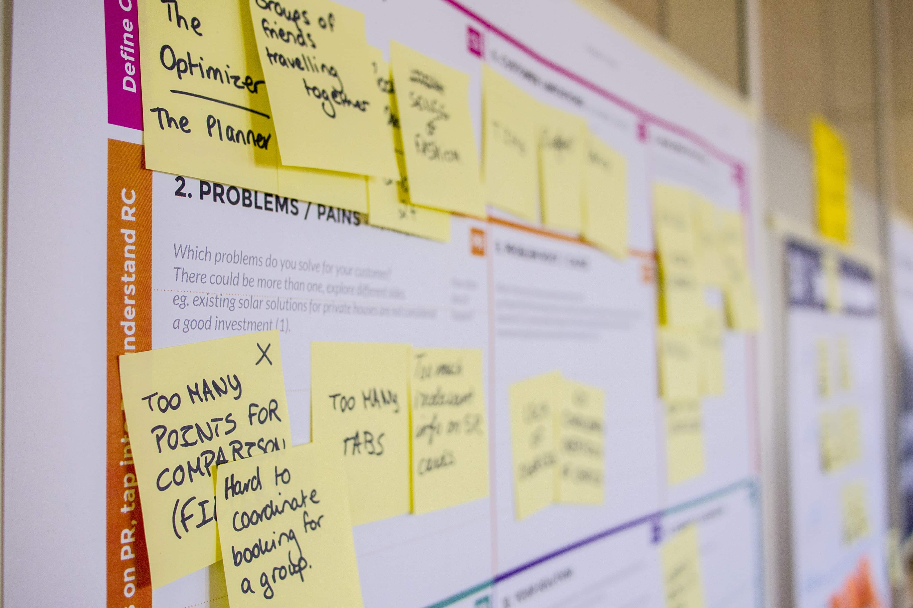
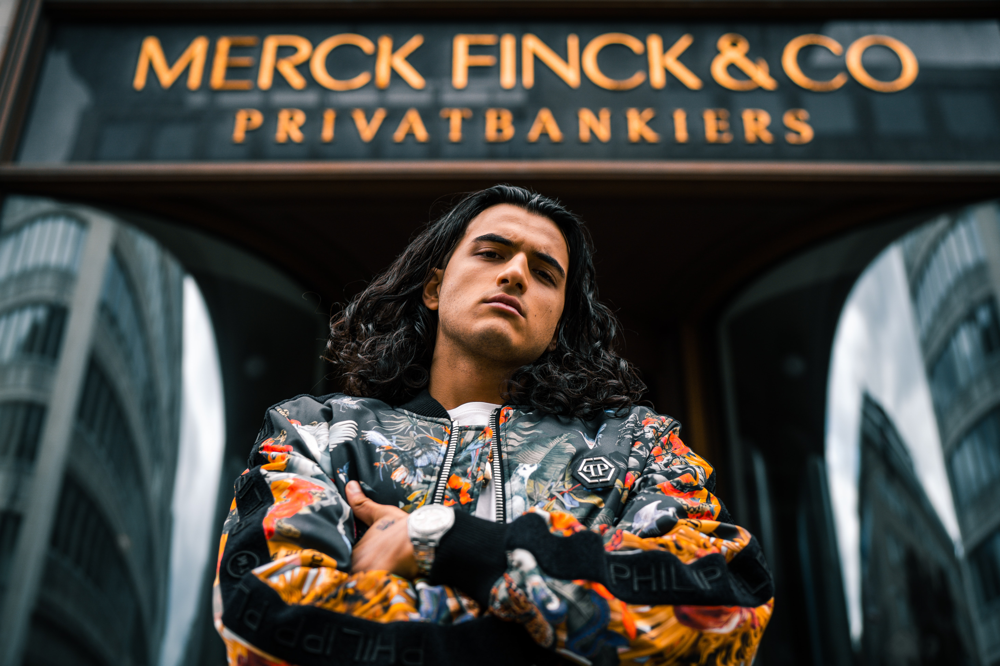
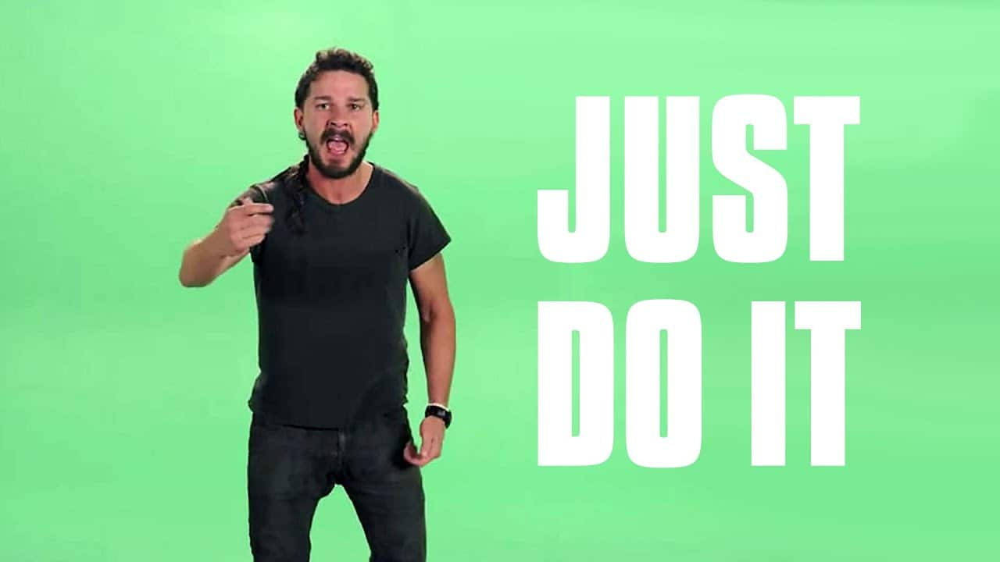
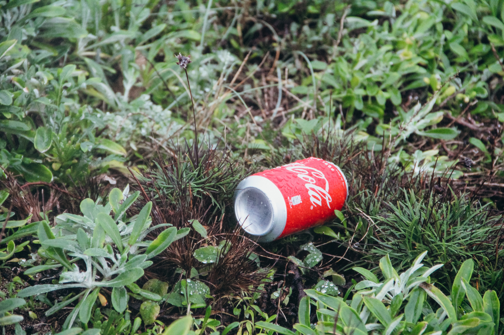

Orange represents the “fifth stage” of human existence. If you’re new to Spiral, please first read:
- [What is Spiral Dynamics](https://spirals.blog/articles/what-is-spiral-dynamics/)
- [Beginning in Beige](https://spirals.blog/articles/beige-introduction/)
- [Progressing to Purple](https://spirals.blog/articles/purple-introduction/)
- [Rising to Red](https://spirals.blog/articles/red-introduction/)
- [Believing in Blue](https://spirals.blog/articles/blue-introduction/)

It's highly encouraged you read these before this article. Things are going to get a bit intense.

## The Big League

Wait. What are YOU doing here? Who invited you?

I’m serious. This is an *exclusive* club.

You wanna play with the big boys? Alrighty, pal. Let’s see if you’ve got what it takes.

But I’m not here to fuck around. I won’t waste your time, so don’t even think about wasting mine.

“Oh, they swear. They must be Red”.

Fuck off with that basic Blue shit. Does a Red dress like this?

Or drive cars like this?

I didn’t think so. We’re a different breed of “I”. We’re Orange.

## Not for the faint of heart
I’ll tell it to you straight. Orange is not for everyone. It’s ***fucking intense***, extremely challenging, and takes everything from you if you’re not careful. And I mean ***everything***.

Orange doesn’t understand taking Christmas breaks. Orange doesn’t stop working because Blue tells them the “day’s over”. Orange doesn’t EVER give up until it’s done. It’s not over till you’ve won.

Let’s talk about winning for a minute. In Orange, you are either the best, the winner, the champion – or you fucking suck. There’s no “second place” in Orange. No bullshit, 5th grade, gold star, participation award. You win, or you lose. It’s that simple.

And I’m not talking about no “Red” winning either. Red just wants to dominate because it likes its “self”. Orange dominates because **losing is not an option**. It will do literally everything in its power to *crush* you. Because it *can*. Don’t ever verse an Orange in anything unless you’re prepared to lose. Or fight till the bitter end.

Intimidated yet? **I hope so**. This **isn’t** a challenge for you “Low Red” s or “moving away from Blue” s to try and *“make it happen”*. Take down your shitty motivational poster above your desk. Don’t objectify it. It’s not all sunshines and rainbows.

### Whatever you think about Orange is probably wrong.

Yeah, you can get the house on the beach, and visit every country, and eat like a fucking king, all while wearing a freshly pressed, Armarni, pin-striped suit. And yeah, it’s fucking great. But it’s not all. *You gotta look behind the scenes.* That “overnight success” bullshit you saw in the newspaper? What they ***DIDN’T*** report was that mother-fucker slaved away day and night for 10 years and lost his first marriage to get that business off the ground. Think twice, buddy.

Before you prop this shit up on a pedestal and worship it like a fucking Blue God, I want you to know what it will cost you. You’ve been warned.

## Breaking Blue: Enter Science

Let’s take a step back for a sec.

To understand Orange, you have to know where Blue falls over. And it falls over, believe me.

Blue is the best thing in the world for consistency, discipline, routine, and order. It’s terrible at thinking outside the box.

> The Industrial Revolution was a result of the failure of the more medieval forms of life. To solve the problems of existence then, it was *anything* else. And when that occurred, then the human had to develop a different way of thinking. You see, if you don’t believe that the power (that be the power that be) knows everything, knows all rules as to how to live, then you have to begin to think that maybe you know some too. Or at least somebody else knows something about how to live. So they started to switch. **People who made this move started to switch from the absolutist way of thinking to what we call a multiplicity.**
>
> – Clare Graves - [In Conversation with Clare W. Graves.(Youtube)](https://youtu.be/tt3Uk1f3y_U?t=2361)

Ok, Graves, English, please?

Let’s be clear on something. Blue doesn’t have all the answers. We know this because even if we follow **EXACTLY**, *TO A “T”*, all the rules (which is impossible these days), we don’t always get what Blue has always promised. The reward at the end.

Governments fail. Churches become corrupt. Police are just humans and are fully capable of performing violently brutal acts of self-interest despite their title of authority. You won’t always get the gold watch after 20 years of service at your company.

Put simply, the authorities fuck up. All the time.

Around the 1700’s, politics and religion were almost synonymous. Law was (and still is in many respects) heavily influenced by the religious faith held by any given country. When this system started fraying at the seams, people needed an alternative.

Enter Orange.

## Taking things into our own hands
Maybe the higher-up’s DON’T know what they’re doing. That higher up could be a god, a boss, or a government. It doesn’t matter. What does matter is what you’ve been told your entire life to do isn’t working. We need a new way of thinking.

The Industrial Revolution birthed an explosive, expansive slew of ideas, breakdowns of conventional society (of the time), dis-belief in monotheistic religious thought, etc.

Here’s the core idea. “If *they* don’t know what they’re doing, then all is fair game”. More specifically, if one becomes disillusioned with their powers that be, and manage to find a better way, the new Orange believes they have a **right** to pursue this. Because it works (and the old way did not).

The Scientific Revolution and the Industrial Revolution go hand in hand. Feeding off each other, together, they broke the limits of Blue thinking and pushed (like Red did from Purple) into the unknown. [The pendulum swings.](https://spirals.blog/articles/i-vs-we/)

Personally, I don’t like the term “revolution”. I understand a “revolution” as something that changes, rotates, only to return to the same place. It’s my opinion that “shift” or “breakthrough” is a more applicable word to describe this movement.

## Science works.

The Orange perspective spread like wildfire. Its propensity to focus on facts, data, and a systematic approach to get results (as opposed to “known Truths”) produced dramatically superior outcomes. **And it was replicateable**. We improved the quality of human existence from the focus on information, NOT living in accordance with what we’re told. The Scientific Method broke-out of the “Church” and set a course to change (and discover) the new world.

Inventors and scientists like James Watt, Isaac Newton, Charles Darwin, Thomas Edison, Nikola Tesla, Albert Einstein (amongst many others) drove forward the powerful vehicle that was developing. To this day, their Orange thinking and discoveries influence billions, with scientists using their findings every day.

Individuals like these have a few things in common.
1. They don’t give up. (Edison famously learned “how not to build a lightbulb” 1000 times)
2. They challenge pre-existing thought (Darwin’s “On the Origin of Species” ruffled a few feathers in the Christian-English establishment)
3. They’re driven by facts (Science doesn’t draw conclusions on guesses)

Now we have the lightbulb, the radio, the computer, have been to the moon, and discovered the ocean’s greatest depths. We know, now, that lightning isn’t God’s wrath (sorry Thor) but the result of a buildup of static energy between two gaseous states of water.

Science works.

## The Entrepreneur and the WANTrepreneur

*Photo by Simon Abrams @flysi3000*

As the Industrial/Scientific “breakthrough” became increasingly more productive and unavoidably prominent, it, in turn, influenced law, as society moved toward the “New Secular” (non-religious) perspective. The New World was a hot topic, as were shipping companies, and “opportunities”. So we created things called companies.

In his book, “Black Swan”, Nassim Nicholas Taleb states:

> “Today, a few take almost everything; the rest, next to nothing”

The new breakthroughs and shifts in perspective that Orange generates, create an unprecedented, disproportionate relationship to what we reap from our labor.

He goes further to say:

> “In [Orange], inequalities are such that one single observation can disproportionally impact the aggregate or the total”

### The power of ideas
Electricity didn’t just change the world. It fundamentally re-invented the very meaning of what it meant to live in modern society. This just doesn’t happen in Blue. It’s too stable. Don’t rock the boat. The attention, significance, wealth, and power generated from these new Orange ideas were/are irresistible for many.

The Entrepreneur rose into a competitive ascendance, fueled by intelligence and the power of its ideas. It was now concepts, not authority that provided the ways and means of changing things, and nothing is off-limits. Red gains power in a raw, physical sense, often through brute force or intimidation. ***Orange gains power through intelligence and strategy***.

> “My success is determined only by me”

Today, much of Orange is channeled in strategy. You’ll often find Orange bragging or fixated on:

- Chess
- Marketing
- Competitor analysis
- Social-media ad targeting
- Training to win
- Professional sports
- Sales
- Etc

The Orange lives and breathes in out-thinking, out-competing, out-working, out-earning everyone in their path. And they will literally die trying.

For an Orange, strategy is everything. Whether it’s work, the pictures they’re uploading to their Instagram with 100K followers, or the partner they chose; everything comes down to strategy. And status, but more on this later.

Still think it’s the shiny, suit-laden, cocaine infused, supermodel orgy on a private beach that you can show up to in a Maserati with little to no work? Think again. If Orange is not running through your blood, you will never work as hard as they will.

### Low Orange: Why your next “app idea” is total shit

*Photo by Austin Distel @austindistel*

The promise of being an inventor, ship/factory owner, or scientist was (and is) an attractive promise-land; a shining North Star to inspire those hungry and daring enough to leave the tiny, safe, Blue Box, and “bet the farm” on the “next best thing”. It attracts the masses, and only a few make it. Social media is riddled with the “(10 year) overnight success’”, but we never hear about the 999999999999 other failed attempts.

Gold-rushes, your friend’s new business venture, pyramid schemes, Bitcoin, day trading, the “Digital Nomad” movement; they all promise the same thing. You don’t have to do Blue. They’re all fucking wrong.

Real Orange is risky as all hell, and if you lose, you often don’t ever come back. But real Orange is not Blue-shy. A ***true, healthy*** Orange knows that Blue is the platform on which to build these ideas. Without it (to use a phrase from where I come from), “You’re up Shit Creek without a paddle”. If you don’t have Blue, healthy Orange is impossible. Yes, Oranges, I know you hate that word. “Don’t fucking tell me something is impossible.” you’ll say. Blue without Orange doesn’t work. Period.

If you find yourself attracted to whatever you *think* Orange is, read the next paragraph over 20 times out loud, and stick it on your monitor.

> Real Orange starts and ends in *reality*. It’s dull and boring. Low Orange starts and ends in your imagination, where everything is fun and exciting and almost certainly out of perspective. \
> – Anonymous

Today, we witness this in the Silicon Valley culture. A bunch of hooded (why this is a stereotype I have no idea) hackers, tapping away at a stickered MacBook Pro, attempting to build the next Facebook/Airbnb/Uber/Google. Most are full of shit. Some aren’t. The ones that aren’t? They create such an imbalance for the rest of the world that it’s almost impossible not to be affected.

The problem is the “successful 1/999999999 are so drastically over-represented in media, news, [motivational graduation speeches](https://www.youtube.com/watch?v=UF8uR6Z6KLc), and [Orange Books](https://fourhourworkweek.com/). No Orange actually works 4 hour weeks. Any real Orange would spit out their coffee if you told them you could be successful, only working 4 hours a week. Even Tim admits this. It’s excellent marketing non-the-less 👌.

Your travel blog you spend writing in Canguu Bali won’t make you rich from affiliate marketing. Nobody wants your shitty pyramid-scheme protein shake. Fuck off. Don’t tell me you’re making money from your dropshipping unless you’re willing to show me your bank account. Don’t even get me started on life coaches.

Go back to Blue, Low Orange’s. Stop fucking complaining and do the work. Don’t run away from tedious, dull work, because THAT is what you do for 99.9999% of the time to be successful. **For years on end**. Starting a business won’t give you more time. It will take it.

There is an incredibly disproportional relationship to “success” in Orange vs. everything “below” it. Blue does what it’s told, Red, what it wants, and Purple just wants to live. From the Orange perspective, arises the desire for more.

## You win, or you lose

*Photo by Braden Collum @bradencollum*

Are you beginning to get the picture? I sure hope so. Let’s talk about winning.

In the game of ideas, the best one wins. Business and finances are a zero-sum game. When you’re playing a sport, there’s only one winner. One. Not two. You win, or you’re a loser. Second place is for pussies who can’t accept defeat. Are we clear?

An Orange is addicted to the rush of winning. The closing of the sale. The sight of the customer pulling out their wallet to pay for the goods. The superiority and recognition you get when you defeat your opponent. They’ll take it wherever they can.

How *healthy* your Orange determines how far you’ll go into this. How much will you upset the other colors, the balance of the Spiral? Ever watch the Wolf of Wall Street? Yeah, you took that too far, Jordan.

Orange’s train themselves, especially at a competitive sports level, to remove losing from the picture. It’s simply just not an option. An *inconceivable* notion for Blue (or Red, or Purple).

### High Risk - High Reward

*Photo by Fionn Claydon @fclaydon*

This addiction to winning coaxes Orange’s to take larger and more significant risks. They grow more boisterous and confident in their perceived ability (they’re often full of shit too) and reach out further.

In Orange, the risks are monumental. A stock trader can put down their entire life savings to “win it big”. If they lose, they lose it all, and there’s no recovering from that. But they do it anyway. Why? Because the reward is so enticing.

Healthy Orange dodges this kind of thinking, instead, combining their Blue/Orange to mitigate risk as much as possible and make a calculated decision. Blue + Orange still wins, but more safely.

This high risk/reward is what attracts other unhealthy colors to the “idea” of Orange. You can indeed earn uncapped money in Orange (unlike Blue), but do you really have what it takes? Are you running from something? Be FUCKING careful. Anyone that tells you, you can get everything for nothing is selling you. Walk away.

## Totality of fixation

*Photo by Alvaro Reyes @alvarordesign*

> It’s not over till you’ve won.

An Orange doesn’t stop until the job is done, or the result is achieved. Blue doesn’t get this.

Here’s an illustration of how a Blue approaches the problem, vs. an Orange.

#### Blue:
1. The printer at work breaks.
2. Blue tries to fix it with their limited knowledge of printers
3. When that doesn’t work, they call IT, who says “We’ll send someone up sometime today”
4. The Blue goes and get’s a coffee because they’ve passed the puck onto some other shcmuck
5. At the end of the day, when the IT guy never showed up, the boss asks to see the report. “I couldn’t print it, sir. The printer is broken”
6. The boss (who deals with shit like this every day) is at a loss and has to solve it themself

#### Orange:
1. The printer at work breaks.
2. Orange tries to fix it with their limited knowledge of printers
3. When that doesn’t work, they ask every person in the office if they know how to resolve it.
4. If nobody knows, they then get on their phone, google the serial number of the printer, and search “How do I fix a broken XYZ printer”
5. They go through every option until it works
6. If that’s still not working, they call IT. “We’ll send someone up sometime today”
7. While they’re waiting, they continue to google to see if there’s anything they missed.
8. When the IT guy doesn’t show up, they call again (knowing they will get the same response).
9. While they’re on the phone to IT, during their lunch break, they Uber down to an office supply shop and buy a new printer of the exact model.
10. They print it and give it to the boss, telling them they bought a new printer because it was broken, detailing everything they tried.

Do you recognize the difference? Orange doesn’t stop until it’s done. They are **fixated** on doing whatever it takes to get the result. A Blue comes to the boss with problems. An Orange comes with solutions.

> Reporter: “How did it feel to fail 1,000 times?” \
> Edison: “I didn’t fail 1,000 times. The light bulb was an invention with 1,000 steps.”

To say an Orange is “driven” is an understatement. They don’t take “no” as an answer.

## The Orange Perspective: Multiplistic & Significance

*Photo by Daria Nepriakhina @epicantus*

How is an Orange able to do the above? What sets them apart psychologically? What drives Orange?

Orange expresses self. Like Red. *But not at all like Red*. It does it in a way that’s calculated, playing in the grey spaces between what Blue thinks is right and wrong.

In a technical sense, Blue is what we’d call “absolutist”. Something either is, or it isn’t. It’s black, or it’s white. It works, or it doesn’t. It’s my job, or it isn’t. This is great for some things (whether I should drink the glass of water with poison in it is an absolutistic problem, and **should** be considered as such). This breaks down entirely when things get more complex.

Orange, in a technical sense, is “multiplistic”. It’s able to come up with more than one way of doing something. It literally sees more. It tries more. It’s not afraid to fail, and try again, and fail. For “absolutistic” thinking, there is one way to do something. For “multiplistic” there are many ways, but only one ***good*** way. This is the quest of the Orange. To find that way.

Oranges are very creative, thanks to their ability to think of multiple options. Combined with their strategic thinking, and “do n’t-stop-till-you-drop” attitude, they make brilliant inventors, creatives, designers, researchers, writers, marketers, CEOs, etc.

> “Here’s to the crazy ones. The misfits. The rebels. The troublemakers. The round pegs in the square holes. The ones who see things differently. They’re not fond of rules. And they have no respect for the status quo. You can quote them, disagree with them, glorify or vilify them. About the only thing you can’t do is ignore them. Because they change things. They push the human race forward. And while some may see them as the crazy ones, we see genius. Because the people who are crazy enough to think they can change the world, are the ones who do.” \
> – Steve Jobs (The King of Orange)

### Significance of Status

*Photo by Sebastian Pociecha @sebastianpoc*

Orange loves attention. And status. It bathes in the significance that it “sees more than others”, and the external, material, success and recognition that this brings.

Having come from strict Blue, where one could only achieve authority from what family you were born into or how long you worked somewhere, the freedom that Orange gets from it’s ideas is self-gratifying.

> I created this. My mind. My smarts. My analysis. My hard work. So I deserve the rewards. And I want to be respected for it.

Status is essential for the Orange, amongst other Oranges. Who has the bigger paycheck, more luxurious car, and wife with the biggest fake boobs? I’m not being crude. For an Orange, their status is equivalent to their “authority” in Blue. If you’re not successful, you’re nobody to me. Don’t waste my time.

Where do you eat? What type of food. Have you been to the Maldives? Do you have a boat? How big is it? Oh, you only made 3 mil last year? That’s too bad. Better luck with the new Asia expansion.

## Communication with Oranges

Oranges are abrupt. They’re **extremely time-sensitive**, intense, energetic, and are not afraid to yell at you.

You have to understand, this is not coming from a place of malice. It’s just how we talk. There’s so much energy in Orange that it needs to be expelled. Sometimes this results in some explosive comments and activities. Don’t take it personally.

Don’t come to us with excuses or tell us we can’t do something because it’s against the rules. Look us in the eye. Don’t lie to us. Give us the facts without the bullshit back story to it. Get to the point.

We love ideas, experimenting, failing, and trying again, learning through trial and error. We love high energy. We speak quickly. And did I mention we often yell a lot? (Especially the Orange/Reds, but they’re kind of dickheads anyway).

We get we’re intense. It’s just how we are. It’s honestly what is needed to get the job done. Please don’t hold it against us. Please don’t mistake it as Red.

### An insatiable hunger
Underneath many Oranges is a hunger so intense that, seemingly, nothing will fill that gap (hint: this is one of its existential problems).

An Orange always wants more. Always. More money, more sex, more travel, more experiences, more everything. And bigger. And better. Better each time. Don’t stop. Work for it. Just do it. Make it happen. Close the deal. Crush the market. Break through the barriers before you. Stop at nothing. Nothing.

Are you beginning to see the problem?

Are you listening Oranges?

What are the effects of what you’re doing?

How has the exploitive mining practices of your company in the South American Andes affected the local population? How long can your smear campaigns hide the fact you’re killing the local villagers?

There’s only so long before Blue catches up, Mr. Invincible Tech God. And maybe more than just Blue.

Orange, when successfully living to solve Orange problems, creates other problems. Such is the nature of the Spiral. An excellent example of this is America during the COVID Crisis. The billionaires become trillionaires, while they complain on Twitter that Blues, Reds, and Purples don’t deserve a measly $600 per week because they lost their job to AI automation.

How do we solve this? Blue can’t. It doesn’t have the complexity. So what do we do? Orange is all-powerful in today’s world. But it’s not invincible.

That’s a topic for next time.
