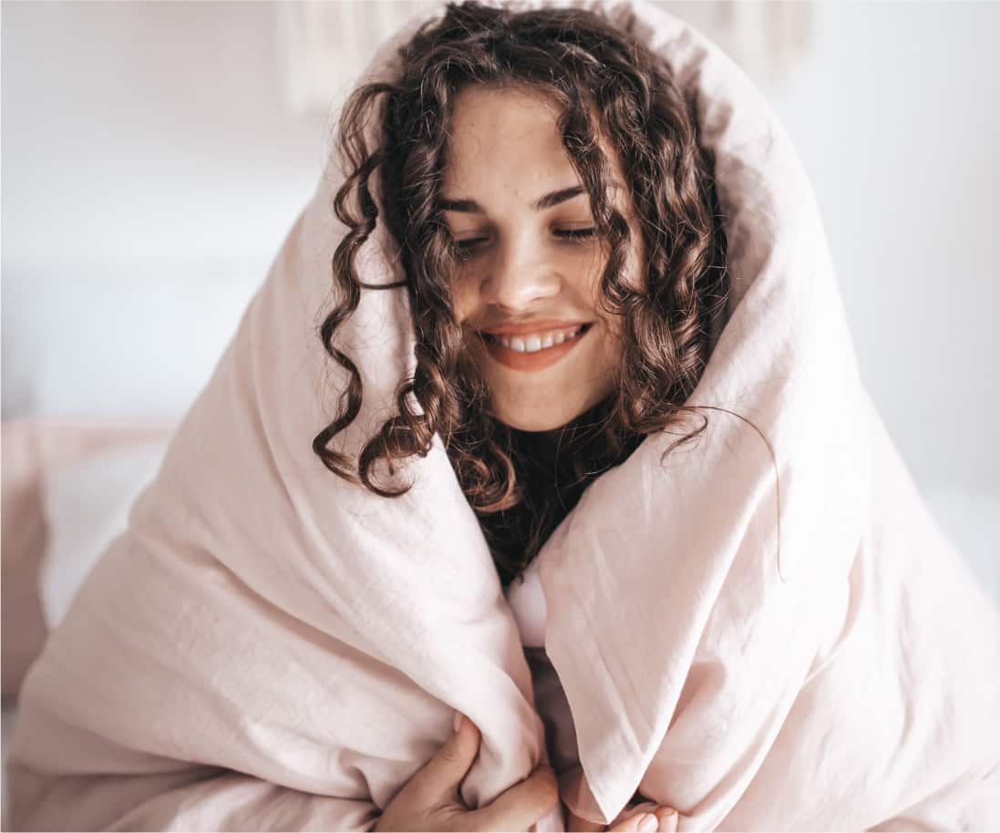

Purple represents the “second stage” of human existence. If you’re new to Spiral, please first read:
- [What is Spiral Dynamics](https://spirals.blog/articles/what-is-spiral-dynamics/)
- [Beginning in Beige](https://spirals.blog/articles/beige-introduction/)
This article will provide the necessary context for some of the concepts here.

Enjoy!

## Entering Purple
> Unlike the person at the first level, who lives a very automatic form of existence, and who has a very limited inner life, [Purple] has a very full inner life, one which is full of indwelling spirits. It doesn’t see self as one with all other human beings. It sees self as something that is animate, and all other things that are alive are also animate. So the tree is alive, and the tree has a spirit, and the panther has a spirit, and all the other animals have a spirit. This is something that is quite different in this level of human existence.
>
> – Clare Graves - [In Conversation with Clare W. Graves. (Youtube)](https://youtu.be/tt3Uk1f3y_U?t=733)

We could argue that Purple is one of the **most important** stages/perspectives in the whole Spiral, and indeed for our own personal development. Many who teach Spiral often disregard this magical color as “too primitive” or “basic” for consideration. Some believe it’s already “integrated” into human nature and society. In this article, we’ll explore the tremendous power behind the color underpinning it all, how it applies to us, and what we can do with it.

---

In our [last article](https://spirals.blog/articles/beige-introduction/), we looked at Beige as the most primitive stage of development of the human condition. As the Spiral theory goes, if we solve the existential problems of where we are, and the necessary Life Conditions present themselves, change *may* occur.

Aptly put by Graves himself, the shift into this tribalistic perspective is driven by a sense of “good and bad”. An individual or culture that’s experienced and “solved” the Beige problem has a reference for things that worked and things that didn’t, but is not yet capable of understanding why. As a result, the world becomes very superstitious for this perspective, as one “develops a belief that things are either for you or against you”. This becomes the precursor and driving force behind Purple, banding humans together in larger tribes, and moving humanity forwards.

## The Unseen World: Purple’s Belief System

*Photo by Vineeth Vinod @sundaestudios*

“I call upon the power of the Full Moon’s light.\
Heed my call.\
Charge this amulet with your power so that it may protect this land.\
May the power of the moon forever charge this amulet.\
Thank you, oh moon, I am grateful for your energy.\
Protect with this amulet.”

To this day, Purple remains a core part of our culture. One might say that everything humans have developed culturally evolved from some belief, or way of operating in Purple. So much of our legal systems, ideas around how we work professionally, relationships, political correctness, and way of life, stems from protecting Purple in some fashion (We’ll cover this in other articles).

Human beings at the core of who we are, place the idea of spirits in many things to make sense of the world. We’ve moved past this in many respects onto other belief systems; however, it still underpins the fabric of every further idea we developed. Purple is the first perspective humans developed that “sacrificed self” for something outside itself (unlike Beige). For the Purples, it was the spirits of the mountains, forests, other tribe members, and their ancestors. Humans would go to great efforts to sacrifice animals, precious food, other humans, and worshiped items in service to the spirits and gods. When reaching Blue, this transforms into something else, and later again in Green, etc., but we’ll cover those in another article too. Back to Thor.

## You’re safe with us! - The Purple Perspective
Purple is all around us. The family dinners, telling your partner you love them, chilling with friends, inviting strangers in for tea (not ordinary in the West, interestingly). *They all express a sense of creating safety amongst everyone.*

- “You belong with us”
- “Oh don’t worry, just pay me back whenever. I trust you (as a local business owner)”
- Calling your distant family for their birthday to let them know you still care.
- Looking out for your friends when they’re in trouble.
- “Hey, want some of my ice-cream?” (As hard as it can sometimes be)

In Healthy Purple, this *all* comes from a place of genuinely wanting the best for that person/group/business. They belong to your tribe. The more you look after them, the more they’ll look after you. When we begin to throw other colors/perspectives into the mix, this get’s more complicated, but for now, let’s just stick with Purple.

Back then, Purple was a paradise compared to Beige. The safety of the group meant that you could sleep in, consume MUCH more food, and you didn’t have to worry about being eaten in the night. Yes, please! People learned to get along with each other in much larger groups. They developed different clothing styles to tell themselves apart from “other Purple tribes” (they were dangerous) – rituals and beliefs that belonged only to them.

We began to do everything together; eating, sleeping, dancing, hunting, foraging; all done with others. To go out alone would often mean death, so people learned to be in groups. We often developed different languages for each tribe, things we prayed to, and foods we ate. For many of us, this was where we stopped roaming around and started to settle in one place.

Today, Purple is at the base of almost all our interactions with other humans. Unconsciously, we are *continually* observing others to see if they pose a threat to our safety or belong to our tribe. Depending on how “healthy” the Purple expression is (more on this later), it would determine how “sociable” one is towards strangers, if we share our food, how comfortable we are with ourselves (internal Purple), etc.

## Racism

*Photo by Clay Banks @claybanks*

Those who appear “strange” to us are often operating “outside Purple” or in a “different type of Purple”; exhibiting behaviors or beliefs that don’t fit the group. That is ***not at all*** to say they’re “wrong”; just not *“our Purple”*. This distinction of Purple may be the root of racism, a fear of other cultures, viewing things that are “different to us” as a threat to our way of life. Of course, as we have evolved into a broader awareness and other colors, this fear becomes unjustified and causes many issues. We can combine the segregation of different Purples into a larger Purple (forming a different color/Perspective, Blue or Green, but that’s another story for another day). We see this in countries like Australia, Canada, and New Zealand, who (even though there are still race issues) are very open and welcoming to refugees and foreigners (although neither started this way).

In contrast, we can compare this to the fear and uncertainty that countries like America hold (to this day, as the time of writing, 2020) towards minority Purple groups. By *integrating* Purple into a way of culture, we can alleviate many of our systemic problems. Racism is a deep-rooted, complex dilemma that to heal requires many more levels of perspective than just Purple, but it *starts* here. A great example of this is the Maori culture of New Zealand. The British who landed in Australia nearly wiped out the native Aboriginals, viewing them legally as *animals* until 1967! New Zealand, on the other hand, built a much deeper relationship with the natives from the get-go. Today, children of New Zealand, regardless of race, can learn Maori language and history in school, and their culture is celebrated in national pride. This integration of Purple at the beginning of this culture-merge set New Zealand up with a much healthier base to build the rest of the Spiral from, and we see this very evidently today.

## Internal Purple

*Photo by Taisiia Stupak @taiamint*

The Colors are dynamic ideas that can apply to large groups of people (companies, movements, countries) as well as individuals, and the *cycles of life* that we move through as humans. What does Purple look like at an individual level, and why is it so crucial to get this right before moving on to more complex problems?

If Purple at the macro level represents the safety of the tribe, then at the individual level, it could be described as the relationship we have with ourselves, our acceptance of who we are, and our sense of “Base Safety”. Do we feel like we belong? Are we comfortable in our skin? Do we feel safe? Safe, not just from the lions and natural threats, but also from modern threats of peer acceptance and social pressures. This is massive. An incredible opportunity for almost everyone beginning on their journey into personal growth is looking into their relationship with their own Purple.

Am I kind to others? Can I let my partner go away for the weekend without feeling scared, alone, or that they’ll cheat on me? Do I have a group of others that I feel I intrinsically belong to; that *get* me? Unfortunately, so much of modern culture does not set us up for success in this regard, instead, often forcing us to focus on other colors’ problems that society or the group deems more worthy/important. What we often fail to realize (both as individuals and collectives) is that without a healthy Purple, ALL other expressions of more complex colors will, by nature, be unhealthy. How can we express ourselves healthily in Red if we don’t feel safe? Won’t our Blue become closed and overcomplicated with rules if we’re not addressing the underlying feeling of insecurity? Perhaps you know of an Orange who believes the Ferrari he’s working 16 hours a day for will fill the hole he feels inside. And so on. Without healthy Purple, everything else falls apart.

For many of us, the “lowest hanging fruits” to living a happier, more joyful life lie in Purple. Treating others more kindly, sharing more, [becoming more vulnerable](https://www.ted.com/talks/brene_brown_the_power_of_vulnerability), finding ways in which we’re all part of the same tribe; they all add up. Speaking from personal experience, and having helped and worked with many others in the same boat, healing Purple can provide us with a fulfilling, profound, path to a happier life. We will continue to write about this in many different articles from different perspectives moving forward, as it is such an essential topic to *practically* improving our Spirals.

## Discover what Purple means to you

*Photo by Ethan Hu @ethanhjy*

If you’re looking to explore this side of yourself, your family, and your community, take some time to find your Purple Rituals. You’ll know them from memory; each Purple does it differently. For some, it’s a weekend trip to the woods, swapping stories around a campfire. For others, it’s curling up on the couch with a loved one (or alone!) and watching your favorite film of which you know ALL the words. Maybe it’s going for a long walk along the beach, or taking a bath, or cooking the recipe your grandmother gave to you on her deathbed (RIP grandma, your carrot cake legacy lives on in us).

The vital aspect of all these is that they share the same *intention*; they help us belong and feel safe. They connect us, bringing us closer to ourselves and others. Until this becomes a problem...

### Leaving Purple

The safety of the tribe may start to feel limiting for some. There are those who seek to explore and see beyond the limits of where everyone they know exists. In another article, we'll look into how Red takes a stand. Setting out on a new adventure that would change the course of human history for our ancestors, and exploring our own identities, Red takes the Spiral to a [whole new place](https://spirals.blog/articles/red-introduction/).

### A note from one learner to another
The title of this article, “Progressing to Purple - An Introduction” really wants to emphasize the word ***“Introduction”***. Each color on the Spiral is immensely deep, and complex; one could devote an entire lifetime exploring everyone. Hopefully, today, this article serves as a good place to start this discussion of Purple; however, there is a multitude of concepts and ideas to discover. May you continue to study it, converse with it, and use it for the rest of your life.

---

Purple is a magical, beautiful perspective and tool that can bind warring countries together, and heal wounded souls from distant traumas. It’s warm and cozy, a little “cult-y,” and just the thing we need after a long day of solving other color’s problems. Come, meet us by the fire; we have hugs, good vibes, and marshmallows. What else could you want?
