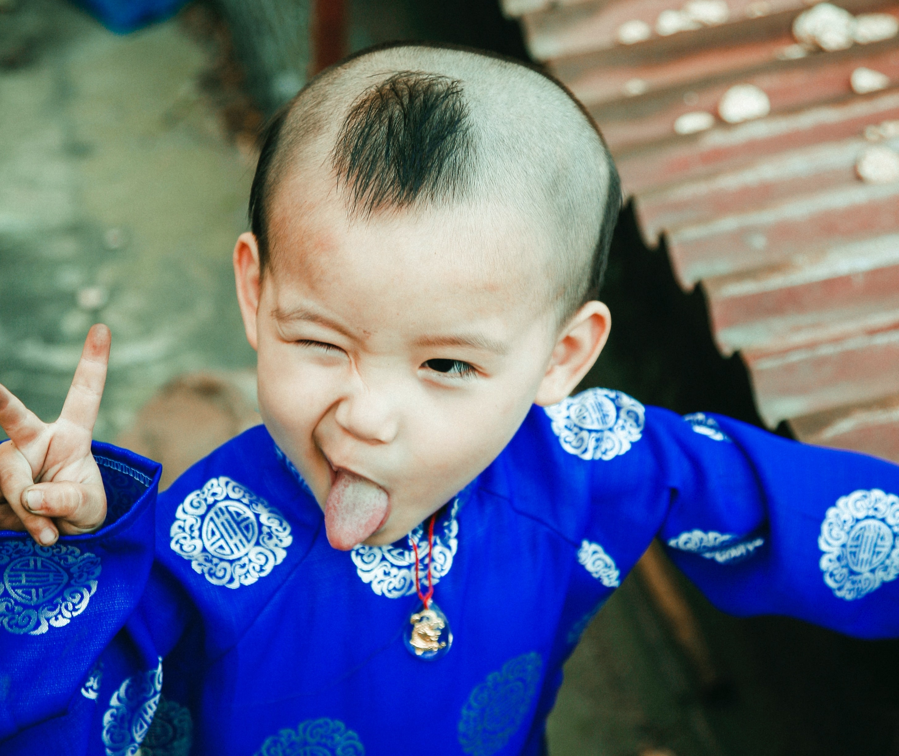
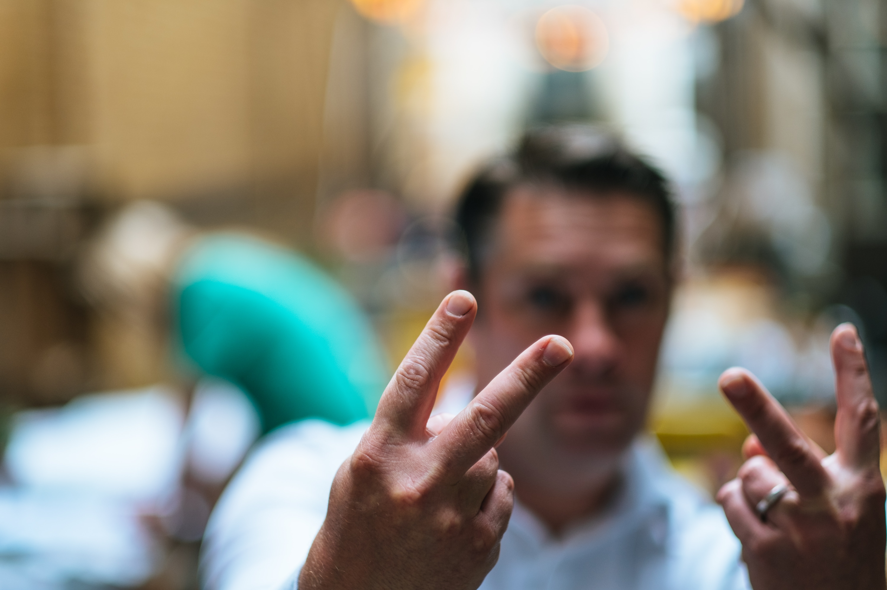
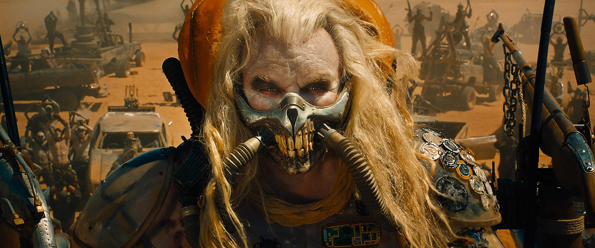
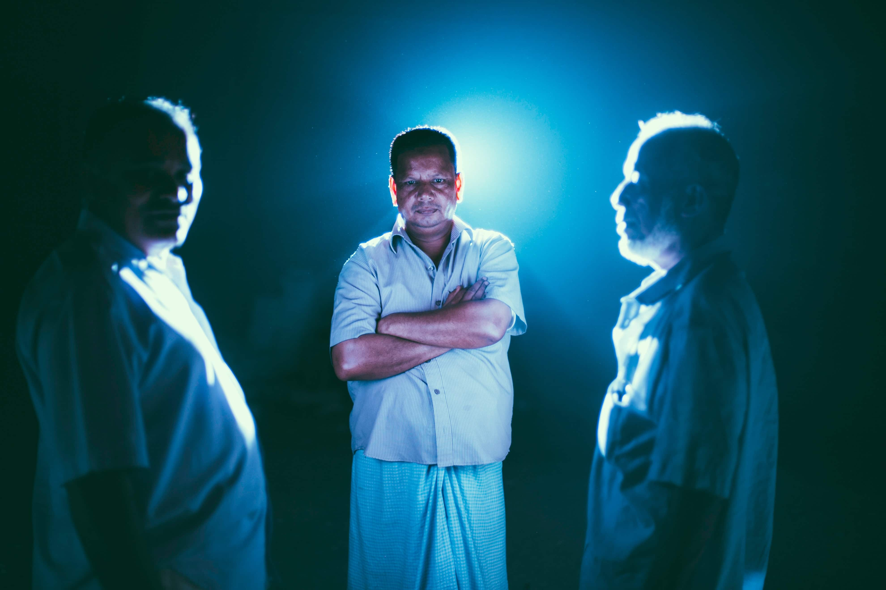

Red represents the “third stage” of human existence. If you’re new to Spiral, please first read:
- [What is Spiral Dynamics](https://spirals.blog/articles/what-is-spiral-dynamics/)
- [Beginning in Beige](https://spirals.blog/articles/beige-introduction/)
- [Progressing to Purple](https://spirals.blog/articles/purple-introduction/)

This article will provide the necessary context for some of the concepts here.

Enjoy!

## Hey! You!

I ***fucking*** love Red. That’s right, I started my article like that. What are ***YOU*** gonna do about it? But I do. It’s sexy, brave, fiery, and full of adventure. It defends, it’s funny, and it doesn’t give a fuck (and yeah, sometimes that’s a BIG problem).

Am I talking your language? Did I get your attention? Good chance you’re filtering through Red, or it appeals to a substantial Red in you! If this language made you feel uncomfortable (and fair enough), or you thought it was entirely inappropriate for what you were expecting to read, you’re probably not filtering through Red as much (which is totally fine too).

If it’s not yet apparent, Red likes to be heard. Depending on how healthy it is, sometimes this “loud” is fun and expressive (like a rock concert), or it’s loud like a fight breaking out.

Red is often abrupt and doesn’t want to say more than it has to. To the point and in not-so-many-words. Which is why I’m now going to stop the article because you get the point, right? Cool.

Red also likes to joke.

I’ll stop before I lose those who aren’t resonating. Red can be intense for some and rightly so. If we’re still growing in Red as an individual, it can be very intimidating to experience Red’s energy, *especially if you’re the focus*.

**Especially if it’s unhealthy**.

Let’s go back to Purple for a second. Where did all this come from? I thought we were still singing “Kumbaya”…

## The World Outside (Of Purple)

*Photo by Kalen Emsley @kalenemsley*

Let’s first start by asking, “What’s the problem of Purple?” If we were all experiencing a beautiful, simple life without having to worry about the lions and starving to death, why would we ever leave this paradise? How did we get from Purple to where we are today? Surely there must be something else?

While Purple is significantly safer than Beige, it’s not immune. There are still “other Purples” that we need to worry about, harsh conditions of the world that require us to move, and the world outside of our ancestor’s protection.

At an individual level, we see this reflected around 3-6 years old, usually starting when we begin kindergarten or school. For the first time in our lives, our Purple (parents/family) leaves us alone with complete strangers to fend for ourselves with a room full of other kids. Talk about a different environment!

But, as we find out, it’s not *all* bad. In fact, it gives us individually a chance to explore who “I” am! Who am I without my mum and dad? How do I behave outside the tribe? What do I find interesting? As someone tentatively entering Red, we begin to reach out further from our “safe place,” taking more risks. We adventure into the surrounding world around us.

## Curiosity ~~killed the cat 🐈~~ made the Red

In Purple, we often live in fear of the outside world, as it regularly meant death if we were alone. When we enter Red, we re-address our [Agent/Arena relationship](https://spirals.blog/articles/internal-external/) yet again, redefining our understanding of where we sit in the grand scheme of things.

Whether driven by boredom, a growing sense of frustration that the Shaman’s rain dances are not working (Duh!), or sheer curiosity; *some Purples* step outside the “Purple Circle” to seek their **own** quests.

In many ways, our entire identity was defined by the group in Purple. We don’t choose our language, our parents and their beliefs, the food of our culture, or our place of birth. These are all given to us when we enter this world. As Red gains confidence, standing on its own, these layers are peeled back and sometimes replaced with what the Red wants. “I don’t want to come home for dinner, mum! I want to play outside with my new friends!”

> The individual is developing in his or her Self, his first real comprehension of the fact that he or she lives as a person, that, “I am a self. I am something that is separate and distinct from the other things.”
>
> – Clare Graves - [In Conversation with Clare W. Graves. (Youtube)](https://youtu.be/tt3Uk1f3y_U?t=1210)

## “I’m Different!” - The Red Perspective

Red’s power comes from this ability to separate itself from the group. Different to Purple, Red is ***fully*** aware of it’s “self” and lives to prove this (to itself AND to others). One might say that Red is driven by a strong need of **“significance”**. This “need” drives the behaviors common to Red’s as they “express-self” ([as opposed to “sacrifice-self” in Purple](https://spirals.blog/articles/i-vs-we/)). A Red values anything that contributes to its idea of “self.” Red worships the ego as the solution to all its problems. As you can imagine, this can be healthy…and not so healthy.

### Healthy Red

*Photo by Tong Nguyen van @duytanphoto*

What does it mean for a color to be “healthy”? As [we saw in Purple](https://spirals.blog/articles/purple-introduction/), a color is healthy when it’s integrated the previous colors, and is balanced across the Spiral between the “I” and “We.” For Red, this means a stable, healthy Purple, which will allow for someone to feel *safe* enough to *express* in Red.

- Funky or eccentric fashion choices
- Taking a gap-year after high-school to go and “see the world.”
- That fun, new position you and your partner want to try in bed 😉
- Speaking up for yourself (not rudely or arrogantly)
- Rollercoasters and theme parks
- Going to a music concert with your friends (very Purple as well, Purple/Red)
- Drawing, painting, playing music, artistic expression (when done for yourself)
- Getting out in nature and exploring
- Motorbikes
- Saying no to things (with Purple)
- Etc

If this list appeals to you, **great**! Healthy Red is a fun, engaging, exciting way to enrich your life, especially if done with a Purple base, and with others. We’ll address more practical techniques and tools to explore a healthy Red in posts to come.

### Unhealthy Red

*Photo by Harry Grout @harryjamesgrout*

As we’ve learned in other articles, all colors can have “healthy” and “unhealthy” expressions. What does this mean for Red, and why does it occur? How can we identify these *tendencies* in ourselves?

Spirals build on themselves. We often use a “house” metaphor to illustrate the importance of **focusing on Healthy Purple before “moving on to”/“fixing” other colors**. If Purple represents the foundation of everything we build upon, then we could extend this story to say that Red forms the “walls” of our house. Without foundation, we can’t erect the walls.

What does this look like in practice? Notice in yourself, your environment or the world, expressions of this “Red” energy **without** feeling safe first, or taking into consideration how our actions will affect the tribe. What are some examples of this?

- Crime
- Drug **ab**use
- Butting into conversations just to be heard
- **Always** needing to be seen or heard – the center of attention
- Unable to control addictions
- Getting angry/aggressive/frustrated often
- Fighting others, or generally being combative to assert one’s Self or power
- Swearing/cursing to the point that it’s upsetting to others
- Avoiding the law because you “Can’t be fucked following what your boss tells you to do.”
- Shirking responsibilities
- Partying to the point that it’s terrible for your health (Can sometimes merge with some Orange tendencies)
- Taking without giving, constantly
- Picking on other countries (macro) or people (micro)
- ***Many more***

What do all of these have in common? Is there a pattern that you can see emerging from these expressions? What do you notice?

One could say that they all share an underlying sense of insecurity. Whether at the collective level in fighting other warring tribes or at the individual level in an overactive ego, most of it comes from an internal place of “not feeling good enough” – Low Purple.

We can start to see, now, the relationships forming between these colors, and how they interact. Without an internal “truth” and ***knowing*** that you belong, are safe, and are accepted by others, our self-expression will almost always be twisted somehow.

In these situations, Red regularly tries to “protect” Purple. It forms a defensive barrier around the Self, so it doesn’t get hurt again. Often, a past/childhood trauma (when Purple couldn’t stand up for itself) forms an internal or collective strategy to ensure that *never* happens again. This results in the Purple never being exposed or vulnerable, an overactive, assertive Red energy, and a whole lot of issues.

---

**Partner:** “Hey. So, I’ve been thinking about us a lot…and…I think I love you.”

**Low Purple/Red:** “What? No, you don’t! Don’t say shit like that”

**Partner:** “No, really! I do! You mean a lot to me.”

**Low Purple/Red:** “I don’t need this in my life. I’ve been hurt before, and you’ll just hurt me too. Goodbye”

---

Ever been part of, or heard, a conversation like this? There’s a lot to unpack here, but the short of it is: Red tries to protect a wounded Purple, never letting itself heal, and becoming aggressive to anyone who gets close enough to try.

The good news is, it doesn’t have to be this way. If you feel trapped, in pain, or that no-one understands the trauma you’ve been through that’s created the “tough exterior” you wear, you’re not alone. Investing time and energy to heal, be vulnerable, and rebuild our relationship with ourself and others, can be a great way to improve your Purple and thus this unhealthy Red expression. We’ll discuss this in more depth as well in other articles.

## Becoming the Hero

Let us return to the story of our Purple, stepping outside of the nest/tribe to discover themselves and the world. After all their adventures, mishaps, quests, and discoveries, they make their way back to what is familiar, but this time it feels different.

The tribe is enamored with the bravery this new Red has shown, being gone so long, and sharing all their stories. Purple looks to Red as a hero, an influential leader to help protect and provide for them. One who has conquered the “Outside world” and returned victorious! Of course, the Red is living in such a way that he believes everything should add to their “self” and find they very much enjoy this new-found attention.

*Photo from Mad Max: Fury Road*

A lo, the Chief arises! Our Red leader, the protector of the realm, the conquerer of Purple’s enemies, and the mightiest and wisest of us all. The new hero can outwit, outfight, and outsmart everyone they know because of their mighty Red perspective.

The Red inspires other Purples to shift into Red, forming gangs or bands of warriors. Blood is life, and the gods are those of power and strength. After all, the only thing a Red respects is a more significant Red…

### “What did you call me?”

At times, there are those younger Red’s who feel they have what it takes to be the one calling the shots. They challenge the Chief/Warlord/King often resulting in a fight to the death. Whoever wins is the new leader; “I am the Red’ est, baddest mother fucker of them all. Let it be known!”

Have you ever seen two overly Red individuals on the street walk past each other, only for one to yell, “You looking at me, mate?” Ok, perhaps the “mate” is particular to drunk Australians on the beaches at 3am; however, the sentiment is universal.

“I’m more Red than you. What are you going to do about it?”

So begins what I like to call a “Red Off!”. As neither Red is willing to be the “lesser” or “weaker” of the two, things escalate; quickly.

“Oh yeah? Tell that to your girlfriend, who was in MY bed last night.”

You get the picture.

---

## How does Red work in our relationships?

*Photo by Slim Emcee @truth_from_africa_photography*

Red is not all bad – in fact, it’s critical (as many colors are) for operating successfully and happily in our world. A great example of how Red can be used (outside of our internal Red; a sense of importance/significance) is relationships.

*“Hey, so, I saw you from the other side of the room – annnnnd I’ll be honest, you really caught my eye. Can I buy you a drink?”*

Red takes the risk. If we’re still developing our Red, this situation can be incredibly scary. Talking to an attractive stranger in a crowded place with everyone watching? What if it went wrong? Oh god, what if they think I’m ugly. Better not.

Red doesn’t care about what others think, it just acts. When balanced with a healthy Purple, this can empower us to take bold actions to improve our lives and the lives of others. Sometimes we need to go out on a limb to create the life we want. Healthy Red is a **fantastic** tool for this.

The best relationships I’ve ever had were Healthy Purple + Healthy Red (and a few others, but this was the base). When building a connection with someone, it’s vital for both parties to be able to safely express how they feel, get things off their chest, and tell it how it is – without the other person taking it too personally. Communication is ***essential*** for any long-term relationship. If you’re just after a good ol’ Red fling, then forget this for now 😉.

We’re attracted to partners with healthy colors. Healthy Red in a relationship enables the fun, adventurous, sexy attraction that helps it feel fresh and engaging. Have you ever been in a marriage or long-term bond with someone where you two were *always* enjoying your time together, trying new things, expressing, having fun, and creating a safe space to just “be together”? Healthy Purple + Healthy Red is very fulfilling in this respect.

On the flip-side, can you recognize relationships where one or both individuals were still developing their Red? Shyness, unwillingness to get out of the house, apathy/sluggishness, boredom, not standing up for themselves or saying what they really mean – all these may be traits that Red is still “under construction” for this person.

## Leading Red

*Photo by Felix Rostig @felixrstg*

As a complex topic for another time, we’ll address how to lead or encourage healthy Red briefly. The first step (if you didn’t already know) is ensuring there’s a healthy Purple first. This is crucial before stepping into ANYTHING else, as a Red trying to lead a Low Purple to step into their Red can be extremely frightening. Healthy Purple comes first.

But let’s say whoever we’re leading IS in a stable place, they’re perhaps just a little shy, or not as well versed in expressing themselves. What can we do to help our loved ones “come into their own?” **(Provided we’re the right person to do so, and have permission)**

Personally, I start with Purple activities we both enjoy, and turn up the volume a little. For example, a tranquil bike ride along the bay might turn into an amiable race to the next destination. A moment of shyness could be reframed into an opportunity to come out of the shell by both of you talking to the waiter about the town you’re visiting. Cuddling on the couch watching your favorite movie might progress into a “Netflix and chill” kind of situation.

At its core, Healthy Purple + Red has a joyous love for all involved. It wants to be funny, lighten the situation, not take things so seriously and have a good time with everyone, or alone if it pleases – Red doesn’t care.

## What’s YOUR Red?

*Photo by Roberto Nickson @rpnickson*

As we’re starting to see, the complexity of these colors dramatically increases as we progress through the Spiral. This article has tried to touch most of the significant points of Red to form an introduction, however, **it’s impossible to cover everything**.

So what does Red mean to you? How does your Red express itself in your life, in your emotions, and your body? Is it a passionate, intense fire that burns for love? Is it a soft, joyous love for good food, good people, and good vibes? Perhaps we recognize some of the unhealthy tendencies we keep – getting angry at things we really ought not to, being a little too selfish at times, or not thinking about others enough.

Whichever it is for you, we now have a new tool in our Spiral Toolbox to understand a different perspective. Spiral builds empathy. Whether we resonate or not with any given color is irrelevant – as long as we can *understand* someone’s intention before judging them.

I challenge you to write a list of all the Red activities you do. The healthy ones and the no-so-healthy ones. Which ones are working for you, and which one’s aren’t (you may need to get some external perspective on this)?

For those still developing Red, a great way to grow in this area of life is to write a list of all the “Red” things we’ve wanted to do. Skydiving, sexy lingerie, traveling to Bali. Write whatever is relevant for you down, and make an active effort to check them off! Even better is when you share this list with another Red, turning it into all the exciting things you can explore in yourself and the relationship/friendship.

So go! Be free! Live! Express, love, cry, fuck, laugh, and have a good time doing it all. Life is meant to be lived – and even better when you’re most alive with those closest to you. Take command of your life. Live the way you’ve always wanted to be. Listen to the little voice inside your heart that whispers, “Do it”. Red awaits you.

## Leaving Red
Too much Red in your life? Partied enough, or sick of running out of money on your backpacking adventures? Looking to find something a little more stable in your life? Tired of the constant taking and sizing-up of those around you?

Fear not friends. The Spiral does not end here. In the next color, we’ll investigate how Blue helps keep Red in check. A powerful force of justice and truth shall emerge from the madness of Red to save us from sin and chaos alike. Red’s beware! The organized armies of “sacrifice-self” are back, but not like our Purple friends. Blue possess’s something else entirely…

*Photo by Ahmed Carter @ahmedcarter*

## Sweet Lord, what did I just read?
Don’t worry. All our posts won’t be written this way if it’s style didn’t click with you. It was merely to illustrate how Red writes and thinks, with the article itself being an example of Red. They won’t all be like this. Much. Well, maybe a little bit 😀.
