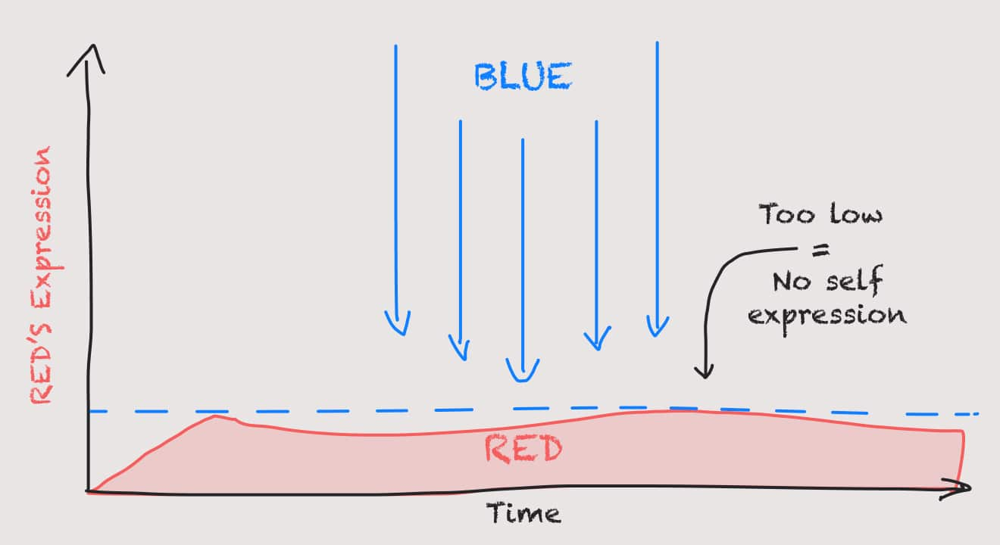

**“STOP!”** The police officer yelled, “This raucous is over!”

The music ceased immediately, and the end-of-year forest party came to an abrupt end. It was good while it lasted. Some of the teenagers ran for the darkness and safety of the trees, while others, horrified of what their parents would say, stood Blue–struck, red beer cups in hand.

What seemed like a fun, secluded, annual ritual – a chance to dance away the boredom of another school year of tests and assignments – was not looked upon so favorably by the strict, local law enforcement. After all, it was only last year that Johnny was seen handing out weed. The town was on edge.

---

## Blue Vs. Red

Along the frontier of the Blue/Red boundary lies many a conflict:

- Terrorists and trained armies.
- “Surfer-dudes” and their frustrated bosses, from the cafes they *sometimes* show up to work for.
- An eager youth and a strict school principal.
- Criminals and the law.
- A rowdy teenager and a concerned parent.
- Etc

The hard line between expressive Red and a responsibility-driven Blue underpins many of societies’ interactions and much of our individual lives.

As we’ve learned from our previous forays into these complex perspectives, ***both are needed***. ***Neither is “right” or “wrong”***. And yet, when one is fueled by a righteous and ordered Blue drive or a carefree and in-the-moment Red fuel, we don’t always see the other side. They’re often the enemy: the misbehaving hooligans, or the stuck-up, prissy suits.

Sound familiar?

## The Guilt Line

In the Spiral’s evolution, Blue clamps down on an overactive Red that was taking things too far. We learned that one of Blue’s powerful assets in controlling Red is guilt. A firm, disciplined, fear of doing something wrong in the eye of the law/god/ism/Truth/company policy.

In the diagram above, Red rises until, usually, something catastrophic happens, and society steps in. A concrete line is drawn, and anybody who crosse this line will be severely punished. You’ve been warned.

Here’s the thing, however. **This line is dependent on how healthy your Blue is, AND your acceptance of Red.**

## A Low Guilt Line = No fun

> As the guilt line drops, so too does healthy expression and self-acceptance of ones desires (culturally or individual)

For example, let’s take a party-going highschool-dropout, who after a dance with alcoholism and a brief intervention from the local church, get’s his shit together and becomes church’s accountant.

How do you suppose this “structure” (Red -> Blue) would respond to *his* children going out to party? I think it’s fair to say he would not be offering to pick them up at 1 am from the beach celebrations.

Likewise, the same applies to countries. After the bloodshed, chaos, and warring disputes, the “peace” that Blue brings is a breath of fresh air. Countries like Japan enforce incredibly strict social norms and rules to limit Red’s expression - often resulting in very unhealthy behavior.

“You can be Red, but only on a Friday or Saturday night, between the hours of 7 pm and 11:59 pm, and it but be contained to this small district we’ve set aside for you.”

This sentiment is exceptionally damaging (as is any over-suppression of the natural Spiral). It creates friction (internal and externally), crippling guilt, sexual frustration, “working one’s self to the bone”, stress, “uptight” ness, boredom, lack of creativity and joy, and many other issues.

In some cases, for those whose “guilt line” has been too low for too long, they’ll snap one day. They’ve sacrificed themselves for society/others, allowing nothing for themselves. Suddenly, the long-term, high-valued employee quits their job, gets a divorce, moves to Hawaii, and buys a Ferrari. *A typical midlife crisis – Red violently bursts through Blue.*

## Too high a Guilt Line = Chaos

> As the guilt line rises, order, discipline, and tempered rationality gives way to extreme behavior, ego, and power struggles.

Of course, the converse of everything above is also true. If Blue laxes too much, allowing Red to walk over it as it pleases, other problems arise.

For example, when crime becomes prevalent (sometimes organized by small amounts of Orange) and the police are too weak, corrupt, or under-funded to control it, Red can claim entire nations. Despite potential external meddling from the CIA, Pablo Escobar is an unfortunate illustration of Red dominating a still developing Blue Colombia.

At one point, an extreme Red was controlling Colombia’s entire country
from a “prison” that HE designed for himself. It crippled Colombia’s people (who thankfully have recovered) and much of South America’s reputation.

Red must be kept in check. Not so much that it limits the self to the point of a puristic chastise, but enough to protect and preserve the safety of all. Lowering the guilt line when Red has reigned for a time is a bloody business.

## Finding the balance
I wonder if you can recognize your own guilt line. Indeed, it often fluctuates depending on the area of our lives. How far do you go before the sense that you’re doing something wrong kicks in? Do you end up hurting people (intentionally OR Unintentionally)? Or are you too strict on yourself and others, not giving space to “take the day off” or “dance the night away”.

If you’re fueled by Red, living in a dominant Blue (which is most of the world), is the line too low for you? Too high?

If Blue fuels you, how much Red can you tolerate? Do you put your foot down at the slightest sight of “unruly behavior” or “bad manners”? Or do you recognize that we all possess a bit of everything, and join in on the fun?

Indeed, different situations call for the raising and lowering of our Guilt Lines.

As always, there are no definitive answers to any of the above. There are only the tools we develop and discover – using and practicing them in the game of life. Like an archeologist, we brush away our own bias and dig a little deeper into the world around us – driven curiously to uncover the mysteries of others world-views.

And now we have another tool.
