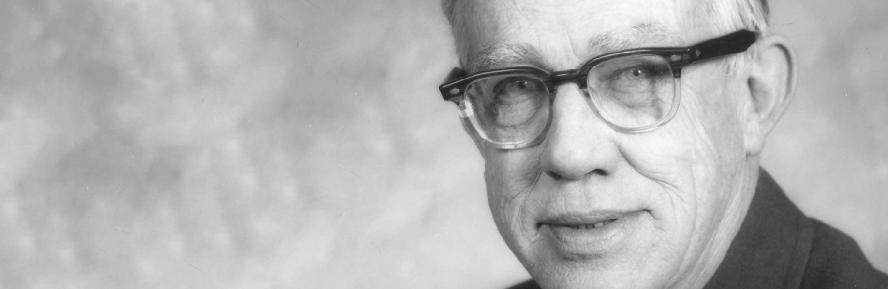

---
tags:
  - intro
  - draft
date: 2020-05-25
title: What is Spiral Dynamics?
seo:
  description: What is Spiral Dynamics? Perhaps you chanced a quick Google search and were presented with complicated pictures and cryptic definitions.
---

## The Language of Perspective
Perhaps you chanced a quick Google search and were presented with complicated pictures and cryptic definitions. Articles discussing “phase shifts” and “vMemes” and “flex-flow”, along with a slew of other complicated nomenclature that left you more confused than when you first started.

Or perhaps you reached out to a friend who studies these weird models and ideas, wherein after a long, awkward pause they may have replied with something like, “Oh, it explains everything...kinda…”

There is often much confusion when starting out on the journey of studying this beautiful model. Due to the complexity and nuance involved it can be challenging to *succinctly* put it into words. In my years of studying Spiral (and models like it) I've had the pleasure of introducing many people to the concepts this blog will explore. I reached out and asked them to help describe it in their own words.

## How would you personally define “Spiral Dynamics”?

> “A framework that gives you a way to talk about all of the crazy things humans do to themselves and one another.”
>
> – Forrest Heath

> “It’s a model for understanding evolutionary world views that exist among people, organizations, and cultures.”
>
> – Lorenzo Castaño

> “I think of it as giving awareness to the feelings of the people in a specific moment or time.”
>
> – Rayser Castrillo

> “A framework to easily describe different phases in life, personality and relationships. Best used as it creates simple, relatable descriptions to everyone's experience.”
>
> – Bianca Raker

The interesting thing about *”perspective”* is that everyone has a different perspective on it. Puns aside, this poses an interesting challenge. How do you know when you say something to someone, filtered through all their beliefs, values and ways of seeing the world that they receive the intended message? This is where Spiral Dynamics steps in.

If we were to summarise all these definitions one might argue that **Spiral Dynamics is simply a language**. A language that describes things you've known your entire life yet have never quite had the words to articulate. A way of communicating to deepen your relationship with your spouse. A model to strategize the best ways to ask for that raise at work. A tool to understand everything from the cycle of life you're currently in, all the way up to how countries relate.

Sound a little grandiose? Let's unpack what this means, how it relates to you and I, and what we can do with it practically in our day to day lives.

## A brief lesson in history
It was the early 1950's and Clare W. Graves had a problem. As a professor of Psychology at Union College in New York, he was repeatedly asked a question by his students to which he had no answer. “Who, from all the competing psychologist and theories, was ultimately 'right' with their models and approaches?”.

There were of course techniques that worked especially well for a certain type of person, however when applied to someone else was unsuccessful. Or perhaps a theory worked brilliantly for a period of time, but as the patient grew older it ceased to work. This lack of consistency disturbed Graves to such a degree that he considered leaving the profession all together. Instead however, he was struck with an inspiration that would set him on a course for the rest of his life. A course that would end up changing the world forever...

*The handsome man himself ladies and gentlemen*

From 1952–1959 he took it upon himself to study over a thousand men and women from all walks of life, varying countries, and disparate world views. His goal was simple; to find an answer to his students question. Was it truly possible to reconcile all these models and frameworks into a unifying theory to explain human behaviour? From his research, he began to notice patterns in the way people would behave in response to external conditions. These “coping mechanisms” would be shared across individuals, cultures, companies and even countries. “World views” that rose up to meet the challenges of the life.

As he studied these patterns further a theory began to form. Clare found that these “world views” were related, and would sometimes shift back and forth depending on what was required. They had ways of interacting with eachother, holding values and beliefs that would complement or repel. As the world around changed and increased in complexity, new ways of dealing with these challenges were required. These perspectives built on eachother to form a theory describing the evolution of consciousness.

In years to come, two of his students (Edward Cowen and Don Beck) would pick up where Clare left off. Together, they invented a system of “colors” to address each type of world view. Colors that increased in complexity as humans moved into more novel arenas and environments. And thus the beginning of Spiral Dynamics was formed.

## What is a “color”?
The simplest explanation for this may just be, “a perspective”. Perspectives can appear to be very different from person to person, across organisations and countries. However upon closer inspection, if you really try to get to the root of where each perspective is coming from, there are strong patterns that emerge. These patterns form the basis of the colors in Spiral Dynamics.

For example a pattern that commonly arises is the desire to belong with people like us. This can be expressed in many different ways; family, friendship, going out to lunch with work colleagues, and belonging to the same sports team; all vastly different manifestations of the same intention. To belong to a tribe.

Another example may follow the need to express one's self. We see this play out with musicians, artists, interesting haircuts and tattoos, taking a long bath, or speaking loudly to ensure we're noticed. The underlying intention for all of these being to discover one's identity and explore/express this.

So we can say that a “color” becomes **a collection of values & beliefs we develop to solve problems**. As we mature we grow better at knowing when to use which color and how to switch between them contextually. Sometimes we solve our problems very well (healthy expression of a color), and sometimes to the detriment of ourselves or others (unhealthy expression). The language of perspective becomes the discussion of these colors, what they each represent, when to use them, how to combine them, move between them, etc.

Where things become very interesting is when these “colors” are combined. Humans are complex creatures with a vast network of competing desires and needs that are often very misunderstood (even to ourselves). By using a language of perspective, we enable ourselves to decipher the various aspects of any given context, behaviour or intention in hopes to better understand it. Perhaps, with deep understanding, we may even change or improve the situation for a more desired outcome.

## Just the beginning

*By lucas Favre @we_are_rising*

This article was written to cover the high levels of these concepts and provide an introduction into *why* you might choose to study Perspective. Over the course of this blog we will explore and unpack these colors in greater detail, giving practical breakdowns of how they work and how you can use them in your own life. We feel this model is a very powerful lens of seeing the world and our selves. The authors of this blog use Perspective every day in our personal and professional lives for a broad range of outcomes. We invite you to join us on the journey of self discovery and building a healthier, happier human race.
