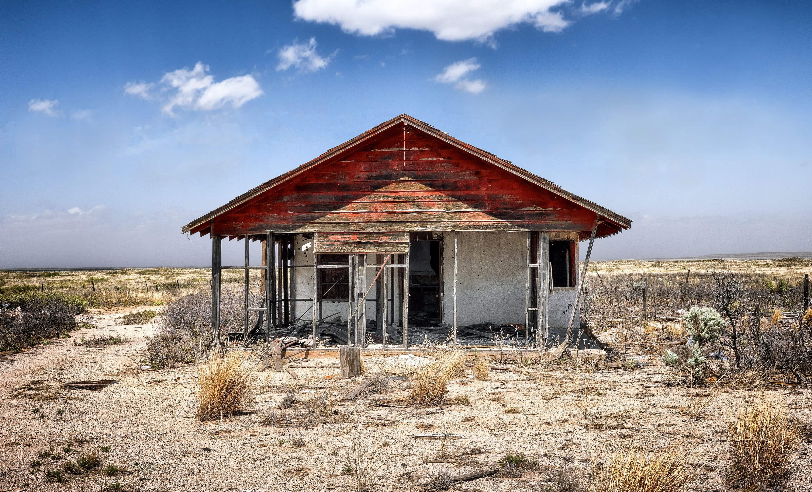
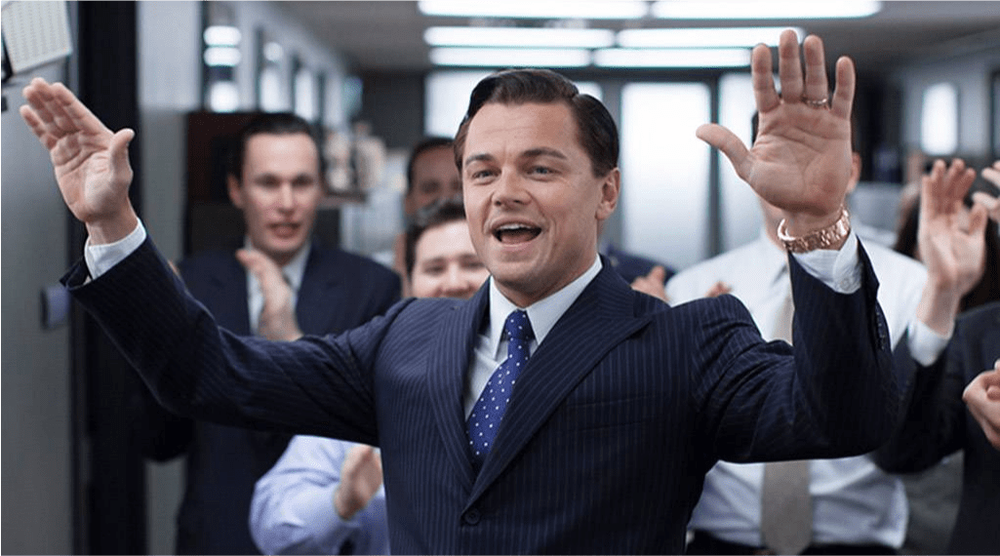
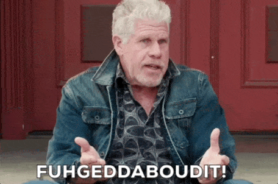

## Is “higher” really “better”?
“I’m really trying to experience the wholeness of self and the universe in Turquoise, but I don’t feel I’m expressing enough Yellow flex-flow”. I held back a painful expression as I attempted to understand where this person [is really coming from](https://spirals.blog/articles/behaviour-vs-intention/).

“That’s interesting,” I reply, “and how’s your Purple going?”

“Oh I feel like I integrated that a long time ago, I’m focusing on the higher colors now. Anyway, have you heard about virtual planes of reality?”

---

Conversations like these both amuse and worry me equally.

When first studying Spiral we begin the ambitious attempt to understand our own structure of colors. We see the Spiral chart on Google Images, read a few blog posts that summarise *all 8 colors known so far in less than 800 words* 🤯, and conclude (based on a short description), that we probably resonate somewhere in the high Yellow’s…right?

I get it. These “higher” colors introduce fancy words like “egalitarian” “global consciousness” and “network based intelligence”. If that’s not enough to pique your interest (and ego while we’re at it) I don’t know what is. We dig further into these concepts and ignore the “lower” colors which seem to address things we already understand. Why would we learn about simple human values like “connection” and “expression” when we can learn about “virtualising consciousness” through a “holistic being mode”? Let’s explore how this line of thinking can be dangerous, and instead present a case for “higher does **not** mean better”

## An Upside-Down House

How do you build a house? It does not take an engineer to know that the first thing you put down is a good foundation. We find suitable ground, pour the cement, and lay a sturdy base for the rest of our marvellous creation. Yet somehow this principle is lost for many when it comes to learning and understanding Spiral. It’s an easy overstep to make! Identifying with “higher” colors without truly understanding the nuances is akin to building a roof, placing it on the bare earth and calling it a day. Better yet is when we invite people over to view our “house”, proclaiming marvels and showing off how beautiful the “ceiling” is!

There’s a strong misconception at play here. We’re taught in many narratives that “higher” is better. Higher grades means better university options. Higher rank on the company ladder means more authority. Higher status in society means more influence on the world. Higher states consciousness allow for greater control of our lives. This social myth we tell time and time again exists in the hierarchies of the [“imagined realities”](https://www.youtube.com/watch?v=zen-m0rMp4I) we construct as a species. Does it apply to Perspective?

> **“Whole”archy**\
> Term: As opposed to a “hierarchy”, a “wholearchy” integrates all pieces of its structure into an organised system. All components are equally needed and rely on each other to provide a healthy ecosystem. No part is seen to be better than another.

Our house’s foundation isn’t worth less than the walls. In the same way that the roof is not better than the door. Looking at Perspective as a “wholearchy” puts things under a different light. It places a much deserved emphasis on founding perspectives like “Purple” and “Red” simultaneously removing the misplaced significance of more complex colors such as Yellow and Turquoise (and for many, Green and Orange). Taking away the “hierarchy” allows all colors to be viewed equally, to be seen objectively, and treated fairly. It balances our understanding of Perspective.

The wholearchy approach aids us in viewing the compounding effect of colors with a greater ease. How could we step out in healthy Red if we don’t feel safe in Purple? Can we really effectively lead in Blue, instructing others what to do, if our Red needs work? Good luck trying to establish a successful Orange venture if you can’t even stick to a basic Blue schedule (many try). Don’t get me started on beyond Orange…

## Back to Basics
The best practitioners of Spiral I’ve witnessed focus on dropping their ego and it’s attachment to these “higher” colors.  This is a *lot* easier than it sounds. They are consistently  having honest conversations about where they’re at and **asking the hard questions** to test their foundations. Here are some example questions to illustrate:

- Do I feel lonely?
- Are there parts of myself that I haven’t fully accepted?
- Am I shy?
- Do I have trouble sticking to things for periods of time?
- Am I bitter about a past relationship?
- Do I get angry a lot?

If you answered yes to any of these then join the club. We’ve got some work to do.

From my experiences in training and using colors in an array of situations, I’ve found most personal problems lie somewhere in Blue, Red or Purple. This is not a popular opinion. It may not necessarily *feel good* when someone tells you that your business failed because you haven’t learned to accept yourself. Especially when you thought it was an Orange problem and you came looking for the next hot sales technique.

Viewing Perspective through the lens of a wholearchy helps us to knuckle down on what’s really going on for us at the base of our Spiral. We tend to bullshit ourselves, and by putting all colors on the table and giving each of them a good, hard look every so often, it keeps us in better perspective.

> A good rule of thumb: Start with Purple

Start at the bottom. For most of us this means Purple. Healing Purple is worthy of a series of books in its own right and is not to be taken lightly. We will be exploring this in further articles. If we posses large insecurities, feel sad or lonely often, or are afraid of the world, these can be strong indicators that our Purple is crying out for some love. No amount of “opening our chakras” or “nutting out the next business plan” will fix this. Uncomfortable questions, therapy, and real conversations with ourselves can provide a good starting ground on healing these hidden parts. After all, can we really expect to operate effectively in the world if we haven’t solved the Base Problem of Safety?

Moving up the spiral with an unhealthy purple [can get ugly](https://www.youtube.com/watch?v=N5NQdmHzBTY). It distorts, twists, and confuses the expressions and problems of more complex colors, with potential of creating devastating effects towards us and those around us. Yet so many of us are drawn to the “shininess” of Orange, or the “blissfulness” of Green that we reject our shadows, lie to ourselves, and parade around wearing clothes that don’t belong to us. When put bluntly like this it may appear mad, but our egos are strong and we are all susceptible. Here be dragons.

## False temptations

*I want you to deal with your problems by becoming rich!*

“Higher” colors may create an illusion of grandeur to [solve all our problems](https://www.youtube.com/watch?v=JE3KPnW5dWU) but this is a lie. The further up we go on the Spiral, the more complex things become...

How many of us understand what it truly, personally, feels like to have our plans for eradicating malaria worldwide thwarted by terrorists? Bill Gates does. Not a problem I’d imagine that many of us would really like to fix. This is what happens in Spiral. The problems we are faced with grow harder, longer, scarier and more risky as we continue solving them. It’s like a video game where the levels increase in difficulty, each time presenting us with a novel challenge that never gets easier. We only have one life, and there’s no reset button…

For me personally, I objectified Orange. I was moving away from Blue, idolising the freedom and innovative ideas that Orange was selling. It took many years and patient people to show me that I would never move forward in any of my “low Orange” ideas until I learned to fully embrace Blue and the time needed to do things well (Unhealthy Orange wants to skip to the end). I didn’t want to listen, my ego stuck up it’s guard, and I held my ground for years, all the while the problems of Purple and Red were raging underneath.

## Why change at all?
> "Change is not the rule, lack of change is not the rule.”\
> – Something the ol’ Mr. Graves used to throw around frequently

What then can be said about the transition to “higher” colors? If moving through the Spiral doesn’t bring more happiness, riches, or move to solve all our problems, then what’s the point?

The objective is to solve the problems of where we’re at. Remember that colors arose to deal with external realities? We can forget about what’s down the line, what other’s color structures are, and what they’re doing. Practicing Spiral on ourselves means getting as in perspective as we can about our own structure and direction, setting a course, then forgetting about it.

*Over-analysing your Spiral? Fugghetaboutit!*

As we move carefully though the problems we’re faced with we may experience new ones. Problems we have never encountered before. This *may* call for a new shift in thinking, but before jumping into the new shiny land that promises to fix everything, take a good long look. If your existing Spiral needs work you may need to hold off… Ensure you speak to someone who understand you and the Spiral well. It always pays to check.

---

Spiral is a tool to lead a more informed and happier life. As soon as a color becomes an objective, or we find ourselves comparing our “lack” of “<insert idolised color here>” to another we’ve lost the point. In moments like these (and they will happen), let go, go laugh, and stop taking yourself so seriously. Whatever your color structure, wherever you come from, we’re all on the journey that’s right for us. So smile, and remember *you’re exactly where you need to be*.
